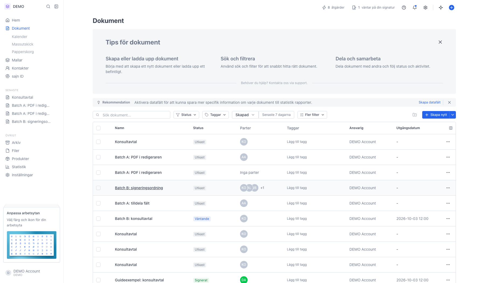
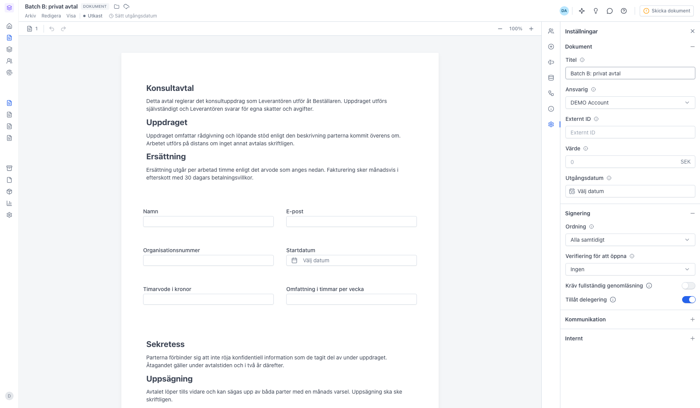
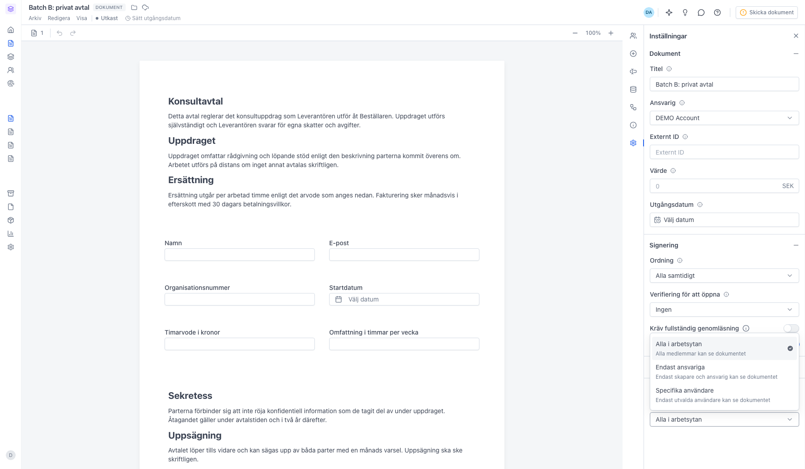
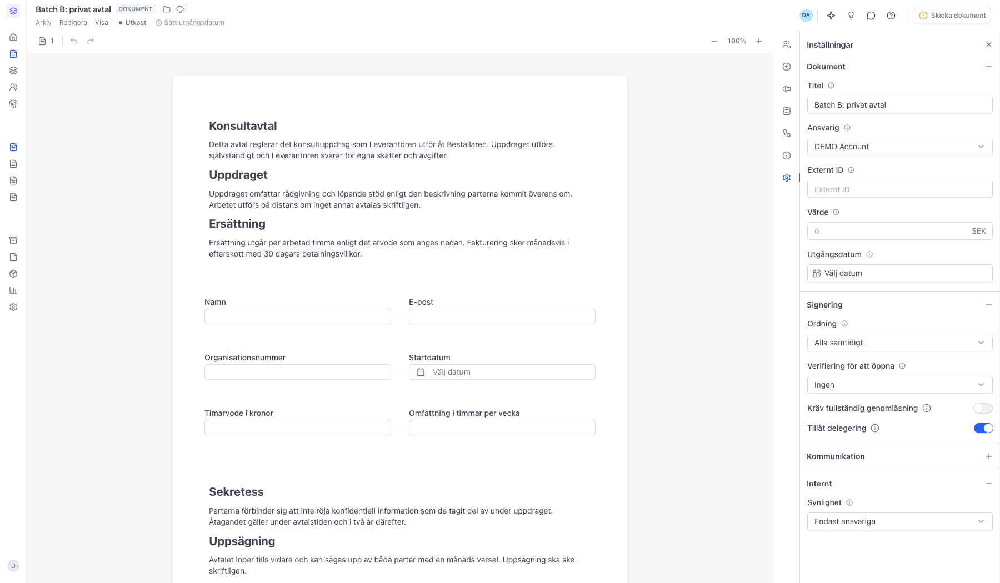
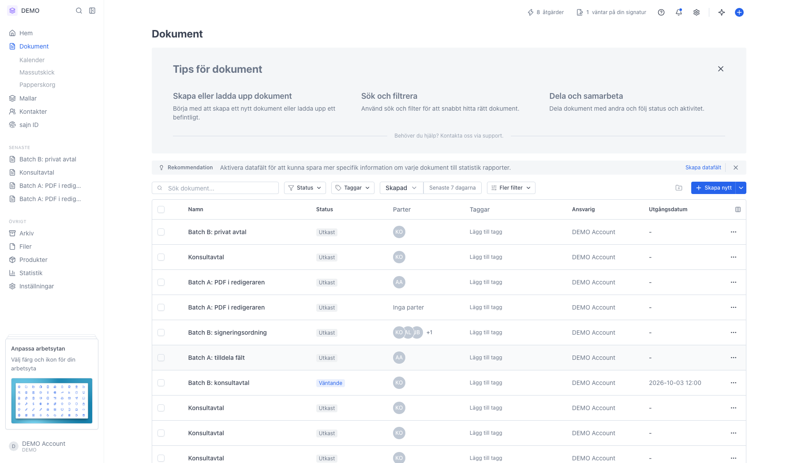

# Skapa ett privat dokument

<!--
slug: private-documents
audience: Alla användare
last_verified: 2026-09-13
auto-generated from steps.json — edit the spec, then re-run the runner
-->

Synligheten styr vilka medlemmar i arbetsytan som kan öppna ett dokument inifrån sajn. Guiden visar var inställningen ligger, vilka lägen som finns och hur dokumentet ser ut för dig som ägare efteråt.

## Innan du börjar

- Du är inloggad i sajn och har valt en arbetsyta.
- Du är skapare, ansvarig eller administratör på dokumentet.

## Steg

### 1. Utgå från dokumentlistan

Här ligger arbetsytans dokument. Klicka på Skapa nytt uppe till höger för att starta dokumentet vi ska göra privat, eller öppna ett befintligt utkast.

### 2. Synligheten ligger i panelen Inställningar

Öppna panelen med kugghjulet längst ner i ikonraden. Sektionen Internt är hopfälld från start och ligger sist i panelen — klicka på rubriken för att fälla ut den.

### 3. Standardvärdet är Alla i arbetsytan

Inställningen Synlighet styr vilka medlemmar i arbetsytan som kan öppna dokumentet inifrån sajn. Den påverkar inte parterna — de får sin signeringslänk oavsett vad du väljer här.

### 4. Välj hur privat dokumentet ska vara

Alla i arbetsytan är standard och betyder att varje medlem ser dokumentet. Endast ansvariga begränsar till skaparen och den ansvariga användaren. Specifika användare låter dig peka ut en exakt lista.

### 5. Dokumentet är nu satt till Endast ansvariga

Valet sparas automatiskt — ingen extra spara-knapp behövs. Från och med nu syns dokumentet bara för dig som skapare och för den ansvariga personen.

### 6. Du ser dokumentet som vanligt

Som ägare har du kvar full åtkomst och dokumentet ligger kvar i listan. För övriga medlemmar i arbetsytan finns det varken i listan eller i sökresultaten. Behöver en kollega ändå läsa dokumentet möts hen av en låst vy med knappen Begär åtkomst.

---

*Senast verifierad: 2026-09-13. Generad av `scripts/guide-runner.ts`.*
