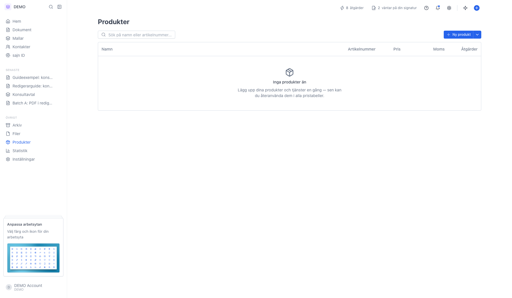
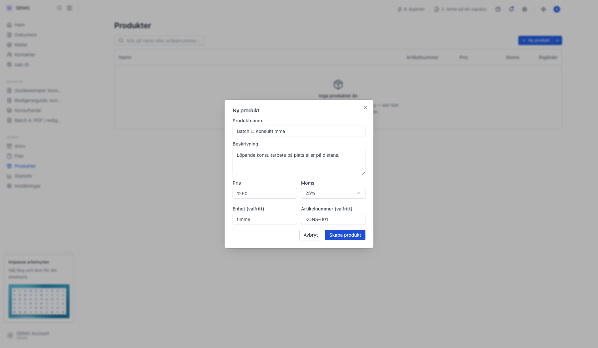
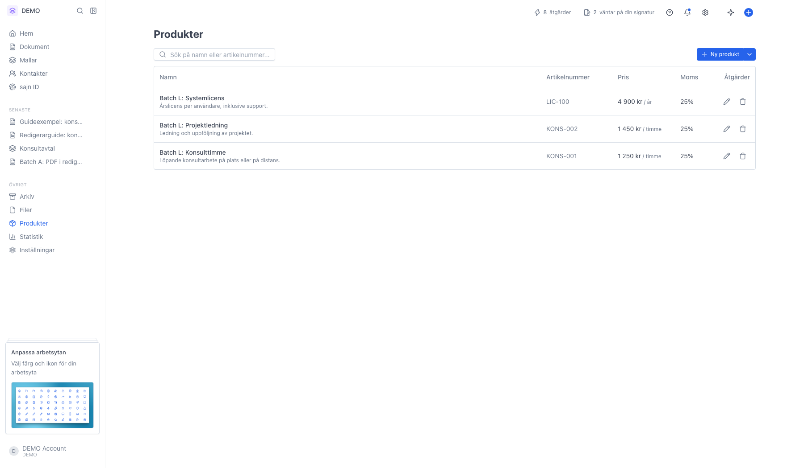
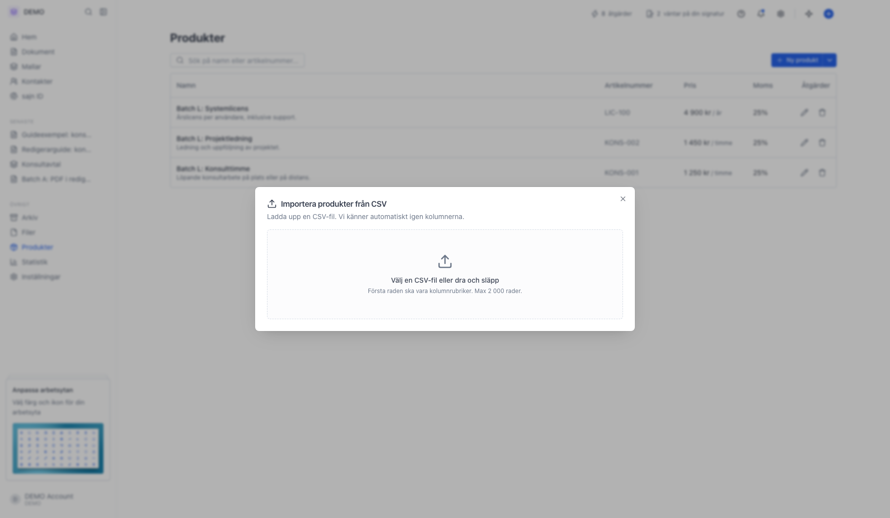
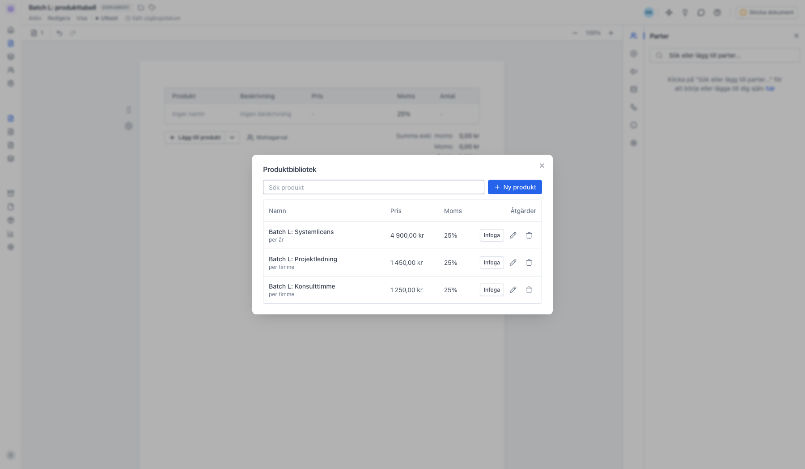
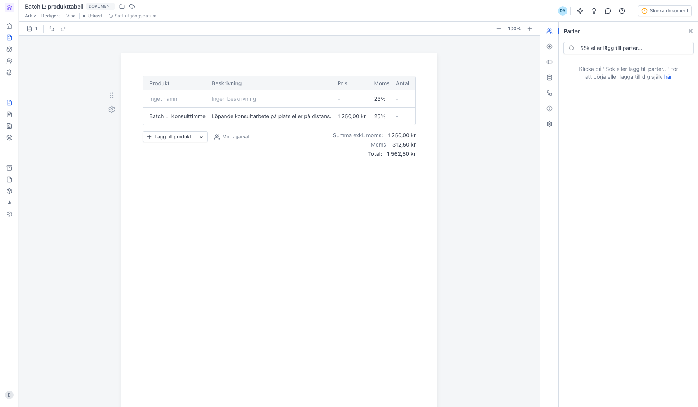
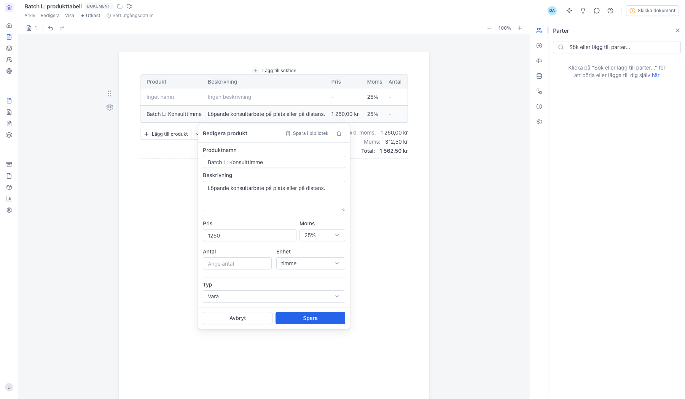

# Bygg upp produktkatalogen

<!--
slug: produkter
audience: Arbetsyteadministratörer
last_verified: 2026-09-13
auto-generated from steps.json — edit the spec, then re-run the runner
-->

Produkter är arbetsytans katalog över varor och tjänster. Du lägger upp priset en gång och hämtar sedan in raden i vilket dokument som helst, i stället för att skriva av samma siffror varje gång.

## Innan du börjar

- Du är inloggad i en arbetsyta där du får hantera produkter.

## Steg

### 1. Öppna Produkter i sidomenyn

Katalogen tillhör arbetsytan, så alla som arbetar i den delar samma produkter. Listan visar namn, artikelnummer, pris och moms. Sökfältet söker på både namn och artikelnummer.

### 2. En produkt är namn, pris, moms och enhet

Bara produktnamnet är obligatoriskt. Priset är styckpriset exklusive moms, och enheten är vad priset gäller per, till exempel timme, styck eller år. Momsen väljs bland 0, 6, 12 och 25 procent. Artikelnumret är ditt eget och används för att söka fram produkten.

### 3. Katalogen är en lista du redigerar direkt

Pennan öppnar produkten för ändring, papperskorgen tar bort den ur katalogen. Tar du bort en produkt behåller dokument som redan använder den sina värden, eftersom raden i dokumentet är en kopia.

### 4. Har du redan en prislista importerar du den

Pilen bredvid Ny produkt döljer Importera från CSV. Släpp filen i rutan, så läser sajn rubrikraden och föreslår vilken kolumn som är namn, beskrivning, artikelnummer, pris, enhet och moms. Du kan ändra förslaget innan du importerar. Högst 2 000 rader per fil.

### 5. I dokumentet hämtar du raden ur katalogen

I en Produkttabell-sektion lägger knappen Lägg till produkt till en tom rad. Pilen bredvid öppnar Från bibliotek, och där ligger arbetsytans katalog. Infoga lägger produkten sist i tabellen. Du kan också skapa en ny produkt direkt härifrån.

### 6. Raden kommer in med namn, pris, enhet och moms

Den översta raden är den tomma du la till för hand; den undre kom från katalogen. Raden är en kopia, så ändrar du priset i katalogen senare påverkas inte dokument som redan är skrivna. Antal fyller du i per dokument, och tabellen summerar längst ner.

### 7. Vägen tillbaka: Spara i bibliotek

Klicka på en rad i tabellen för att ändra den. Har du skrivit en rad för hand som du vill återanvända lägger Spara i bibliotek upp den som en produkt i katalogen. Ändringar du gör här stannar i dokumentet.

---

*Senast verifierad: 2026-09-13. Generad av `scripts/guide-runner.ts`.*
