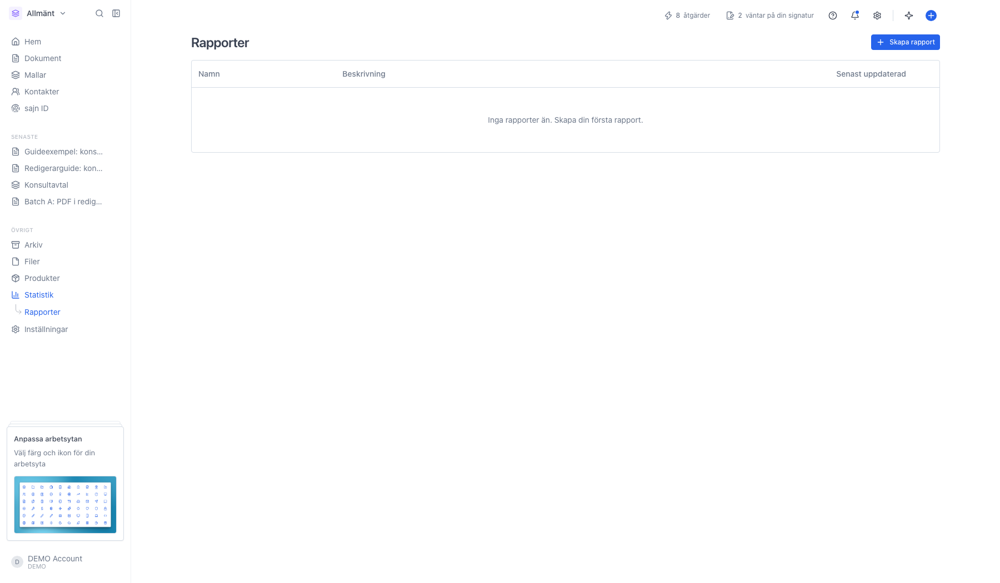
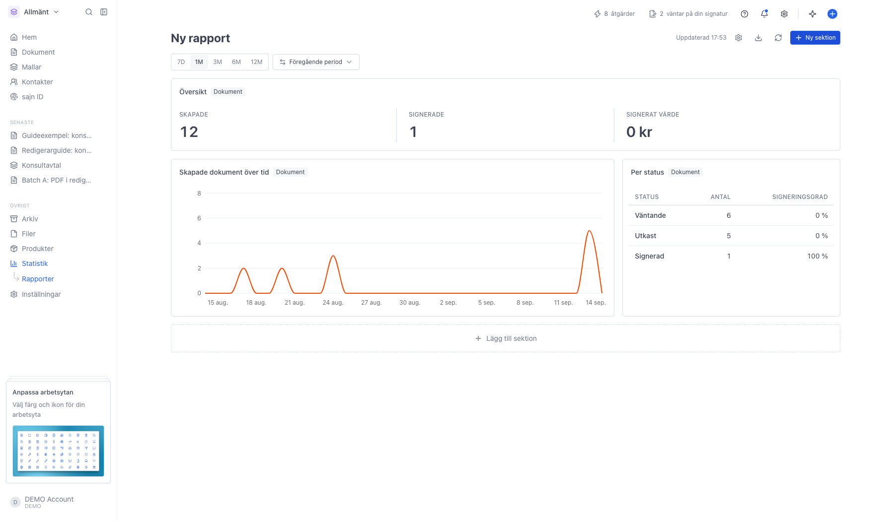
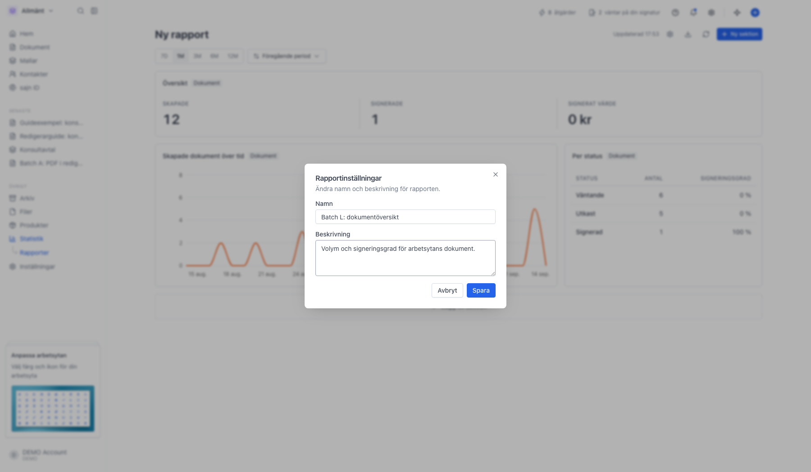
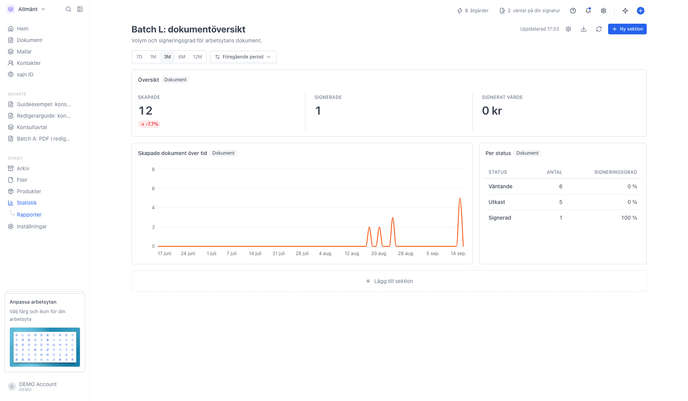
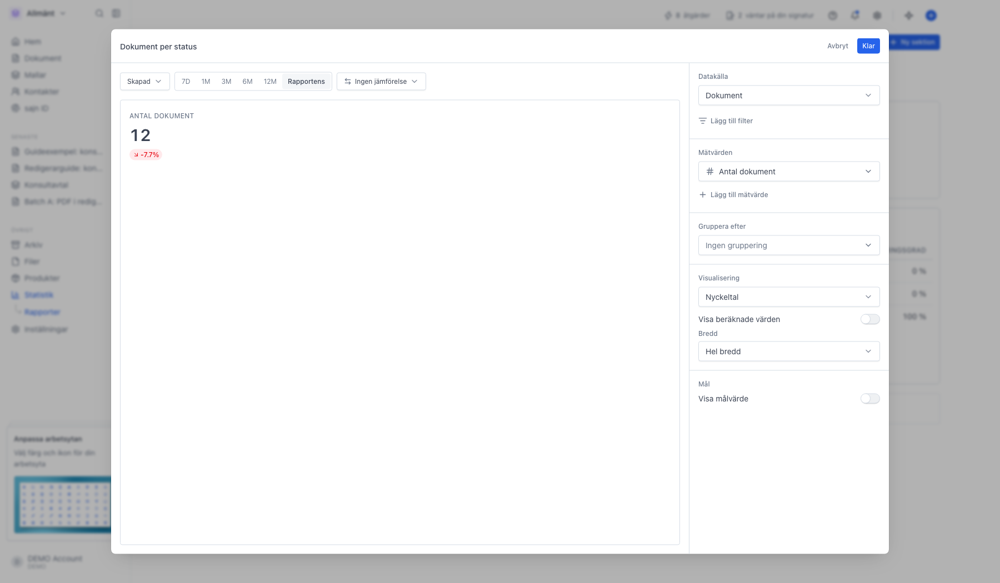
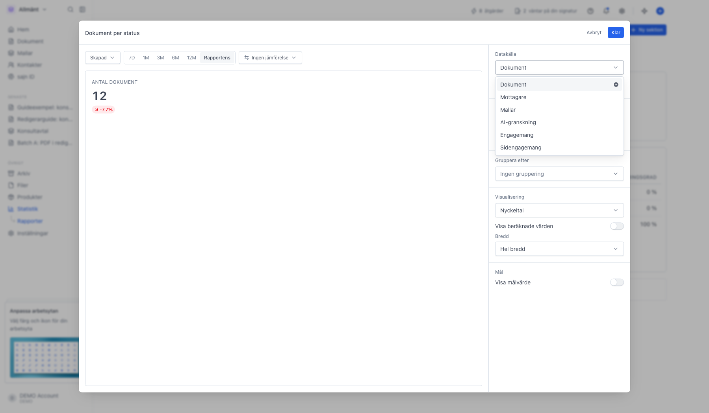
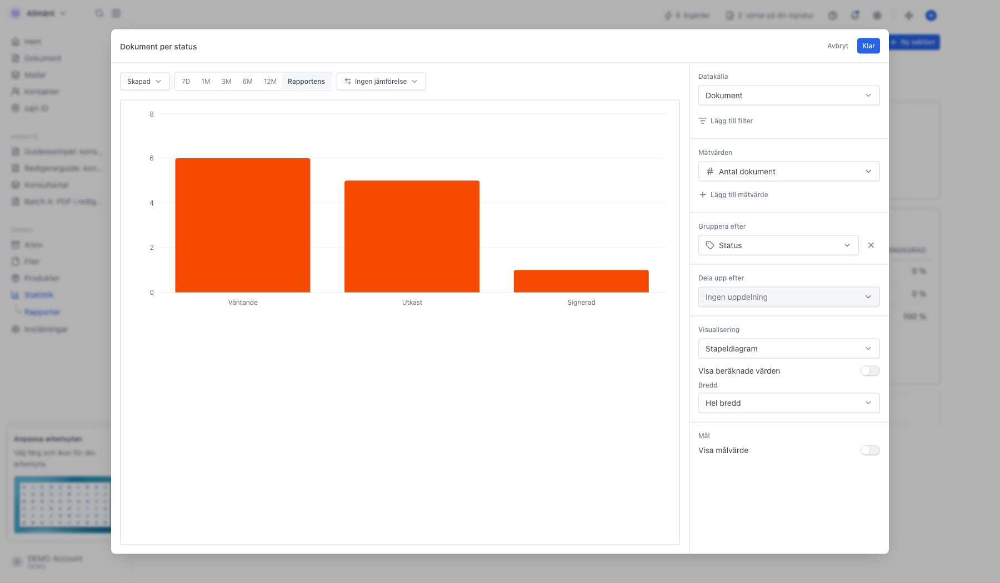
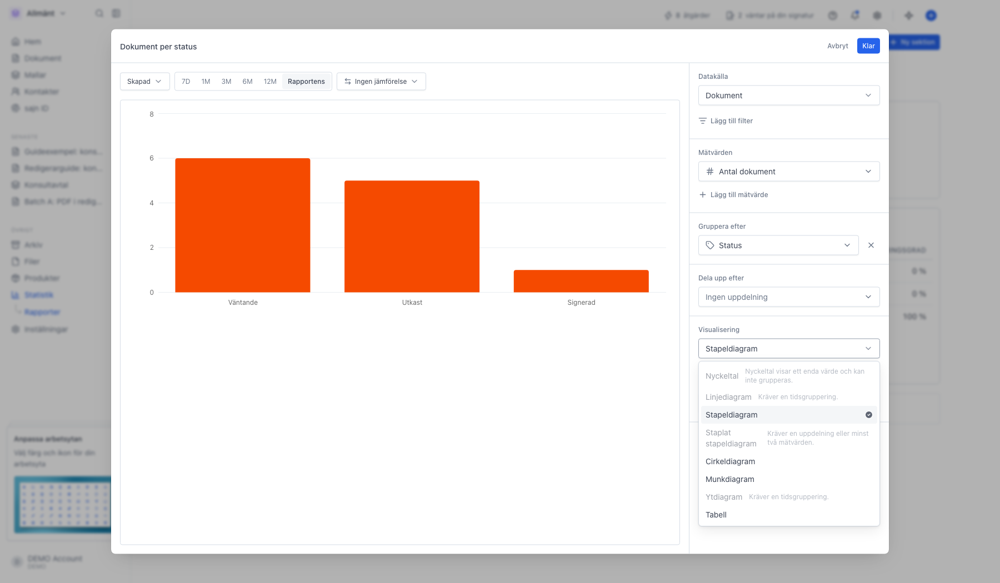
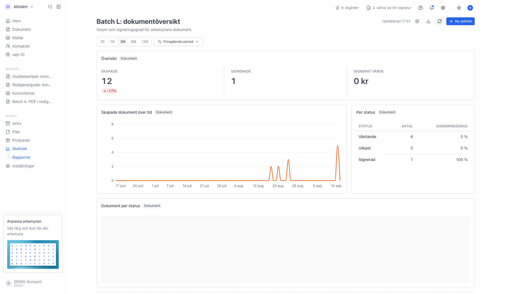
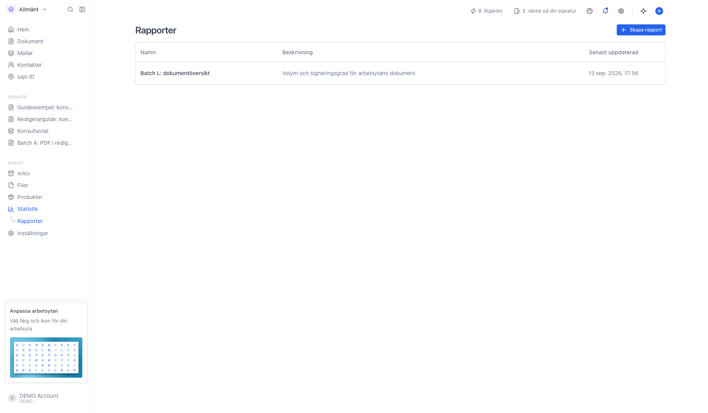

# Bygg en rapport

<!--
slug: rapporter
audience: Arbetsyteadministratörer
last_verified: 2026-09-13
auto-generated from steps.json — edit the spec, then re-run the runner
-->

Statistik är den färdiga översikten. Rapporter är den du bygger själv: du väljer datakälla, mätvärden, gruppering och diagramtyp, och sparar resultatet som en egen sida.

## Innan du börjar

- Du är inloggad i en arbetsyta där du får läsa och skapa rapporter.
- Rapporter kräver Solo eller högre.

## Steg

### 1. Öppna Rapporter under Statistik

Rapporter ligger som en undersida till Statistik i sidomenyn. Listan visar namn, beskrivning och när rapporten senast ändrades. Rapporterna tillhör arbetsytan, så alla som får läsa rapporter ser samma lista.

### 2. En ny rapport börjar med tre färdiga sektioner

Rapporten heter Ny rapport och innehåller en nyckeltalsrad, ett linjediagram över skapade dokument och en tabell per status. Varje ruta är en sektion med sin egen fråga mot databasen. Raden under rubriken styr perioden för hela rapporten.

### 3. Ge rapporten ett namn och en beskrivning

Kugghjulet uppe till höger öppnar rapportens inställningar. Namnet är det som står i listan, och beskrivningen hjälper dina kollegor att förstå vad rapporten svarar på.

### 4. Perioden och jämförelsen gäller hela rapporten

Knapparna 7D, 1M, 3M, 6M och 12M byter period för alla sektioner samtidigt. Menyn bredvid väljer vad siffrorna jämförs mot: ingen jämförelse, föregående period eller föregående år. Valet sparas i rapporten, så nästa person som öppnar den ser samma period.

### 5. Sektionsredigeraren visar resultatet medan du bygger

Till vänster ligger förhandsvisningen, till höger frågan. Panelen läses uppifrån och ner: Datakälla är vad du mäter på, Mätvärden är talen, Gruppera efter delar upp dem och Visualisering avgör hur de ritas. Varje ändring syns direkt i förhandsvisningen.

### 6. Sex datakällor att välja mellan

Dokument räknar dokumenten själva. Mottagare räknar per part, med leverans, öppningar och signeringar. Mallar räknar mallarna i arbetsytan. AI-granskning räknar anmärkningar från AI-granskningen. Engagemang och Sidengagemang mäter hur mottagaren beter sig på signeringssidan. Byter du källa börjar sektionen om, eftersom mätvärden och grupperingar hör till en källa.

### 7. En gruppering gör talet till ett diagram

Utan gruppering är sektionen ett enda tal. Grupperar du på Status delas talet upp per status och sektionen byter automatiskt från nyckeltal till stapeldiagram. Grupperar du på ett datum får du i stället en tidslinje, och då dyker en meny upp för dagligen, veckovis, månadsvis, kvartalsvis eller årsvis.

### 8. Diagramtyper som inte passar frågan står kvar men är släckta

Listan visar alla typer: nyckeltal, linje, stapel, staplat stapeldiagram, cirkel, munk, yta och tabell. En typ som inte går att rita med den aktuella frågan är släckt och skriver ut vad som saknas, till exempel Kräver en tidsgruppering. Tabell fungerar alltid.

### 9. Sektionen läggs till sist i rapporten

Rapporten sparas automatiskt. Menyn med tre punkter på varje sektion har Ladda ner CSV, Redigera, Duplicera och Ta bort. Pilen uppe till höger laddar ner hela rapporten som CSV, och uppdateringsknappen bredvid hämtar färska siffror i stället för de cachade.

### 10. Rapporten finns kvar i listan

Klicka på en rad för att öppna rapporten igen. Papperskorgen längst till höger tar bort rapporten permanent.

---

*Senast verifierad: 2026-09-13. Generad av `scripts/guide-runner.ts`.*
