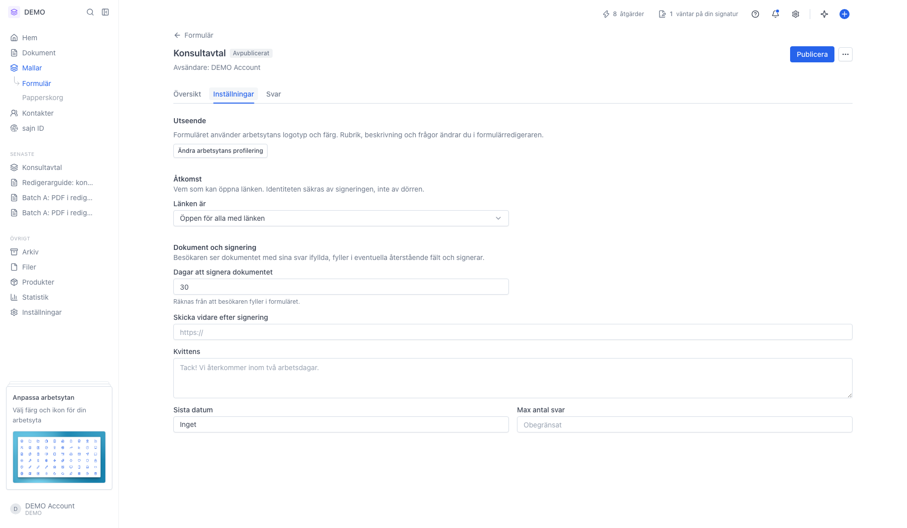

# Skicka mottagaren vidare efter signering

<!--
slug: redirect-after-signing
audience: Arbetsyteadministratörer och utvecklare
last_verified: 2026-09-13
auto-generated from steps.json — edit the spec, then re-run the runner
-->

Var omdirigeringen ställs in: i formulärets inställningar, eller via REST-API:t på ett enskilt dokument.

## Innan du börjar

- Du är inloggad och har behörighet att hantera formulär i arbetsytan.

## Steg

### 1. Skicka vidare efter signering i formulärets inställningar

Fältet ligger under Dokument och signering, mellan dagar att signera och kvittenstexten. Skriv en fullständig https-adress.

---

*Senast verifierad: 2026-09-13. Generad av `scripts/guide-runner.ts`.*
