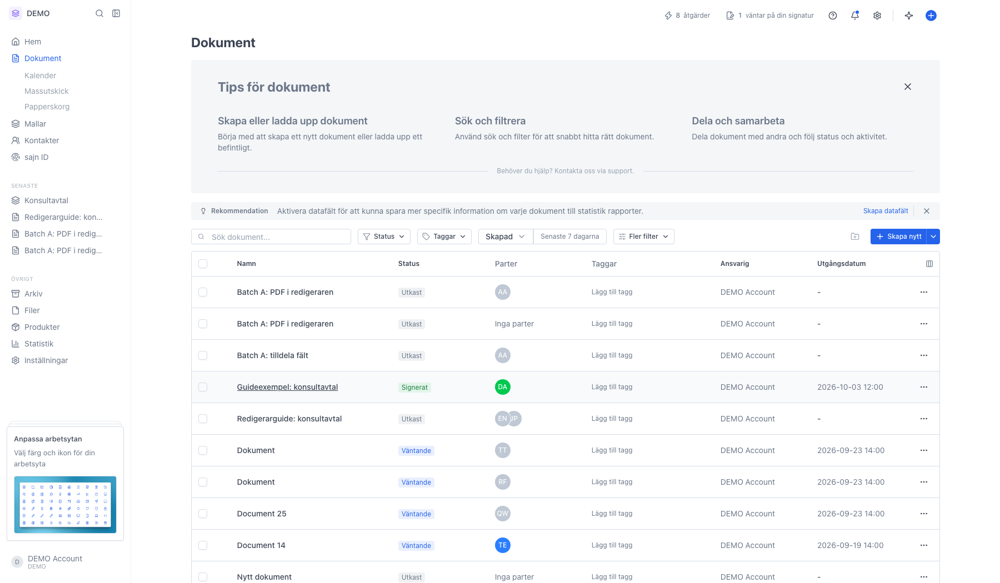
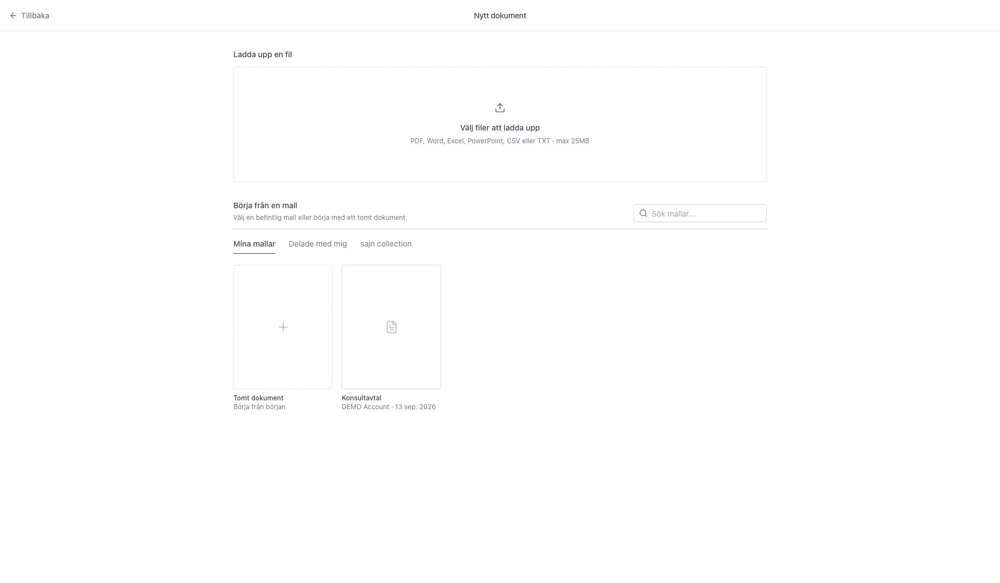
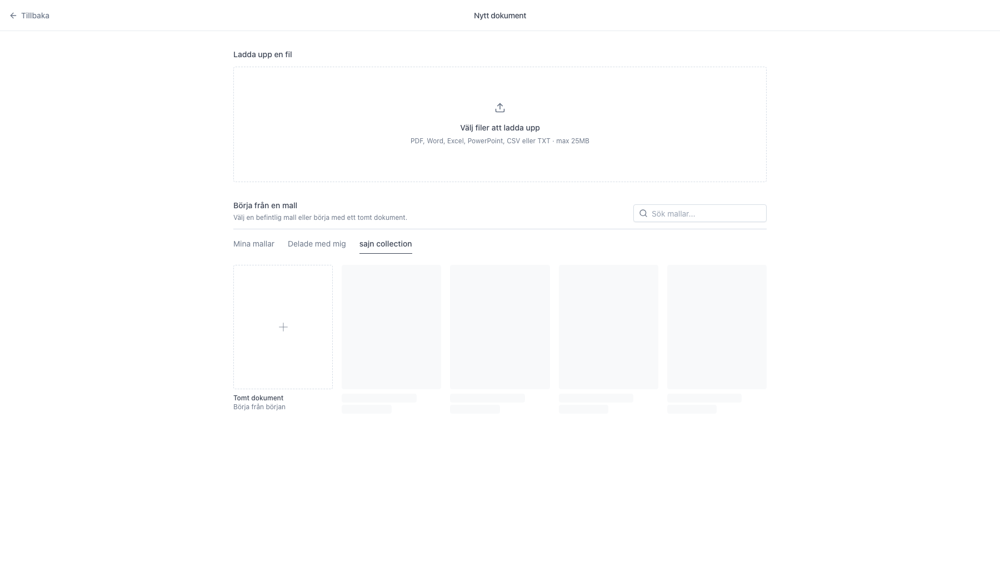
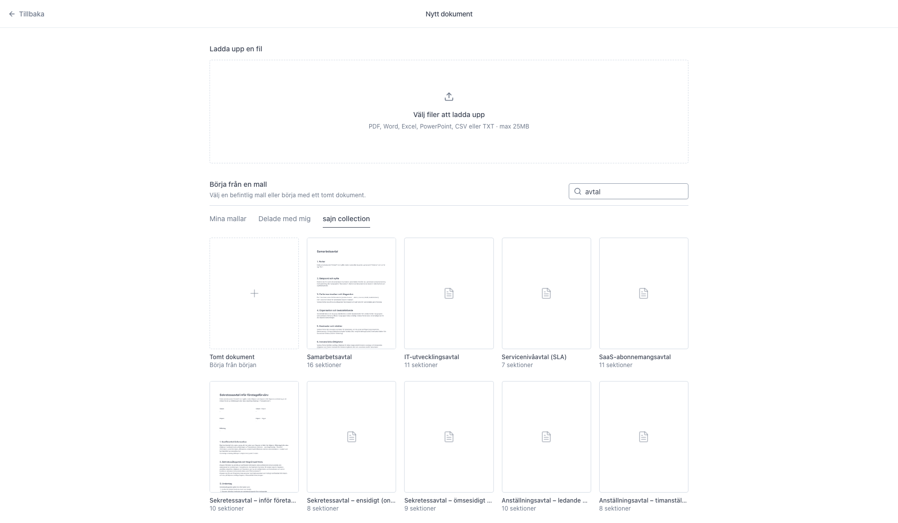
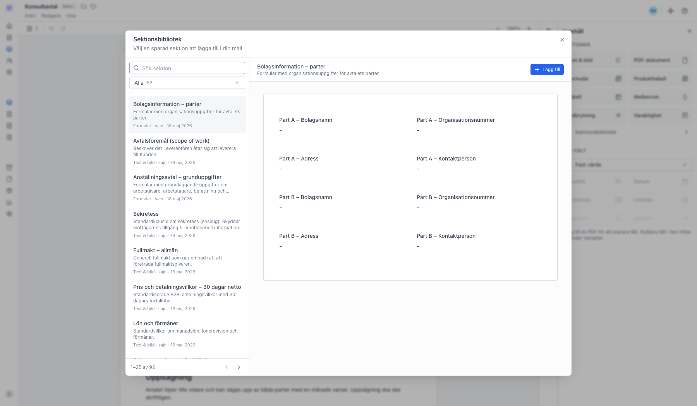
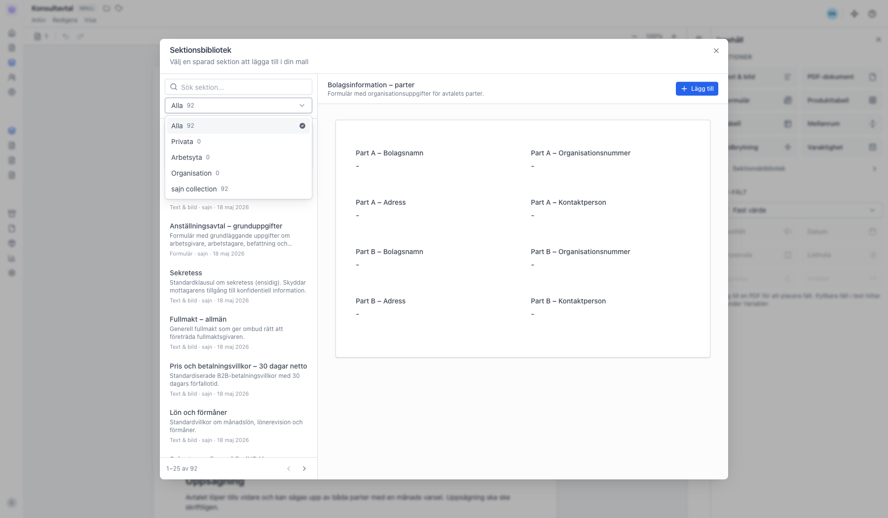

# Använd sajn collection – färdiga mallar och sektioner

<!--
slug: sajn-collection
audience: Alla användare
last_verified: 2026-09-13
auto-generated from steps.json — edit the spec, then re-run the runner
-->

sajn collection är ett gemensamt bibliotek som sajn underhåller. Det dyker upp på två ställen: bland mallarna när du skapar ett dokument, och i sektionsbiblioteket inne i redigeraren.

## Innan du börjar

- Du är inloggad i sajn och har valt en arbetsyta.

## Steg

### 1. Öppna Dokument och klicka Skapa nytt

### 2. Nytt dokument öppnas med mallarna nedanför

### 3. sajn collection är en av flikarna över mallistan

### 4. Sökrutan filtrerar bland de gemensamma mallarna

### 5. Sektionsbiblioteket har samma bibliotek per sektion

### 6. Filtrera på sajn collection

---

*Senast verifierad: 2026-09-13. Generad av `scripts/guide-runner.ts`.*
