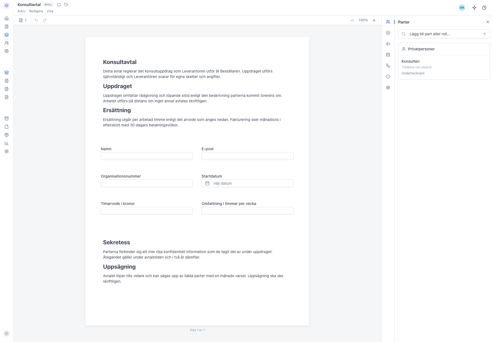
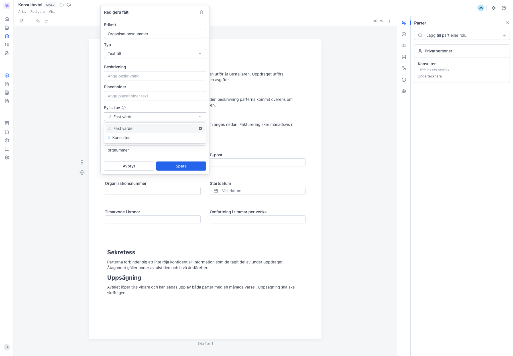
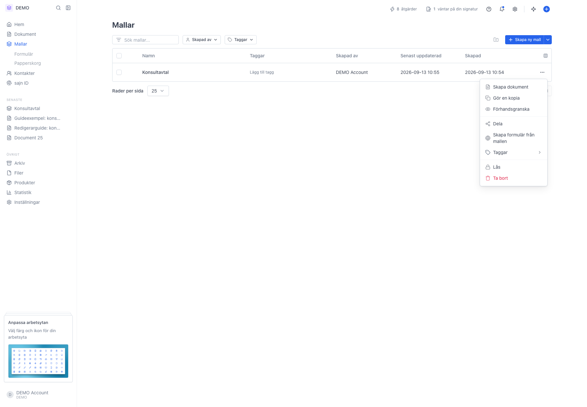

# Samma fält till olika mottagare varje gång

<!--
slug: samma-falt-olika-mottagare
audience: Alla som bygger mallar
last_verified: 2026-09-13
auto-generated from steps.json — edit the spec, then re-run the runner
-->

Skärmdumpar till guiden Samma fält till olika mottagare varje gång. Visar parten som rollplats i mallen, kopplingen Fylls i av på ett fält, och menyvalet som skapar ett dokument från mallen. Utgår från mallen Konsultavtal och ändrar ingenting i den.

## Innan du börjar

- Du är inloggad i en arbetsyta där du får skapa mallar.
- Arbetsytan har en mall med en Formulär-sektion, här Konsultavtal.

## Steg

### 1. Parten i mallen är en rollplats, inte en person

Panelen Parter visar parten med sitt rollnamn, här Konsulten, och texten Tilldelas vid utskick. Mallen behöver alltså ingen e-postadress. Den fyller du i per dokument.

### 2. Fältet kopplas till parten, inte till en e-postadress

Klicka på ett fält för att öppna Redigera fält. Menyn Fylls i av avgör vem som ska fylla i fältet. Välj parten, här Konsulten, så följer fältet med till varje nytt dokument. Fast värde gör fältet statiskt.

### 3. Skapa ett dokument när du ska skicka

Skapa dokument i radens meny ger ett nytt dokument med mallens innehåll, parter och fältkopplingar redan på plats. Det enda som återstår är att fylla i den verkliga mottagaren.

---

*Senast verifierad: 2026-09-13. Generad av `scripts/guide-runner.ts`.*
