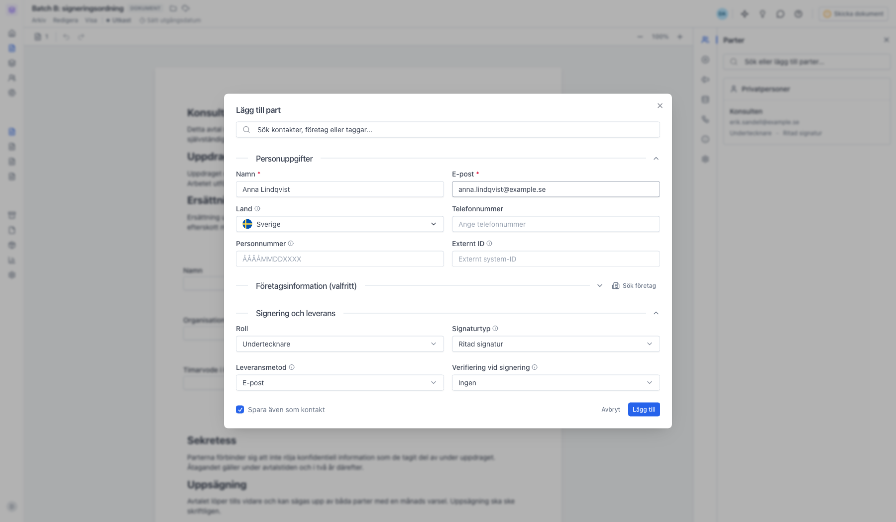
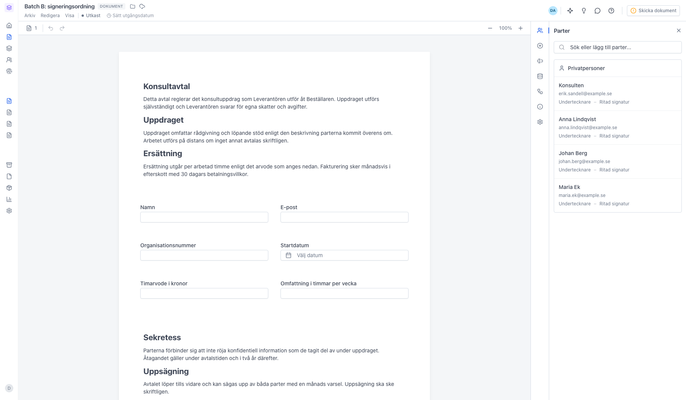
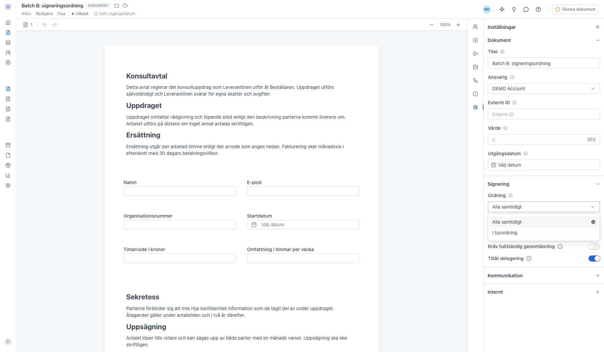
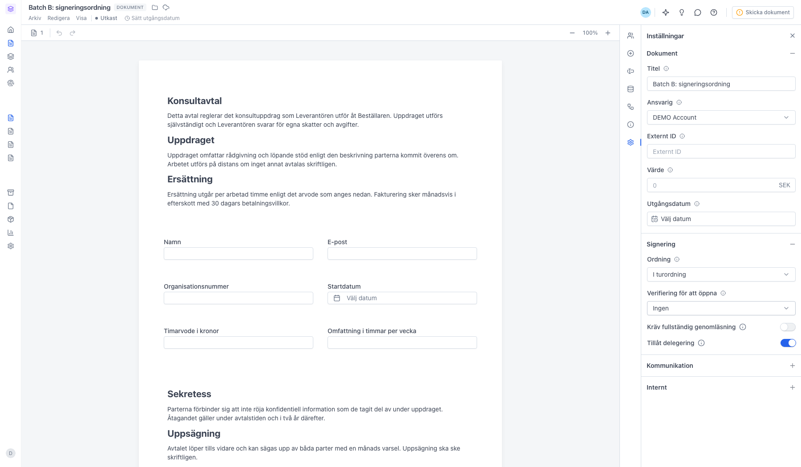
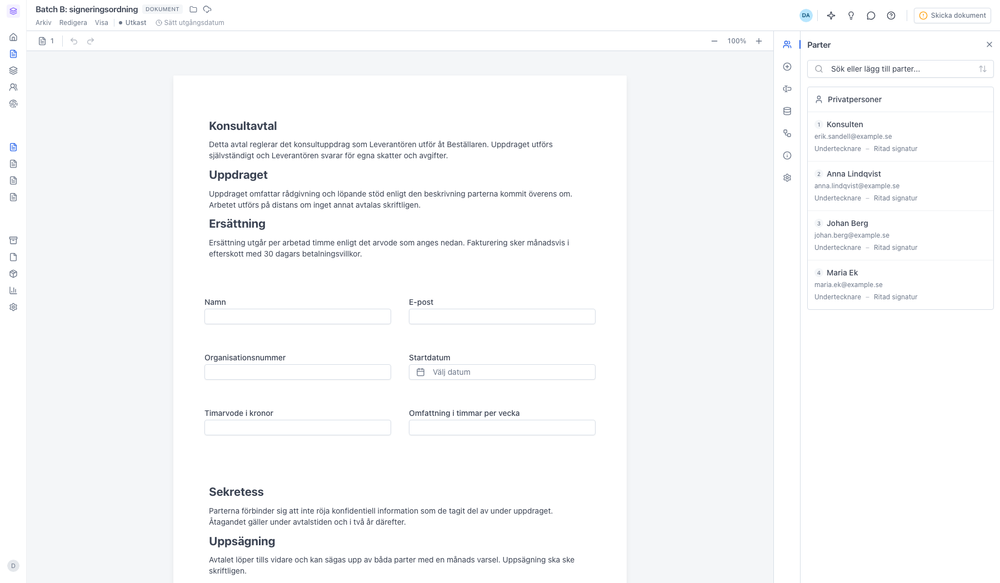
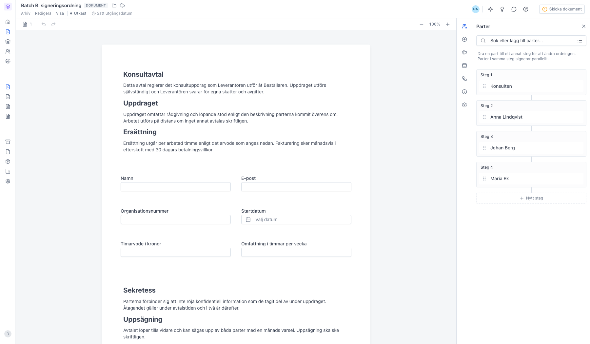
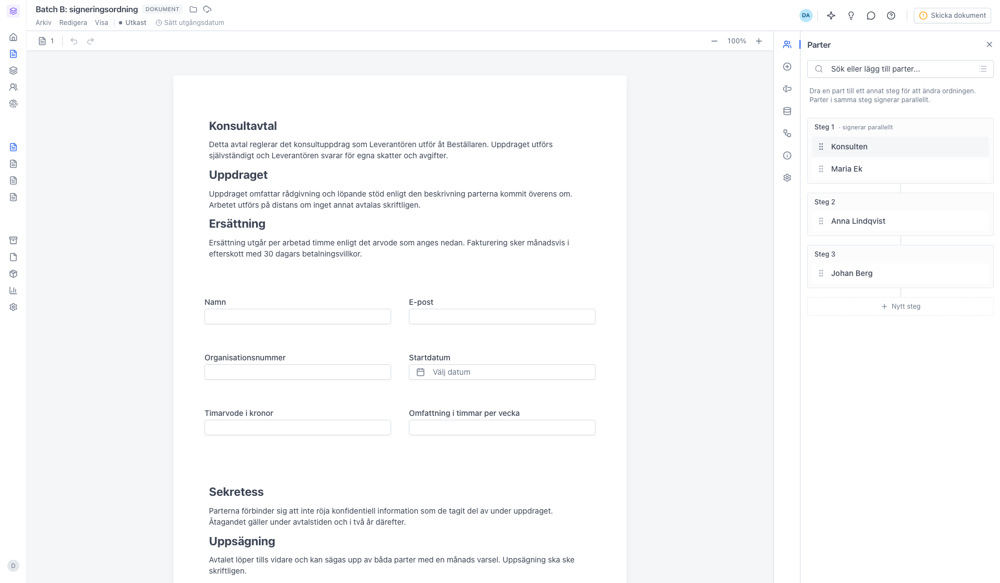

# Sekventiell signering — låt parter signera i steg

<!--
slug: sekventiell-signering
audience: Alla användare
last_verified: 2026-09-13
auto-generated from steps.json — edit the spec, then re-run the runner
-->

Signeringsordningen bestämmer om alla parter får dokumentet på en gång eller om de tas ett steg i taget. Guiden bygger upp ett utkast med fyra parter och ställer om ordningen.

## Innan du börjar

- Du är inloggad i en arbetsyta där du får skapa dokument.
- Dokumentet är fortfarande ett utkast — signeringsordningen sätts innan du skickar.

## Steg

### 1. Lägg till parterna

Klicka på Sök eller lägg till parter, fyll i namn och e-postadress och klicka på Lägg till. Upprepa tills alla som ska signera finns med. Här lägger vi till tre parter utöver den som följde med mallen.

### 2. Som standard signerar alla parter samtidigt

Utan signeringsordning får alla parter dokumentet på en gång och kan signera i valfri ordning. Parterna visas grupperade efter företag, eller under Privatpersoner om de inte hör till något.

### 3. Ordningen sätts i panelen Inställningar

Under rubriken Signering finns inställningen Ordning med två val: Alla samtidigt och I turordning. Det här är hela reglaget — det finns ingen separat switch att slå på.

### 4. I turordning delar upp parterna i steg

Valet sparas direkt. Informationsikonen bredvid Ordning förklarar principen: nästa part får dokumentet först när den föregående har signerat. Själva ordningen ändrar du i panelen Parter.

### 5. Varje part hamnar i ett eget steg

Panelen Parter visar nu stegen. Steg 1 signerar först, sedan steg 2, och så vidare. Ikonen vid sökfältet växlar mellan den vanliga vyn och ordningsvyn där du flyttar parterna.

### 6. Ordningsvyn visar stegen

Ikonen till höger i sökfältet växlar till ordningsvyn. Här ligger varje part i sin egen ruta: Steg 1 signerar först, sedan Steg 2, och så vidare. Rutan Nytt steg längst ner skapar ett steg till.

### 7. Flera parter i samma steg signerar samtidigt

Dra en part till ett annat steg för att slå ihop dem. Parter i samma steg får dokumentet samtidigt och rutan märks signerar parallellt. Vill du ha motsatsen — en part först och sedan flera parallellt — lägger du en part ensam i Steg 1 och drar de andra till Steg 2.

---

*Senast verifierad: 2026-09-13. Generad av `scripts/guide-runner.ts`.*
