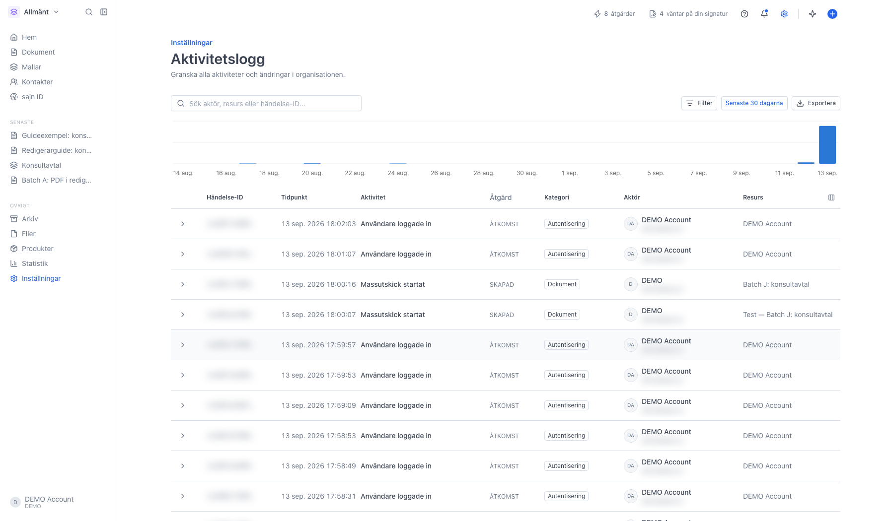
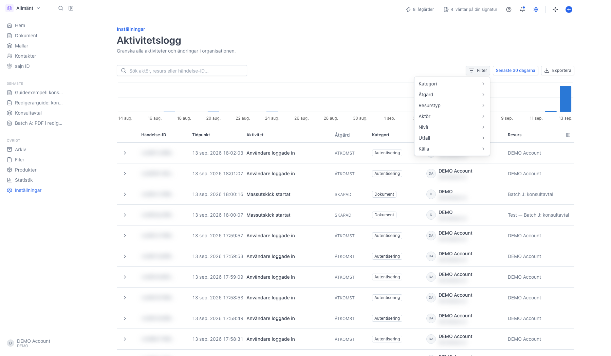
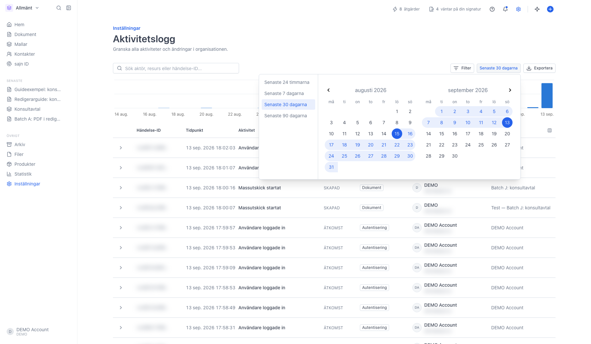
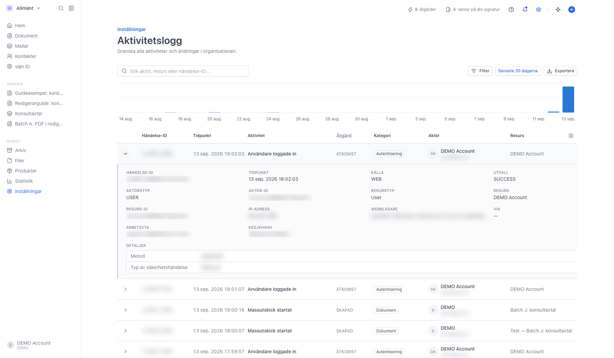

# Granska organisationens aktivitetslogg

<!--
slug: settings-audit-log
audience: Organisationsadministratörer
last_verified: 2026-09-13
auto-generated from steps.json — edit the spec, then re-run the runner
-->

Aktivitetsloggen samlar allt som händer i organisationen: inloggningar, medlemshantering, ändrade inställningar, API-nycklar, dokument och ägarskifte. Guiden visar var loggen ligger, vad kolumnerna betyder, hur du filtrerar och hur du öppnar en enskild händelse. Loggen går bara att läsa.

## Innan du börjar

- Du är inloggad och har behörigheten Visa aktivitetslogg i organisationen.
- Aktivitetsloggen kräver Team eller Enterprise.

## Steg

### 1. Öppna Aktivitetslogg under Organisation

Sidan har tre delar: filterraden högst upp, ett stapeldiagram som visar hur händelserna fördelar sig över perioden, och tabellen med en rad per händelse.

Kolumnerna är Händelse-ID (klicka för att kopiera), Tidpunkt med datum och klockslag, Aktivitet på svenska, Åtgärd som säger om något skapades, ändrades eller togs bort, Kategori, Aktör med namn och e-postadress, Resurs som är objektet som påverkades, och Nivå. Nivå är tom för vanliga händelser och visar Varning, Fel eller Säkerhet för allt som avviker, plus Nekad eller Misslyckades när en åtgärd inte gick igenom. Ikonen längst upp till höger i tabellen väljer vilka kolumner som ska visas.

Sökrutan söker på aktör, resurs eller händelse-ID, och Exportera laddar ner allt som matchar filtren som en CSV-fil, inte bara den sida du ser.

### 2. Åtta filter bakom knappen Filter

Varje rad öppnar en lista att kryssa i: Kategori, Åtgärd, Resurstyp, Aktör, Nivå, Utfall och Källa. En åttonde rad, Arbetsyta, tillkommer när organisationen har fler än en arbetsyta. Filtren kan kombineras, och siffran på knappen räknar hur många som är aktiva. Rensa nollställer allt.

### 3. Välj period

Knappen bredvid filtren styr hur långt bak loggen visar: senaste 24 timmarna, 7, 30 eller 90 dagar. Senaste 30 dagarna är förvalt. Du kan också markera ett eget datumintervall i kalendern. Perioden gäller både diagrammet och tabellen.

### 4. Öppna en rad för hela bakgrunden

Pilen längst till vänster fäller ut händelsen. Där står källa, utfall, aktörstyp, resurs, IP-adress, webbläsare, arbetsyta och en kedjehash som gör att loggen kan kontrolleras mot manipulation. Under Detaljer listas det som ändrades. Känsliga värden skrivs aldrig ut utan markeras Dolt.

---

*Senast verifierad: 2026-09-13. Generad av `scripts/guide-runner.ts`.*
