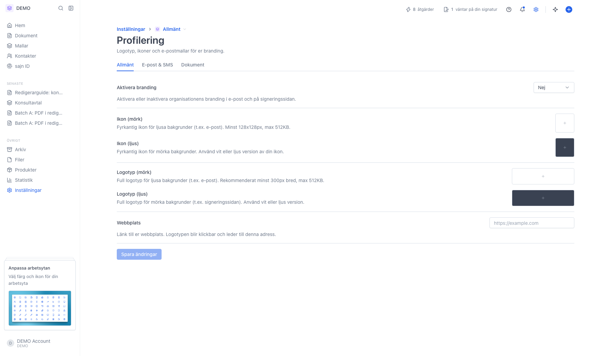
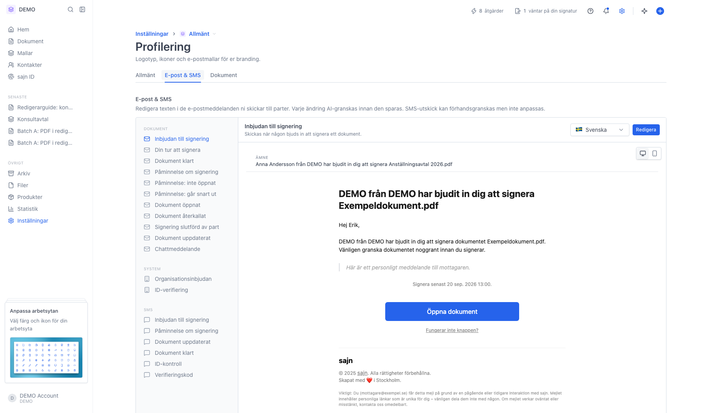
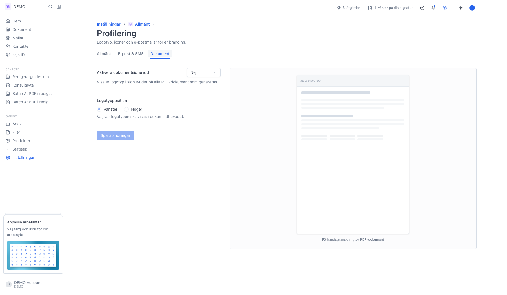

# Er profilering i mejl och signeringssida

<!--
slug: settings-branding
audience: Arbetsyteadministratörer
last_verified: 2026-09-13
auto-generated from steps.json — edit the spec, then re-run the runner
-->

Profilering sätter arbetsytans visuella identitet: logotyper och ikoner som följer med i utskick och på signeringssidan, texten i mejlen och en logotyp i sidhuvudet på genererade PDF:er. Guiden visar sidans tre flikar och vad varje fält gör, utan att ladda upp något eller spara.

## Innan du börjar

- Du är inloggad och har behörighet att hantera arbetsytans inställningar.
- Profilering kräver Solo eller högre. På Basic visas i stället en uppmaning att uppgradera.
- Inställningarna är arbetsytespecifika — varje arbetsyta har sin egen profilering.

## Steg

### 1. Fliken Allmänt — logotyper, ikoner och webbplats

Aktivera branding är huvudvalet. Står det Ja används era bilder och er länk i e-post och på signeringssidan; står det Nej visas sajns standardutseende, och bilderna ligger kvar sparade men används inte.

Ikon är den fyrkantiga varianten, minst 128×128 px och max 512 KB. Logotyp är den fullständiga logotypen, rekommenderat minst 300 px bred. Båda finns i en mörk variant för ljusa bakgrunder som e-post och en ljus variant för mörka bakgrunder som signeringssidan — ladda upp en vit eller ljus version i det ljusa fältet, annars syns den inte.

Webbplats är adressen logotypen ska leda till. Lämna fältet tomt om logotypen inte ska vara klickbar. Ingenting sparas förrän du klickar Spara ändringar.

### 2. Fliken E-post & SMS — texten i utskicken

Allmänt-fliken styr utseendet. Den här fliken styr innehållet. Listan till vänster är varje meddelande som kan gå ut, grupperat i Dokument, System och SMS — inbjudan till signering, påminnelser, dokument klart, organisationsinbjudan, ID-verifiering och så vidare. Klicka på ett meddelande för att se det till höger, med växlaren uppe till höger i förhandsvisningen för att se hur det ser ut på dator respektive mobil.

Språkväljaren gör att du kan ha en egen text per språk. Redigera öppnar texten för ändring; varje ändring AI-granskas innan den sparas. SMS-utskicken går att förhandsgranska men inte anpassa.

### 3. Fliken Dokument — logotyp i sidhuvudet på PDF:er

Aktivera dokumentsidhuvud lägger er logotyp i sidhuvudet på alla PDF-dokument som genereras, och Logotypposition väljer om den ska stå till vänster eller höger. Förhandsvisningen till höger uppdateras direkt så du ser resultatet innan du sparar.

---

*Senast verifierad: 2026-09-13. Generad av `scripts/guide-runner.ts`.*
