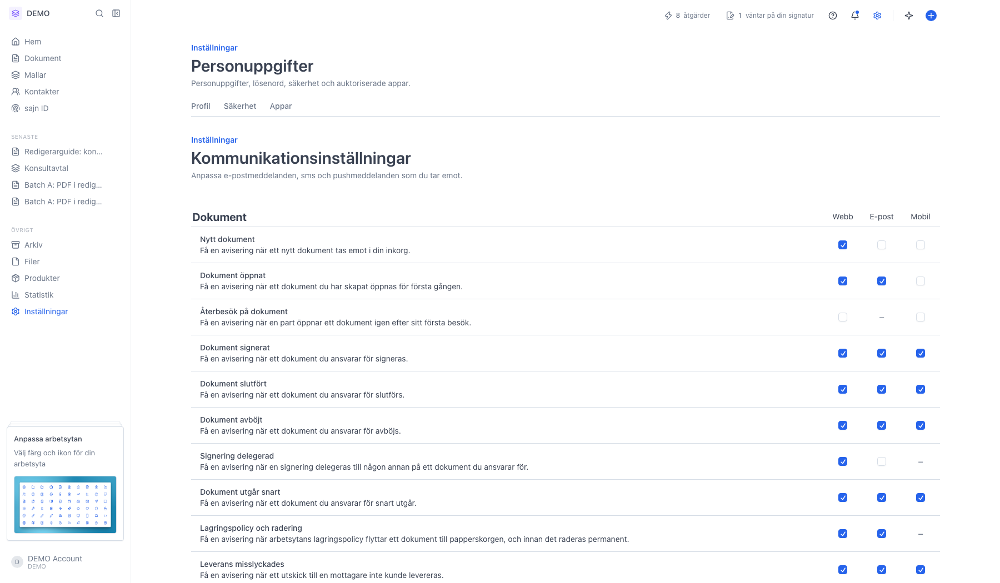
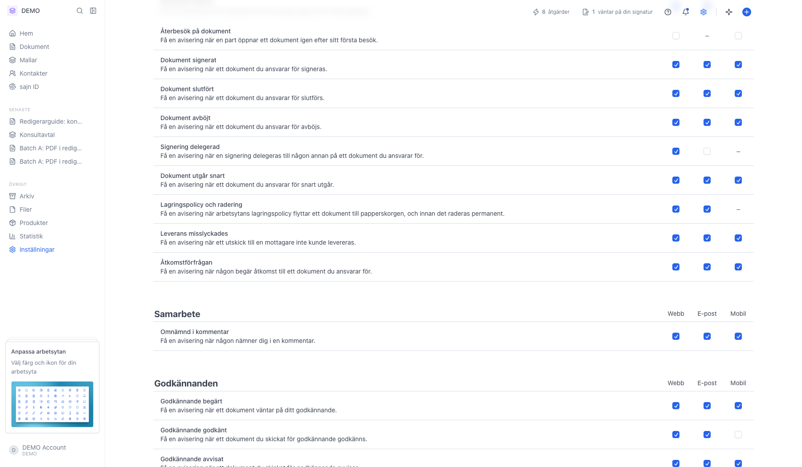
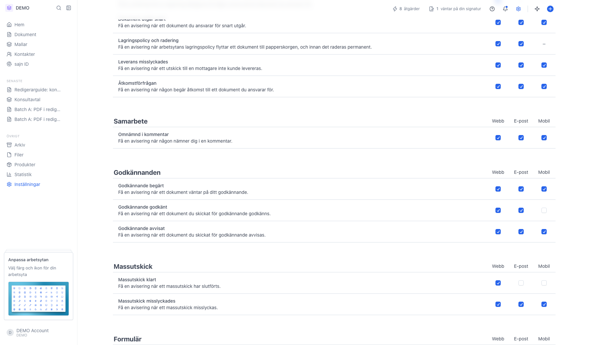
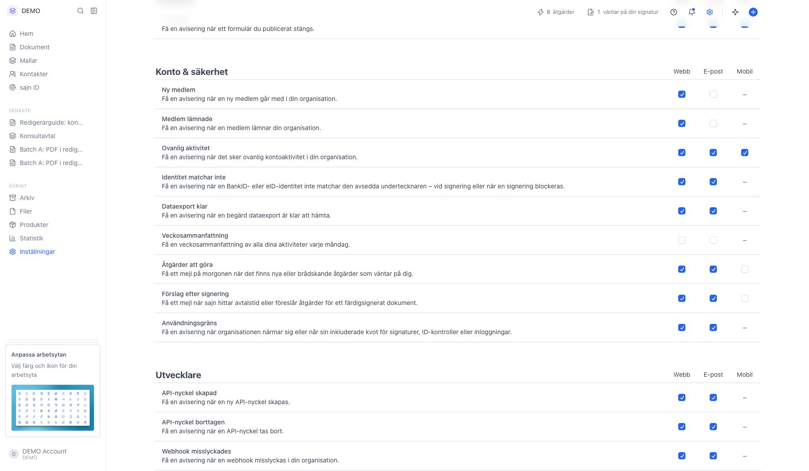
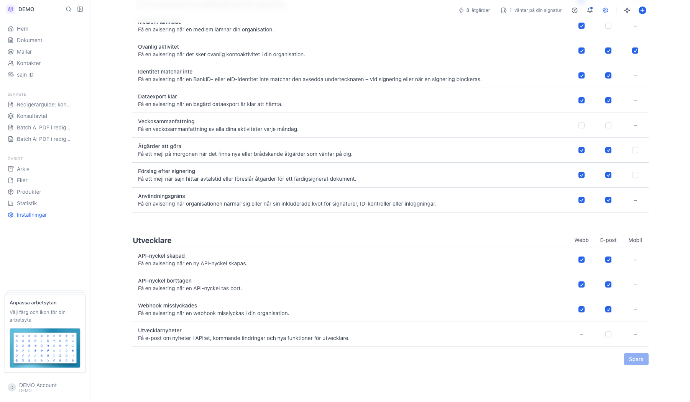

# Välj vilka aviseringar du får

<!--
slug: settings-communication-preferences
audience: Alla användare
last_verified: 2026-09-13
auto-generated from steps.json — edit the spec, then re-run the runner
-->

Kommunikationsinställningar styr vilka aviseringar du tar emot och i vilken kanal. Inställningarna är personliga och följer dig som användare, oavsett vilken arbetsyta du jobbar i. Guiden går igenom sidan utan att ändra något.

## Innan du börjar

- Du är inloggad i sajn.
- Varje användare har sin egen uppsättning — det du ändrar här påverkar bara dina egna aviseringar.

## Steg

### 1. Öppna Kommunikationsinställningar

Sidan är en enda lista med rubriker per område, inte flikar. Till höger finns tre kolumner: Webb är notiscentret i sajn, E-post är mejl till din inkorg och Mobil är pushnotiser i mobilappen. Kryssa i de kanaler du vill ha per rad, och avmarkera alla för att stänga av aviseringen helt. Ett streck i stället för en kryssruta betyder att kanalen inte finns för just den aviseringen.

### 2. Dokument — hela dokumentets livscykel

Här ligger aviseringarna för dokument du ansvarar för: nytt dokument i inkorgen, öppnat första gången, återbesök, signerat, slutfört, avböjt, delegerad signering, dokument som snart går ut, vad lagringspolicyn gör med dokumentet, utskick som inte kunde levereras och begäran om åtkomst till ett dokument. Återbesök på dokument saknar e-postkolumn med flit — en part som läser om ett långt avtal skulle annars generera ett mejl per besök.

### 3. Samarbete, godkännanden, massutskick och formulär

Samarbete innehåller aviseringen när någon nämner dig i en kommentar. Godkännanden täcker begärda, godkända och avvisade attester. Massutskick meddelar när ett utskick är klart eller misslyckats, och Formulär när ett formulär fått svar. Grupperna visas bara med de aviseringar som är relevanta för ditt konto.

### 4. Konto & säkerhet — kontohändelser och sammanfattningar

Här ligger ny medlem, medlem som lämnat, ovanlig aktivitet på kontot, identitet som inte matchar vid signering, klar dataexport, veckosammanfattning, åtgärder att göra, förslag efter signering och när ni närmar er en användningsgräns. Veckosammanfattningen är ett typiskt exempel på en avisering man bara vill ha på e-post: lämna Webb och Mobil tomma och kryssa bara E-post.

### 5. Utvecklare — visas bara med utvecklarbehörighet

Gruppen Utvecklare syns bara om du har behörighet att hantera utvecklarinställningar. Den samlar skapad och borttagen API-nyckel, webhookar som inte kunde levereras och nyheter för utvecklare. De här har ingen mobilkolumn, eftersom mobilappen är en app för att skicka dokument och inte ett driftverktyg. En webhook som tyst slutar fungera är svår att felsöka — låt e-postkolumnen stå kvar ikryssad. Knappen Spara längst ner sparar alla ändringar på sidan på en gång.

---

*Senast verifierad: 2026-09-13. Generad av `scripts/guide-runner.ts`.*
