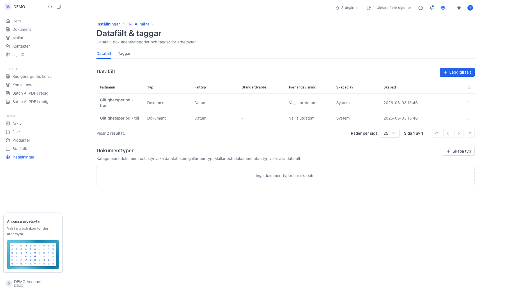
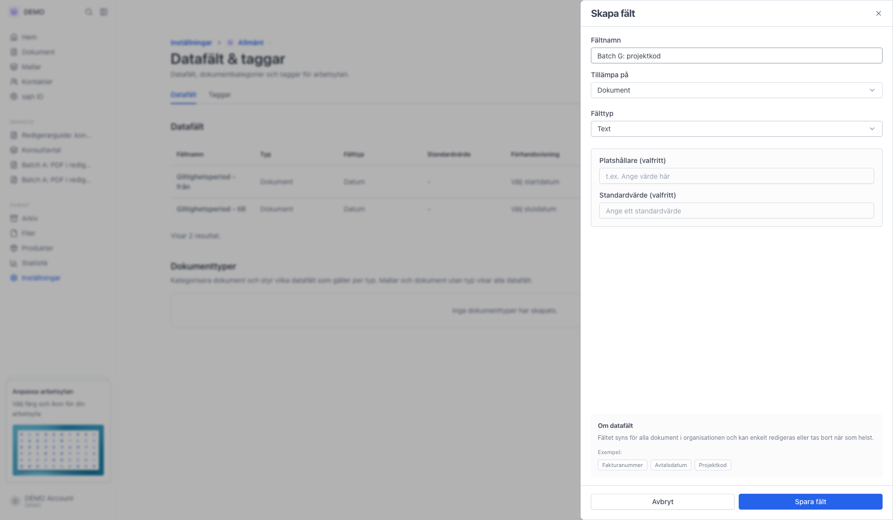
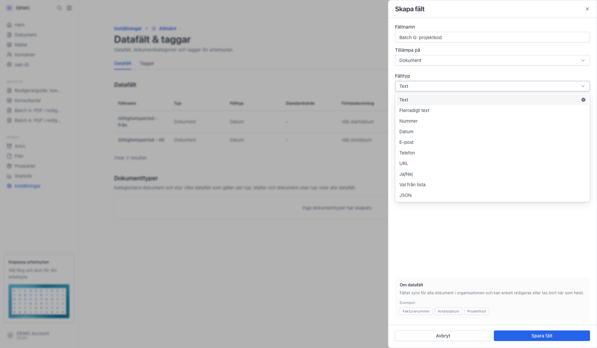
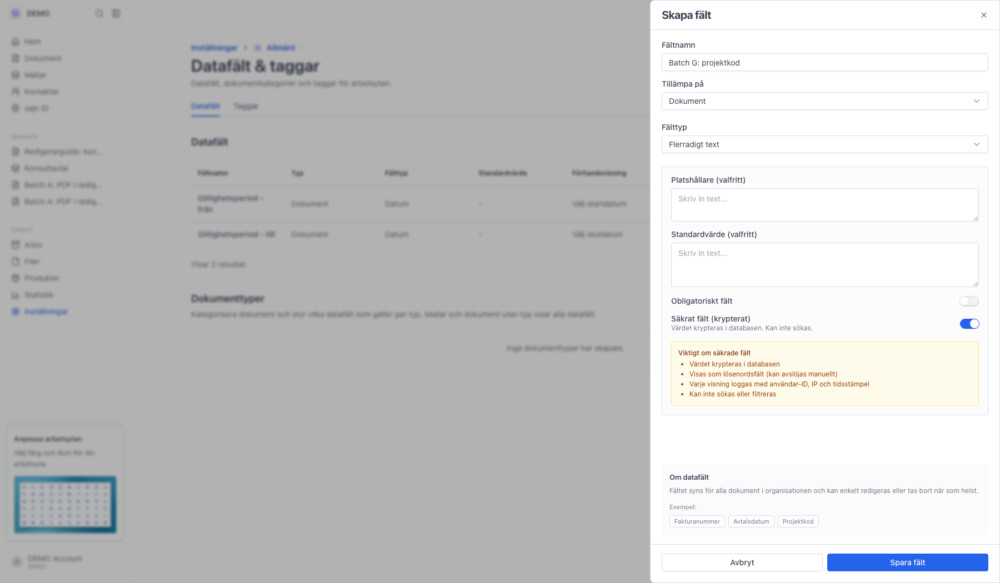

# Skapa egna datafält för dokument och kontakter

<!--
slug: settings-custom-fields
audience: Arbetsyteadministratörer
last_verified: 2026-09-13
auto-generated from steps.json — edit the spec, then re-run the runner
-->

Rundtur av Datafält: var sidan ligger, vad kolumnerna betyder och hur du skapar ett fält.

## Innan du börjar

- Du är inloggad och har behörighet att hantera arbetsytans inställningar.

## Steg

### 1. Öppna Inställningar och sedan Datafält & taggar

Sidan har två flikar: Datafält och Taggar. Fliken Datafält innehåller i sin tur två avsnitt — Datafält och Dokumenttyper.

### 2. Panelen Skapa fält

Fältnamn är det du och dina kollegor ser. Tillämpa på avgör om fältet hör till dokument eller kontakter, och Fälttyp avgör vad som får skrivas in.

### 3. Fälttyperna du kan välja mellan

JSON finns bara för dokumentfält. De andra tio gäller både dokument och kontakter.

### 4. Säkrat fält krypterar värdet

Säkrat fält går bara att slå på för Text och Flerradigt text, och bara när fältet skapas. Rutan som dyker upp räknar upp följderna: värdet krypteras, visas dolt, varje visning loggas och fältet går inte att söka på.

---

*Senast verifierad: 2026-09-13. Generad av `scripts/guide-runner.ts`.*
