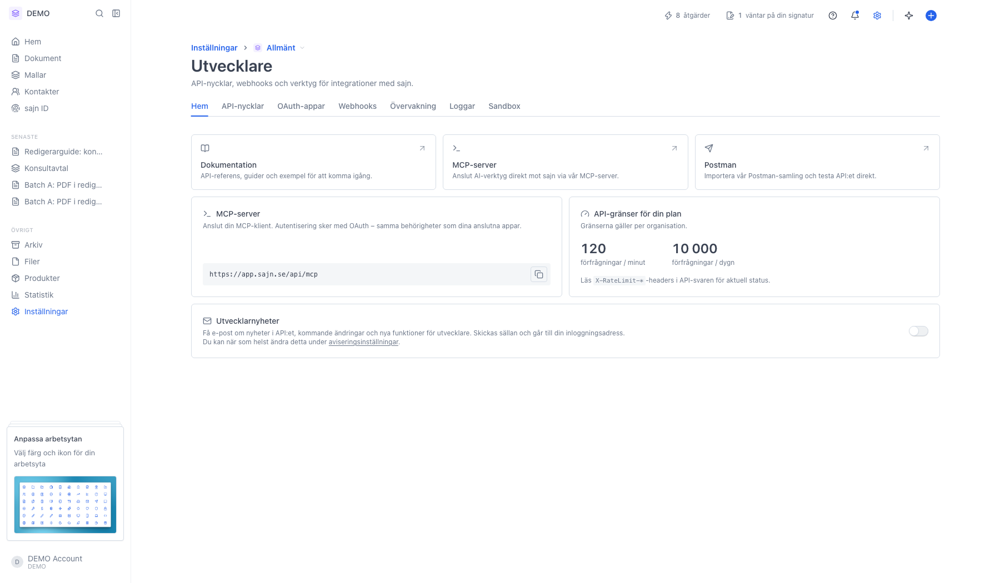
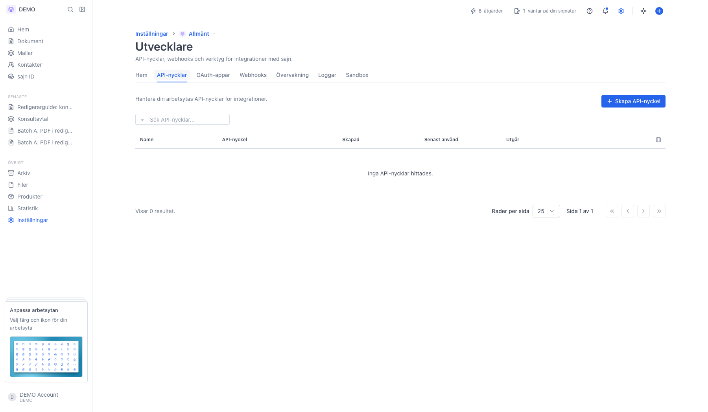
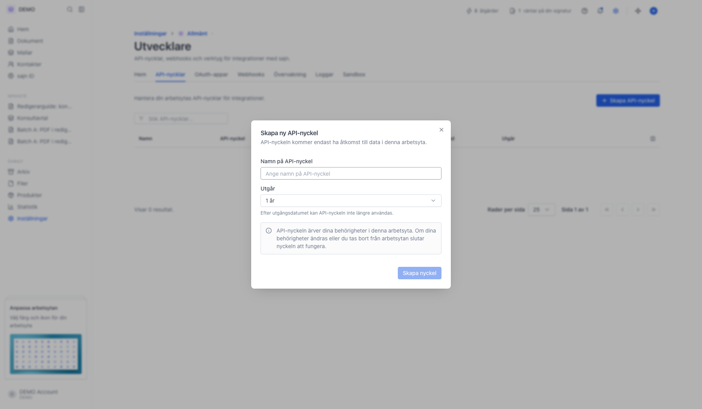
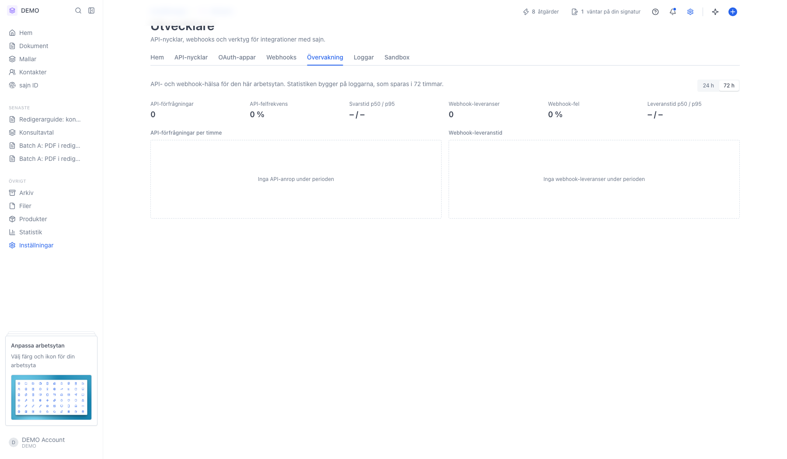
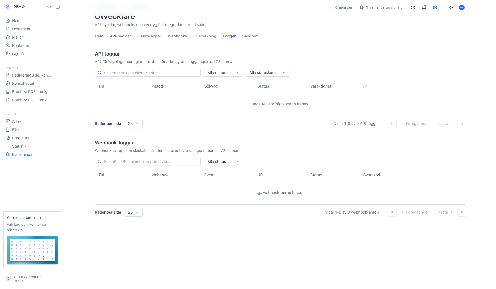

# Hantera API-nycklar och utvecklarinställningar

<!--
slug: settings-developer-api
audience: Utvecklare och arbetsyteadministratörer
last_verified: 2026-09-13
auto-generated from steps.json — edit the spec, then re-run the runner
-->

Rundtur av Utvecklare: flikarna, API-nycklarna, övervakningen och loggarna. Guiden skapar ingen nyckel.

## Innan du börjar

- Du är inloggad och har behörighet att hantera API-nycklar eller webhooks i arbetsytan.
- API-åtkomst ingår i Team och Enterprise.

## Steg

### 1. Öppna Inställningar och sedan Utvecklare

Sidan hör till arbetsytan, inte organisationen. Fliken Hem samlar dokumentation, MCP-server, Postman och arbetsytans API-gränser.

### 2. Fliken API-nycklar listar arbetsytans nycklar

Kolumnerna är Namn, en maskad API-nyckel, Skapad, Senast använd och Utgår. Sökfältet filtrerar på namn.

### 3. Dialogen Skapa ny API-nyckel

Du anger ett namn och hur länge nyckeln ska gälla. Hela nyckelvärdet visas bara en gång, direkt efter att den skapats.

### 4. Övervakning visar API- och webhook-hälsa

Statistiken bygger på loggarna och täcker därför samma 72 timmar som de.

### 5. Loggar har både API-anrop och webhook-leveranser

Överst ligger API-loggarna, under dem webhook-leveranserna. Båda sparas i 72 timmar.

---

*Senast verifierad: 2026-09-13. Generad av `scripts/guide-runner.ts`.*
