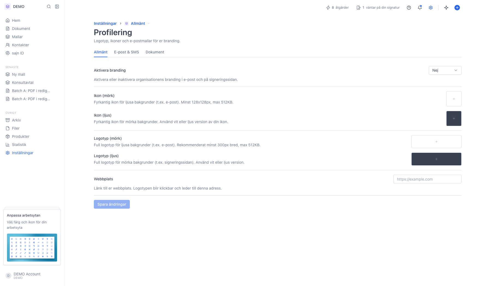
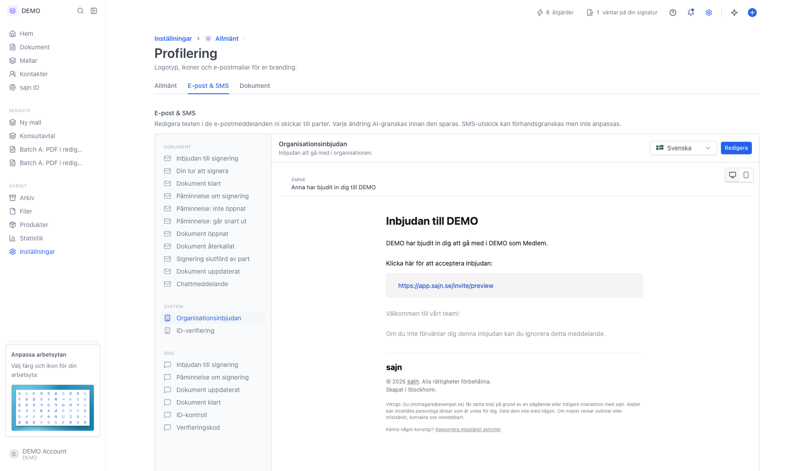
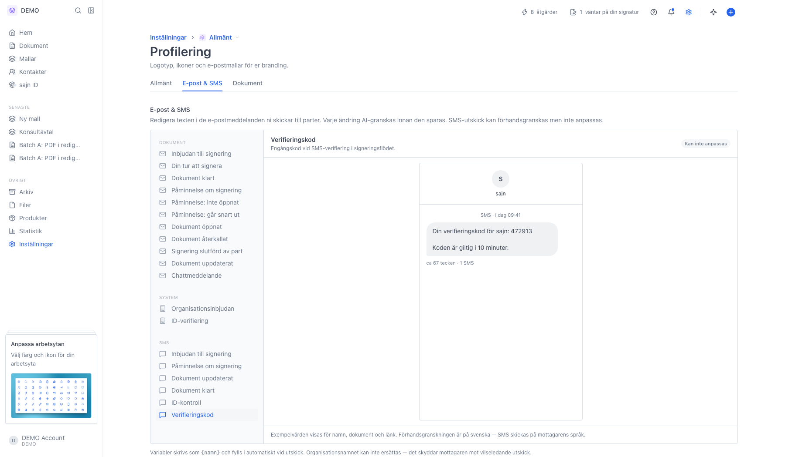
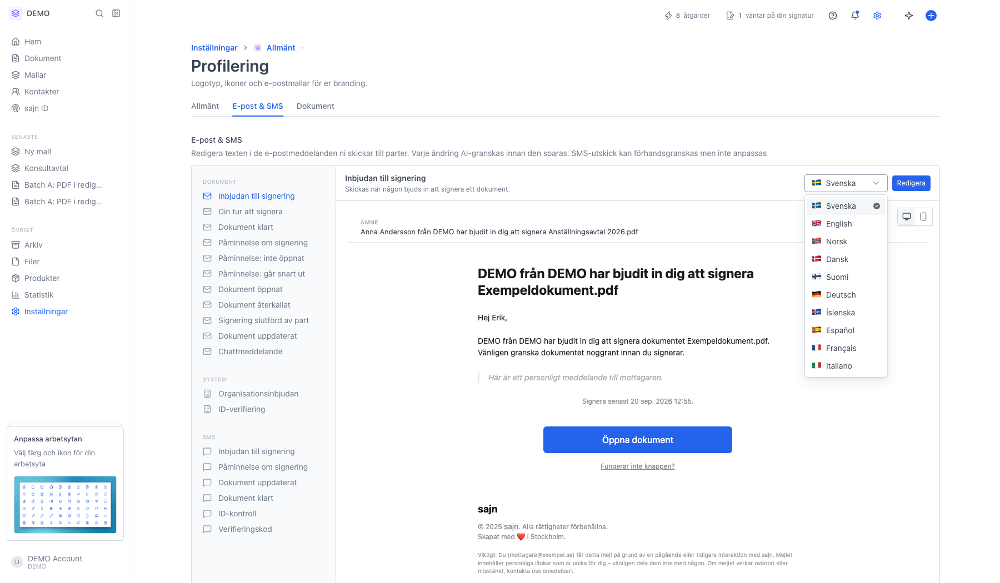
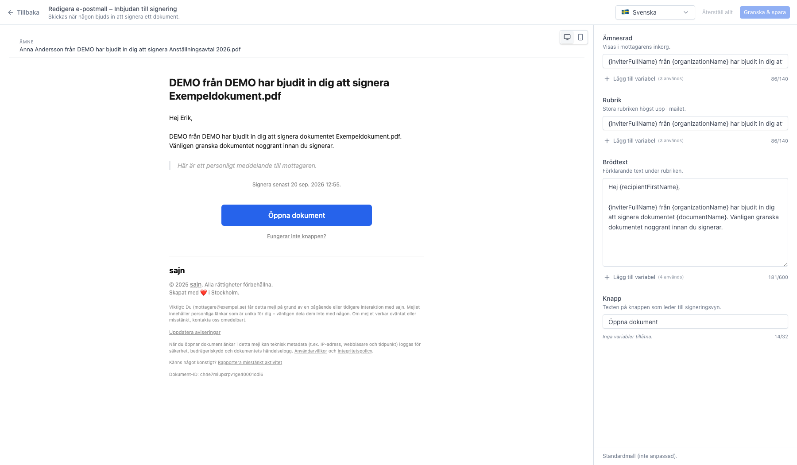
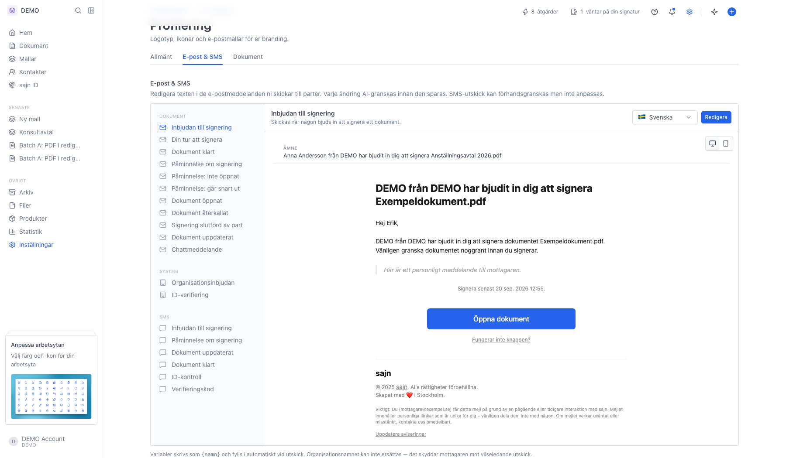

# Anpassa e-postmallar per språk

<!--
slug: settings-email-templates
audience: Arbetsyteadministratörer
last_verified: 2026-09-13
auto-generated from steps.json — edit the spec, then re-run the runner
-->

Rundtur av E-post & SMS under Profilering: var sidan ligger, vilka mallar som finns och hur redigeraren fungerar.

## Innan du börjar

- Du är inloggad och har behörighet att hantera arbetsytans inställningar.
- Profilering kräver Solo eller högre.

## Steg

### 1. Öppna Inställningar och sedan Profilering

Profilering ligger under arbetsytans inställningar och har tre flikar: Allmänt, E-post & SMS och Dokument.

### 2. Gå till fliken E-post & SMS

Sidan listar alla utskick sajn gör i ert namn. Texten överst förklarar att varje ändring AI-granskas innan den sparas, och att SMS går att förhandsgranska men inte anpassa.

### 3. System: utskick som inte hör till ett dokument

Under System ligger Organisationsinbjudan och ID-verifiering. De anpassas på samma sätt som dokumentmallarna.

### 4. SMS kan förhandsgranskas men inte ändras

Den tredje gruppen är SMS. Här ser du exakt vad mottagaren får i telefonen, men texterna är låsta.

### 5. Byt språk för att se översättningen

Varje språk har sin egen version av mallen. Anpassar du den svenska texten ändras inte den engelska.

### 6. Redigeraren visar förhandsvisning till vänster och textfälten till höger

Varje textstycke i mejlet är ett eget fält. Förhandsvisningen uppdateras medan du skriver och kan växlas mellan dator och mobil. Återställ allt tar tillbaka standardtexten, och Granska & spara skickar ändringen till AI-granskning.

### 7. Variabler fylls i automatiskt vid utskick

Raden under rutan påminner om att variabler skrivs som {namn} och fylls i vid utskick. Organisationsnamnet går inte att byta ut.

---

*Senast verifierad: 2026-09-13. Generad av `scripts/guide-runner.ts`.*
