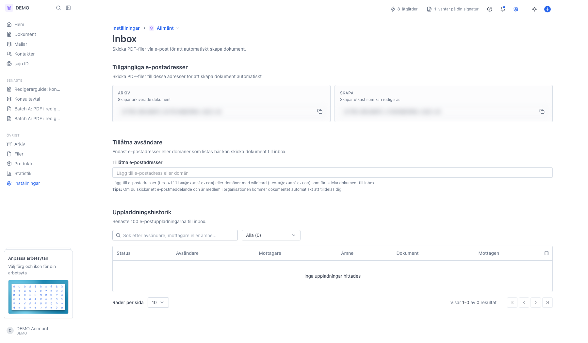

# Skicka in dokument via inbox-e-post

<!--
slug: settings-inbox
audience: Arbetsyteadministratörer
last_verified: 2026-09-13
auto-generated from steps.json — edit the spec, then re-run the runner
-->

Rundtur av Inbox: arbetsytans två inbox-adresser, vem som får mejla in och vad som hände med varje mejl.

## Innan du börjar

- Du är inloggad och har behörighet att hantera arbetsytans inställningar.
- Inbox kräver Solo eller högre.

## Steg

### 1. Öppna Inställningar och sedan Inbox

Sidan har tre avsnitt ovanifrån och ned: Tillgängliga e-postadresser, Tillåtna avsändare och Uppladdningshistorik. Adresserna är maskade i bilden.

---

*Senast verifierad: 2026-09-13. Generad av `scripts/guide-runner.ts`.*
