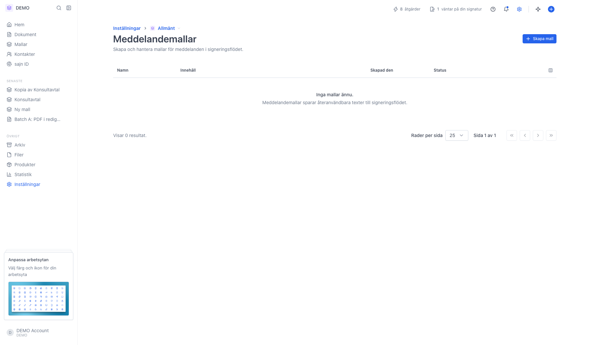
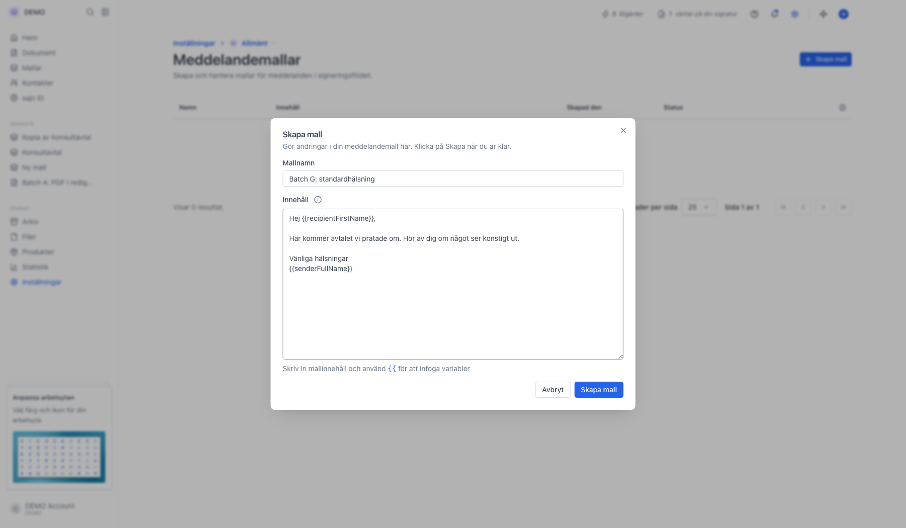
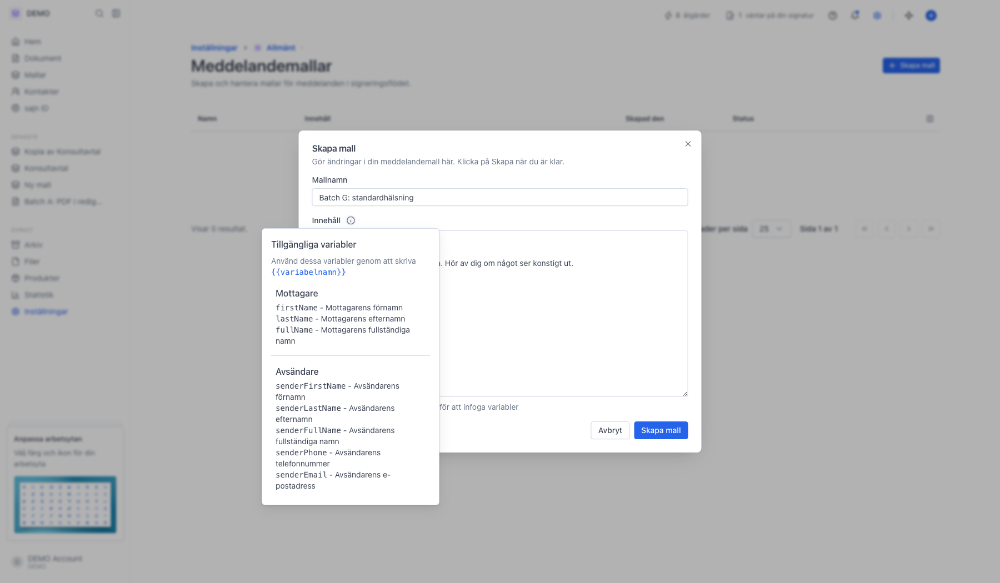
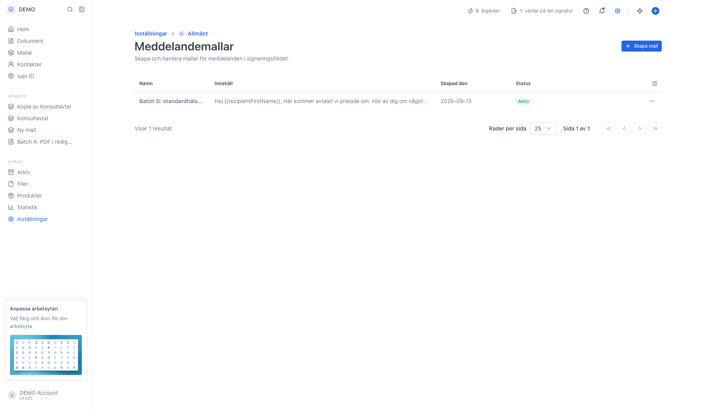
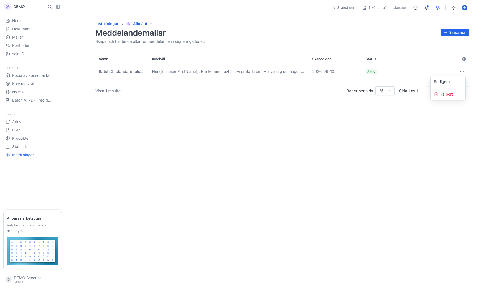

# Spara meddelandemallar för utskick

<!--
slug: settings-message-templates
audience: Arbetsyteadministratörer
last_verified: 2026-09-13
auto-generated from steps.json — edit the spec, then re-run the runner
-->

Rundtur av Meddelandemallar: var sidan ligger, hur du sparar en mall och hur den plockas upp när du skickar ett dokument.

## Innan du börjar

- Du är inloggad och har behörighet att hantera arbetsytans inställningar.

## Steg

### 1. Öppna Inställningar och sedan Meddelandemallar

Mallarna hör till arbetsytan du står i. Är listan tom står det Inga mallar ännu.

### 2. Fyll i mallnamn och innehåll

Mallnamnet är bara till för dig och syns i utskicksdialogen. Innehållet är texten mottagaren får.

### 3. Informationsikonen listar alla variabler

Skriv två klammerparenteser i innehållsfältet så dyker samma lista upp direkt där du skriver.

### 4. Den sparade mallen i listan

Varje rad visar namn, en förhandsvisning av innehållet, när mallen skapades och status. Menyn längst till höger har Redigera och Ta bort.

### 5. Menyn på raden har Redigera och Ta bort

---

*Senast verifierad: 2026-09-13. Generad av `scripts/guide-runner.ts`.*
