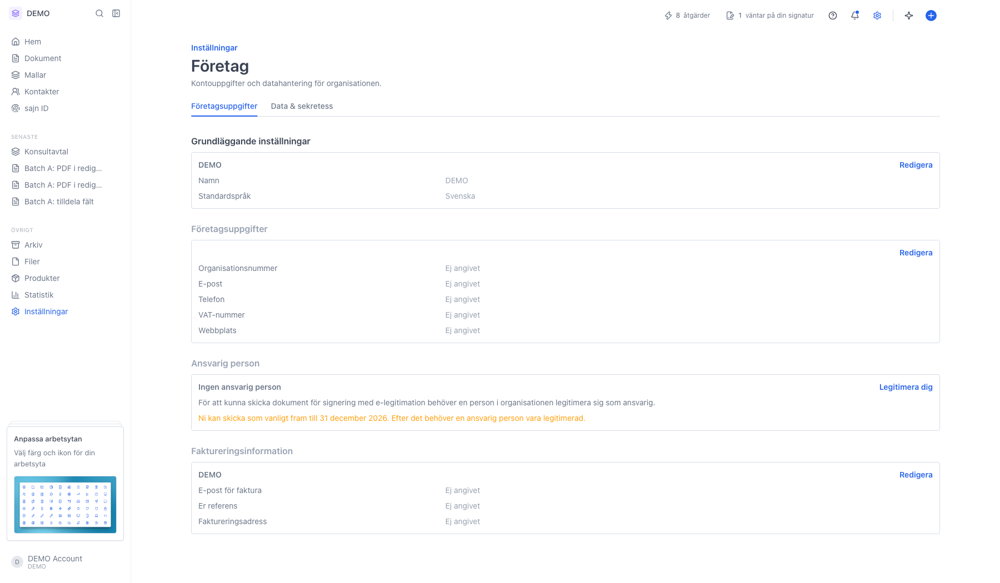
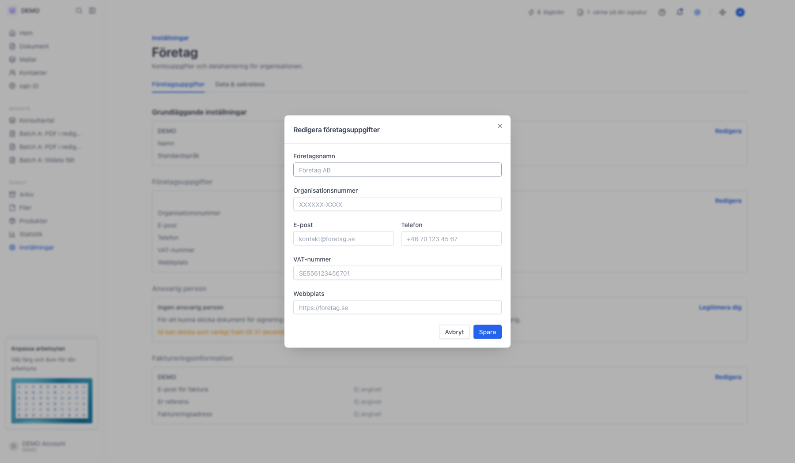
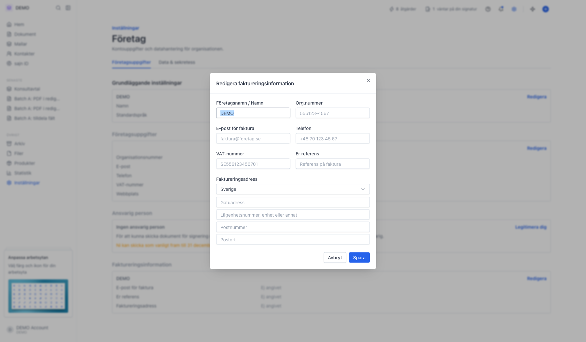

# Företagsuppgifter

<!--
slug: settings-organization-business-details
audience: Organisationsadministratörer
last_verified: 2026-09-13
auto-generated from steps.json — edit the spec, then re-run the runner
-->

Sidan Företag samlar organisationens kontouppgifter: visningsnamn, standardspråk, juridiska företagsuppgifter, ansvarig person och faktureringsuppgifter.

## Innan du börjar

- Du är inloggad och har behörighet att hantera organisationens inställningar.

## Steg

### 1. Öppna Inställningar och välj Företag

Sidan heter Företag och har två flikar: Företagsuppgifter och Data & sekretess. Uppgifterna gäller hela organisationen, alltså alla arbetsytor. Varje kort redigeras för sig via länken Redigera i kortets övre högra hörn.

### 2. Företagsuppgifter är de formella uppgifterna

Företagsnamn är det juridiska namnet och behöver inte vara samma som visningsnamnet högst upp. Här fyller du också i organisationsnummer, e-post, telefon, VAT-nummer och webbplats. Fält du lämnar tomma visas som Ej angivet på sidan.

### 3. Faktureringsinformation styr vart fakturan går

E-post för faktura är adressen fakturor från sajn skickas till; lämnas den tom används organisationens allmänna e-postadress. Er referens är fri text som hamnar på fakturan, till exempel ett kostnadsställe. Adressen används på fakturan.

---

*Senast verifierad: 2026-09-13. Generad av `scripts/guide-runner.ts`.*
