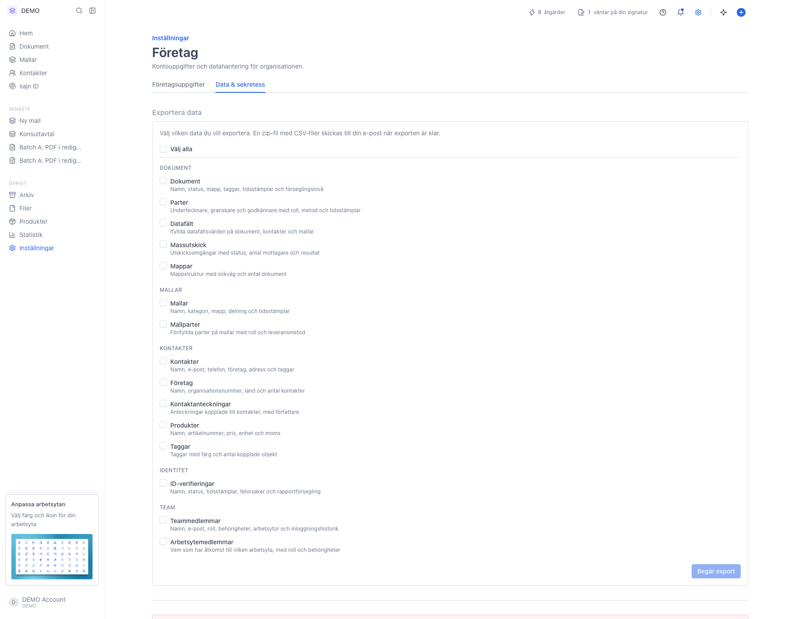
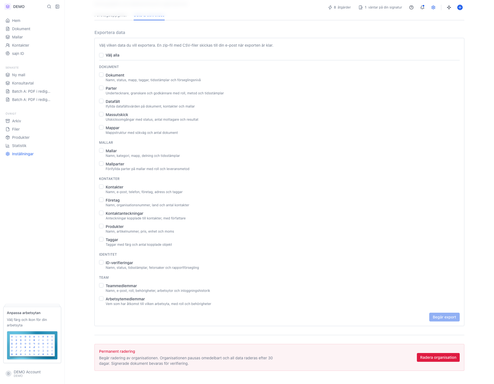

# Data och sekretess

<!--
slug: settings-organization-data-privacy
audience: Organisationsadministratörer och ägare
last_verified: 2026-09-13
auto-generated from steps.json — edit the spec, then re-run the runner
-->

Under Data & sekretess exporterar ni organisationens data och begär, som ägare, permanent radering av hela organisationen.

## Innan du börjar

- Du är inloggad och har behörigheten Administratör i organisationen.

## Steg

### 1. Öppna Företag och välj fliken Data & sekretess

Sidan ligger bredvid Företagsuppgifter under Inställningar › Företag. Överst ligger Exportera data, längst ned Permanent radering för organisationens ägare.

### 2. Knappen Begär export ligger längst ned i kortet

Knappen är inaktiverad tills minst en datatyp är vald. Exporten körs i bakgrunden och en zip-fil med CSV-filer skickas till e-postadressen på ditt användarkonto.

---

*Senast verifierad: 2026-09-13. Generad av `scripts/guide-runner.ts`.*
