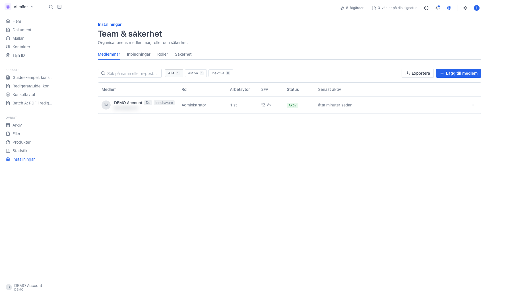
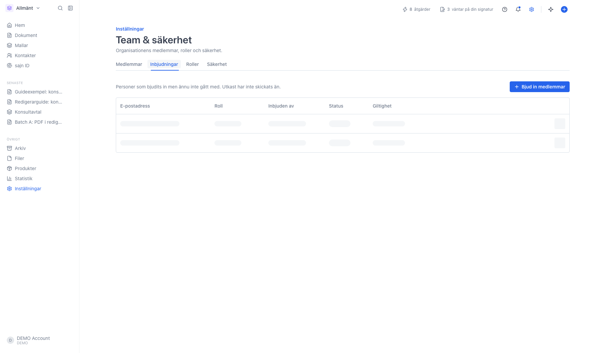
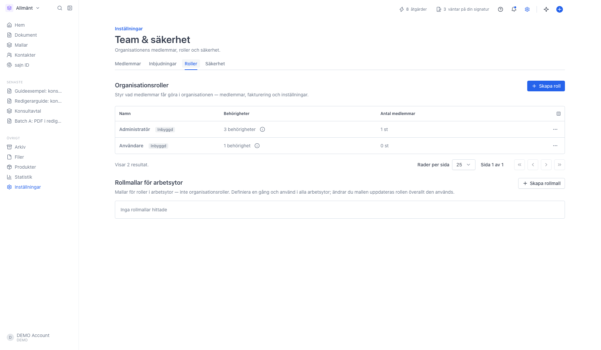

# Hantera organisationens medlemmar och roller

<!--
slug: settings-organization-members-roles
audience: Organisationsadministratörer
last_verified: 2026-09-13
auto-generated from steps.json — edit the spec, then re-run the runner
-->

Organisationen är hela företagskontot, arbetsytorna är rummen inuti det. Under Team & säkerhet ser du alla som har tillgång till organisationen, vilken organisationsroll de har och hur många arbetsytor de är med i. Guiden ändrar ingenting.

## Innan du börjar

- Du är inloggad som kontoinnehavare eller administratör för organisationen.
- Sidan Team & säkerhet kräver Team eller Enterprise.

## Steg

### 1. Öppna Team & säkerhet

Sidan ligger under Organisationsinställningar och har fyra flikar: Medlemmar, Inbjudningar, Roller och Säkerhet. Fliken Medlemmar listar alla som har tillgång till organisationen, oavsett vilken arbetsyta de arbetar i.

Kolumnerna är Medlem (namn och e-postadress), Roll (organisationsrollen), Arbetsytor (hur många arbetsytor personen är med i), 2FA (På eller Av), Status och Senast aktiv. Märket Innehavare visar vem som äger kontot, och Du markerar dig själv.

Ovanför tabellen filtrerar knapparna Alla, Aktiva och Inaktiva, sökrutan söker på namn eller e-post och Exportera laddar ner listan som en CSV-fil.

### 2. Inbjudningar har en egen flik

Personer du har bjudit in syns inte i medlemslistan förrän de tackat ja. Fram till dess ligger de här, med kolumnerna E-postadress, Roll, Inbjuden av, Status och Giltighet. Status är Utkast för en inbjudan som ännu inte skickats och Väntar på svar för en skickad. Giltighet visar när inbjudan går ut.

### 3. Roller styr vad medlemmar får göra

Organisationsroller gäller organisationen: medlemmar, fakturering och inställningar. Vad någon får göra med dokument avgörs i stället av arbetsyterollerna. De färdiga rollerna heter Administratör och Användare och är märkta Inbyggd. Behörigheter visar antalet rättigheter i rollen, och info-ikonen listar dem. Antal medlemmar visar hur många som har rollen just nu.

Längst ner ligger Rollmallar för arbetsytor. Det är arbetsyteroller som du definierar en gång och använder i alla arbetsytor, inte organisationsroller. De har en egen guide.

---

*Senast verifierad: 2026-09-13. Generad av `scripts/guide-runner.ts`.*
