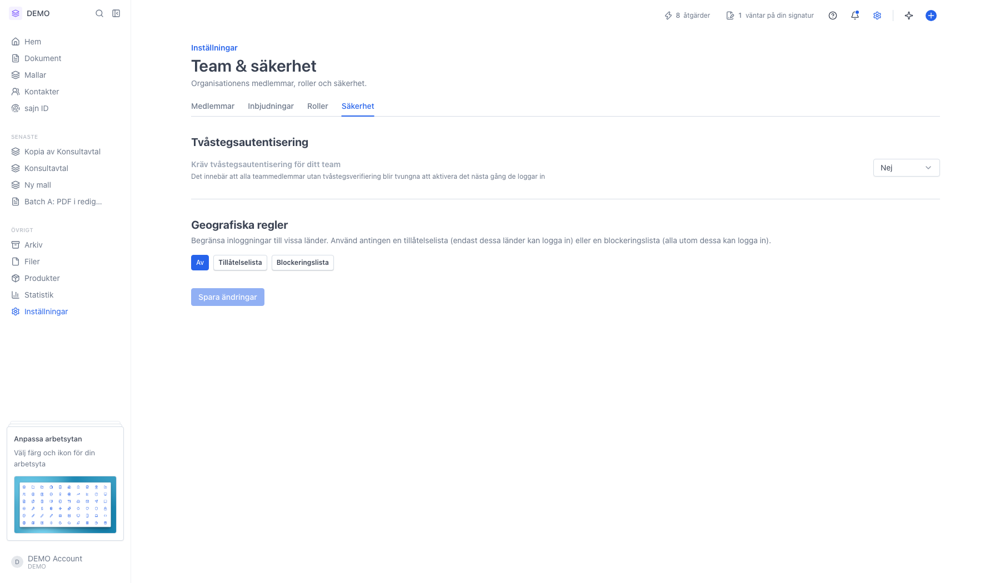
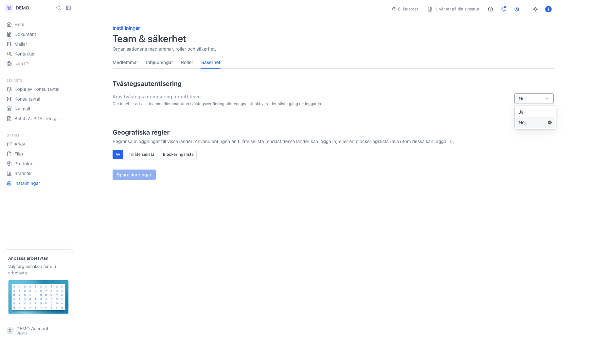
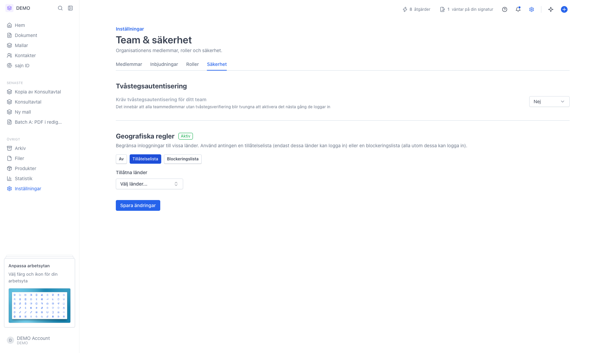

# Säkerhetsinställningar för organisationen

<!--
slug: settings-organization-security
audience: Organisationsadministratörer
last_verified: 2026-09-13
auto-generated from steps.json — edit the spec, then re-run the runner
-->

Under Team & säkerhet › Säkerhet kan du kräva tvåstegsautentisering för alla medlemmar och begränsa vilka länder som får logga in.

## Innan du börjar

- Du är inloggad och har behörighet att hantera organisationens inställningar.

## Steg

### 1. Öppna Team & säkerhet och välj fliken Säkerhet

Sidan har två sektioner: Tvåstegsautentisering och Geografiska regler. Knappen Spara ändringar längst ned är grå tills du har ändrat något.

### 2. Tvåstegsautentisering: välj Ja för att tvinga hela teamet

Med Ja måste alla teammedlemmar utan tvåstegsverifiering aktivera det nästa gång de loggar in. Med Nej är det frivilligt per användare.

### 3. Geografiska regler: välj läge och länder

Av betyder inga begränsningar. Tillåtelselista släpper bara in de länder du väljer. Blockeringslista släpper in alla utom de du väljer. När ett annat läge än Av är aktivt får rubriken en grön etikett Aktiv.

---

*Senast verifierad: 2026-09-13. Generad av `scripts/guide-runner.ts`.*
