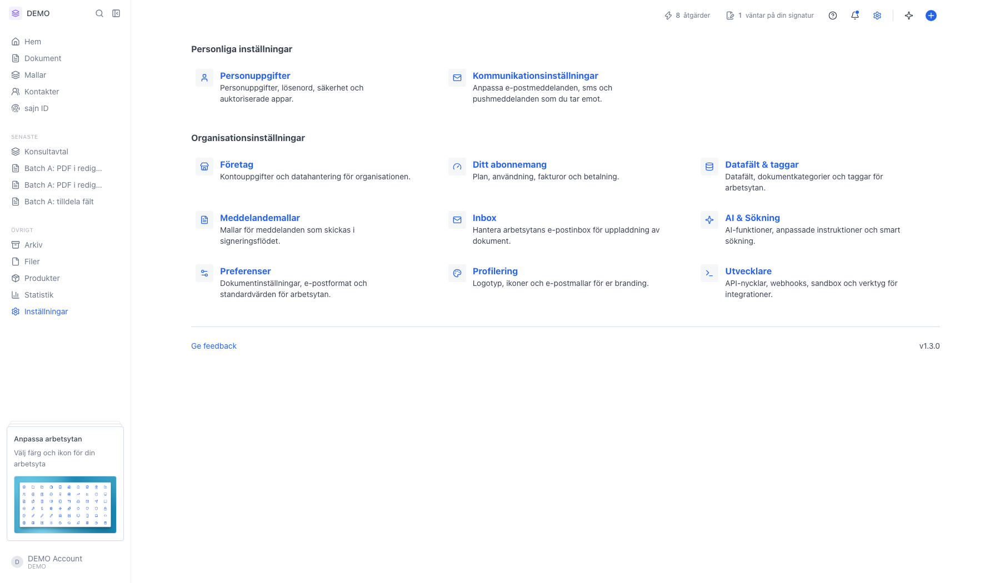
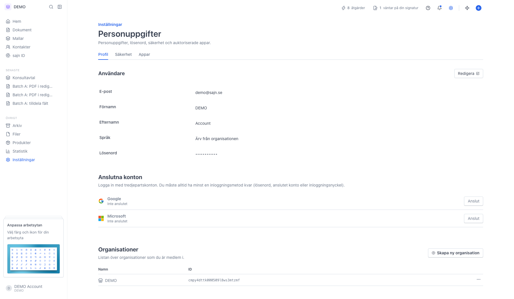
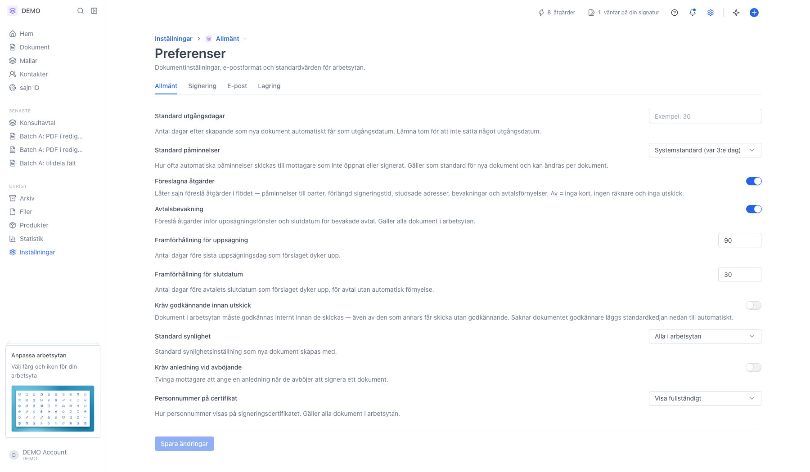
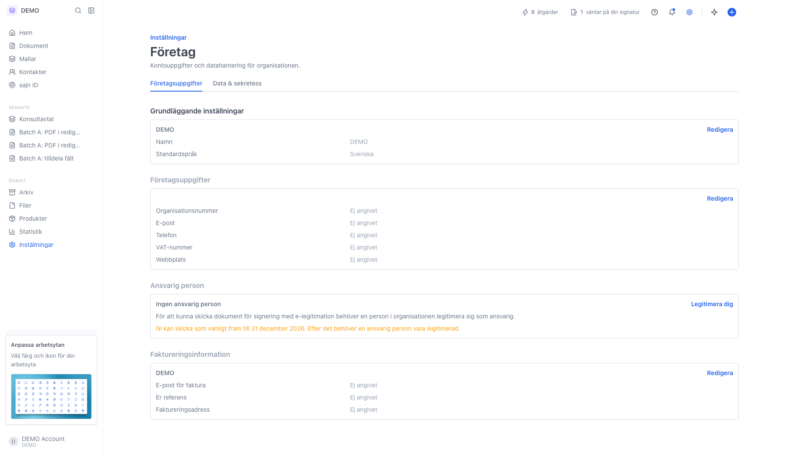

# Hitta rätt i inställningarna

<!--
slug: settings-overview
audience: Alla användare
last_verified: 2026-09-13
auto-generated from steps.json — edit the spec, then re-run the runner
-->

Inställningarna är grupperade i nivåer: personliga inställningar som bara gäller dig, arbetsyteinställningar som gäller en arbetsyta och organisationsinställningar som gäller hela kontot. Guiden visar strukturen och tar några exempel, utan att gå in i en enskild inställning.

## Innan du börjar

- Du är inloggad i sajn.

## Steg

### 1. Öppna Inställningar i sidomenyn

Varje kort är en länk till en inställningssida. Saknas ett kort har du antingen inte behörighet, eller så ingår funktionen inte i ert abonnemang. Längst ner finns Ge feedback och versionsnumret — numret är bra att ha med om du kontaktar supporten.

### 2. Personliga inställningar följer ditt konto

Personuppgifter och Kommunikationsinställningar hör till dig som användare och ser likadana ut oavsett vilken arbetsyta du står i. Personuppgifter har tre flikar: Profil, Säkerhet och Appar.

### 3. Arbetsyteinställningar gäller en arbetsyta i taget

Preferenser, Datafält & taggar, Meddelandemallar, Inbox, AI & Sökning och Profilering hör till arbetsytan. Byter du arbetsyta får du en egen uppsättning. Väljaren bredvid brödsmulan högst upp visar vilken arbetsyta du ändrar.

### 4. Organisationsinställningar gäller hela kontot

Företagsuppgifter, abonnemang, medlemmar och roller delas av alla i organisationen. På paket med en enda arbetsyta — Basic och Solo — visas arbetsytekorten under samma rubrik som organisationskorten, eftersom det ändå bara finns en arbetsyta att välja mellan. Först med flera arbetsytor delas listan upp i två rubriker.

---

*Senast verifierad: 2026-09-13. Generad av `scripts/guide-runner.ts`.*
