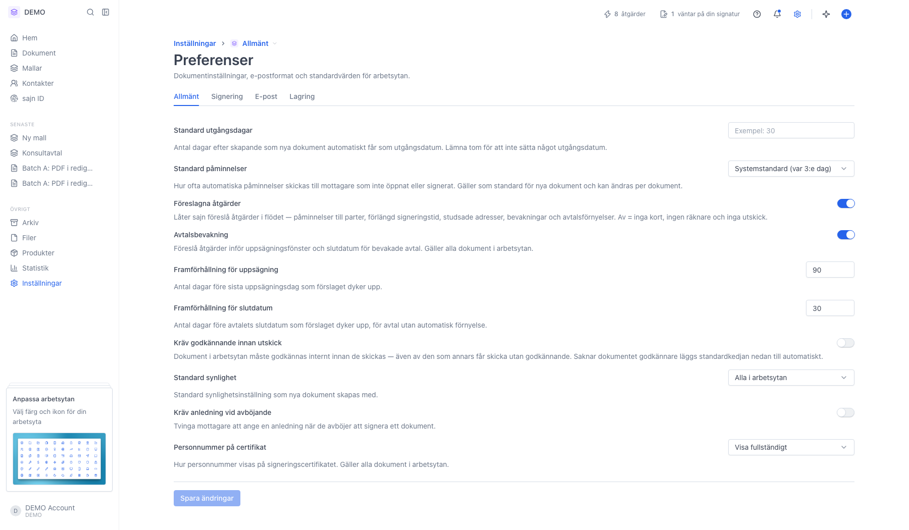
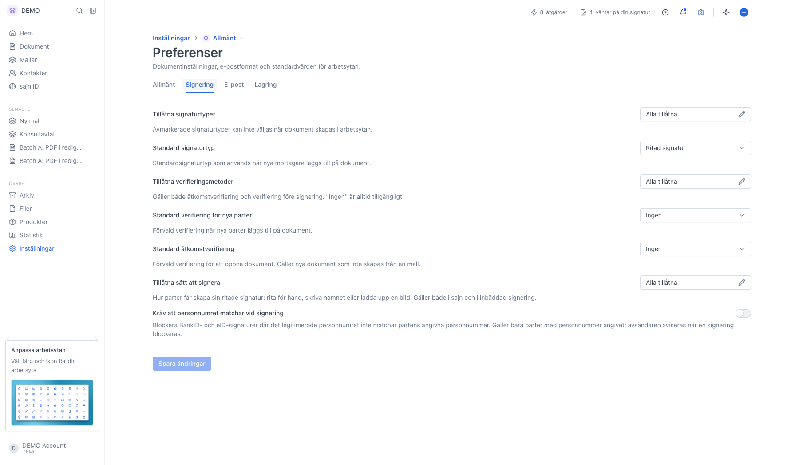
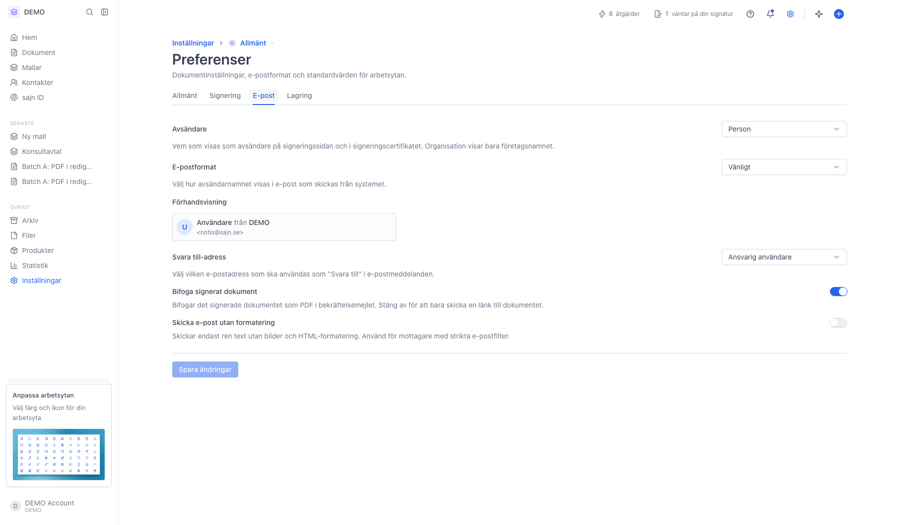
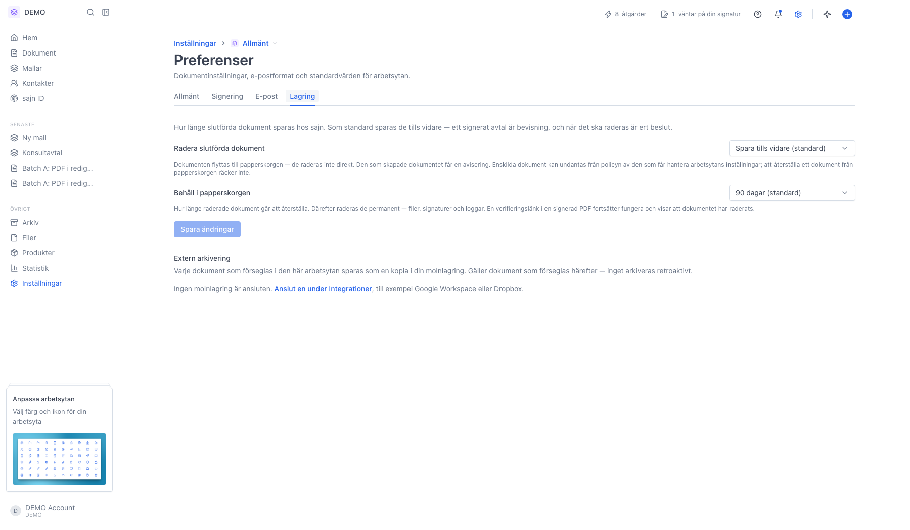

# Standardvärden för arbetsytan

<!--
slug: settings-preferences
audience: Arbetsyteadministratörer
last_verified: 2026-09-13
auto-generated from steps.json — edit the spec, then re-run the runner
-->

Preferenser samlar de standardvärden som nya dokument och utgående mejl får i den här arbetsytan. Sidan har fyra flikar: Allmänt, Signering, E-post och Lagring. Guiden går igenom en flik i taget utan att ändra något.

## Innan du börjar

- Du är inloggad och har behörighet att hantera arbetsytans inställningar.
- Inställningarna är arbetsytespecifika — byter du arbetsyta får du en egen uppsättning.

## Steg

### 1. Allmänt — utgångsdatum, påminnelser och synlighet

Standard utgångsdagar är antal dagar efter skapandet som nya dokument får som utgångsdatum; lämna fältet tomt för att inte sätta något alls. Standard påminnelser styr hur ofta automatiska påminnelser går ut till parter som inte öppnat eller signerat. Föreslagna åtgärder och Avtalsbevakning låter sajn föreslå påminnelser, förlängd signeringstid och bevakning av uppsägnings- och slutdatum, med framförhållningen i dagar under. Kräv godkännande innan utskick tvingar intern attest före utskick, Standard synlighet bestämmer vilka kollegor som ser ett nytt dokument, Kräv anledning vid avböjande tvingar mottagaren att motivera sig, och Personnummer på certifikat styr hur personnumret visas på signeringscertifikatet. Varje flik har en egen Spara ändringar-knapp som tänds först när du ändrat något.

### 2. Signering — vilka sätt att signera och verifiera som är tillåtna

Tillåtna signaturtyper och Tillåtna verifieringsmetoder bockar bort det arbetsytan inte ska kunna välja; det som är avmarkerat går inte att välja när ett dokument skapas. Standard signaturtyp och Standard verifiering för nya parter är förvalen nya parter får, och Standard åtkomstverifiering är förvalet för att öppna dokumentet. Tillåtna sätt att signera styr hur en ritad signatur får skapas: rita för hand, skriva namnet eller ladda upp en bild. Kräv att personnumret matchar vid signering blockerar BankID- och e-legitimationssignaturer där det legitimerade personnumret inte stämmer med det som angetts på parten.

### 3. E-post — avsändare, format och svarsadress

Avsändare bestämmer vem som visas som avsändare på signeringssidan och i signeringscertifikatet; Organisation visar bara företagsnamnet. E-postformat styr hur avsändarnamnet ser ut i mejlen, och rutan Förhandsvisning visar resultatet som mottagaren ser det. Svara till-adress avgör vart svar hamnar. Bifoga signerat dokument skickar med den signerade PDF:en i bekräftelsemejlet i stället för bara en länk, och Skicka e-post utan formatering skickar ren text för mottagare med strikta e-postfilter.

### 4. Lagring — hur länge slutförda dokument sparas

Som standard sparas slutförda dokument tills vidare. Väljer du en gräns flyttas dokumenten till papperskorgen när tiden gått ut — de raderas inte direkt, och den som skapade dokumentet får en avisering. Behåll i papperskorgen styr hur länge ett raderat dokument går att återställa; därefter raderas filer, signaturer och loggar permanent, men verifieringslänken i en signerad PDF fortsätter fungera och visar att dokumentet raderats. Extern arkivering längst ner sparar en kopia av varje förseglat dokument i din molnlagring, och kräver att du först ansluter en under Integrationer.

---

*Senast verifierad: 2026-09-13. Generad av `scripts/guide-runner.ts`.*
