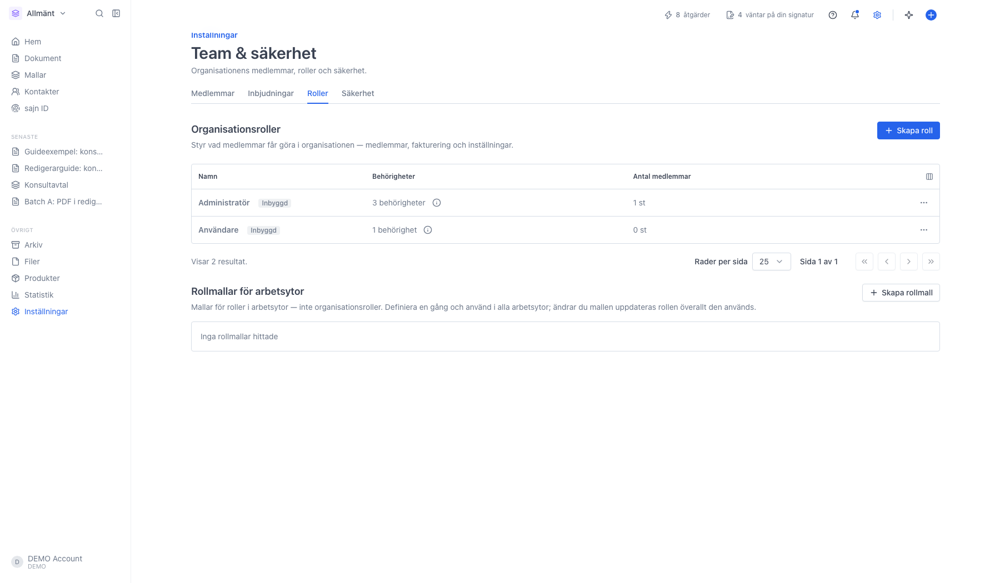
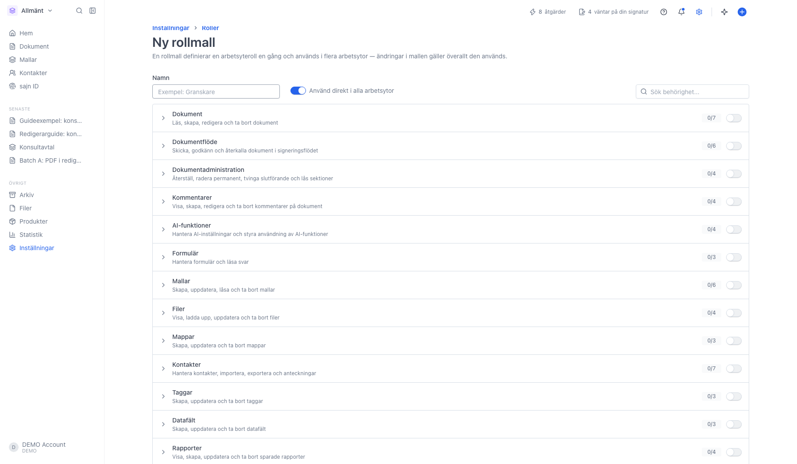
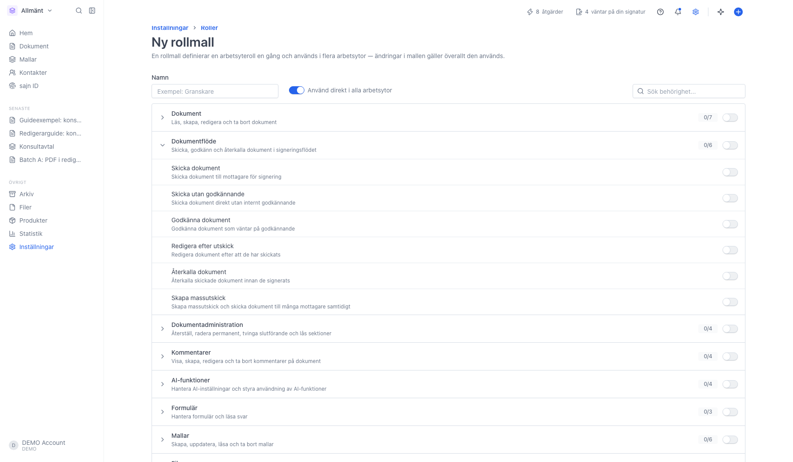

# Rollmallar för arbetsytor

<!--
slug: settings-role-blueprints
audience: Organisationsadministratörer
last_verified: 2026-09-13
auto-generated from steps.json — edit the spec, then re-run the runner
-->

En rollmall är en arbetsyteroll som du beskriver en gång på organisationsnivå och sedan använder i alla arbetsytor. Ändrar du mallen ändras rollen överallt den används. Rollmallar är alltså inte organisationsroller, utan ett sätt att slippa bygga om samma arbetsyteroll i varje arbetsyta.

## Innan du börjar

- Du är inloggad som kontoinnehavare eller administratör för organisationen.
- Rollmallar ligger under Team & säkerhet, som kräver Team eller Enterprise.
- Du har behörigheten Hantera roller i organisationen.

## Steg

### 1. Rollmallarna ligger längst ner på fliken Roller

Ovanför står organisationsrollerna, som styr vad någon får göra med själva organisationen. Rollmallarna under dem är arbetsyteroller. Avsnittet är tomt tills den första mallen finns. Varje mall får sedan en rad med namn, hur många behörigheter den ger och i hur många arbetsytor den används. Färdiga mallar som följer med organisationen är märkta Inbyggd och går bara att läsa.

### 2. Ge mallen ett namn och välj behörigheter

Namnet är det arbetsytorna kommer att se rollen som. Reglaget Använd direkt i alla arbetsytor lägger till rollen i varje arbetsyta så fort du sparar; slår du av det skapas bara mallen, och du väljer arbetsytor senare.

Behörigheterna ligger i grupper: Dokument, Dokumentflöde, Mallar, Kontakter, Rapporter och så vidare. Reglaget på gruppraden slår på hela gruppen. Räknaren nere till höger visar hur många av alla behörigheter mallen ger.

### 3. Fäll ut en grupp för enskilda behörigheter

Varje behörighet har ett eget reglage och en förklaring. I gruppen Dokumentflöde ligger bland annat Skicka dokument, Godkänna dokument och Skicka utan godkännande, som avgör vem som får vara godkännare i ett attestflöde. Sökrutan högst upp hittar en enskild behörighet utan att du behöver leta i grupperna.

---

*Senast verifierad: 2026-09-13. Generad av `scripts/guide-runner.ts`.*
