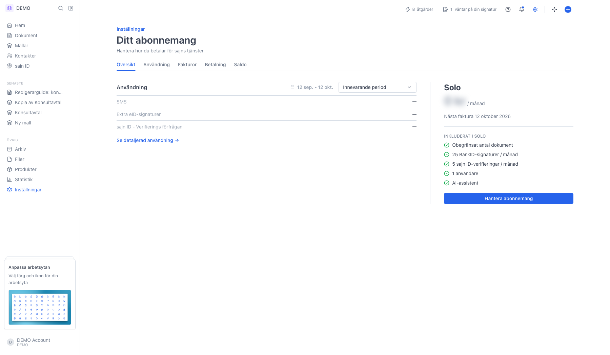
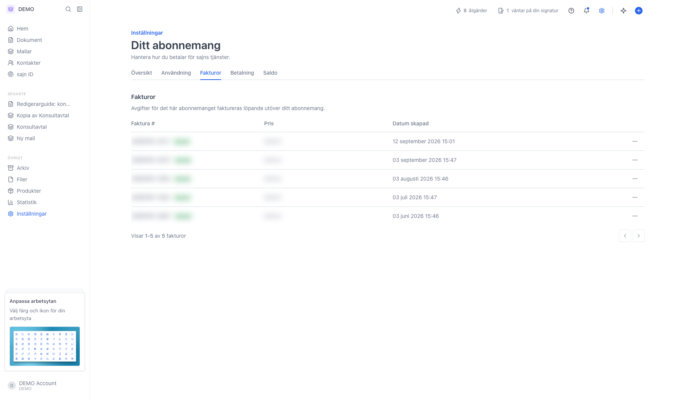
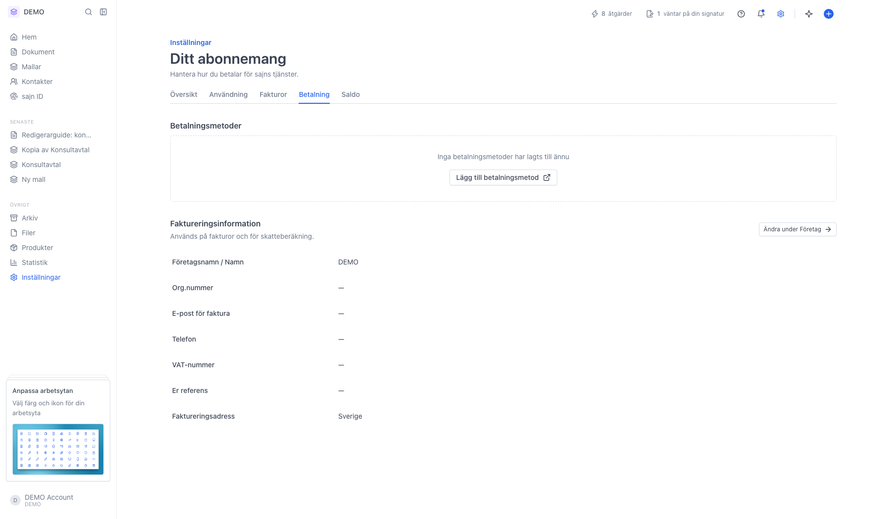
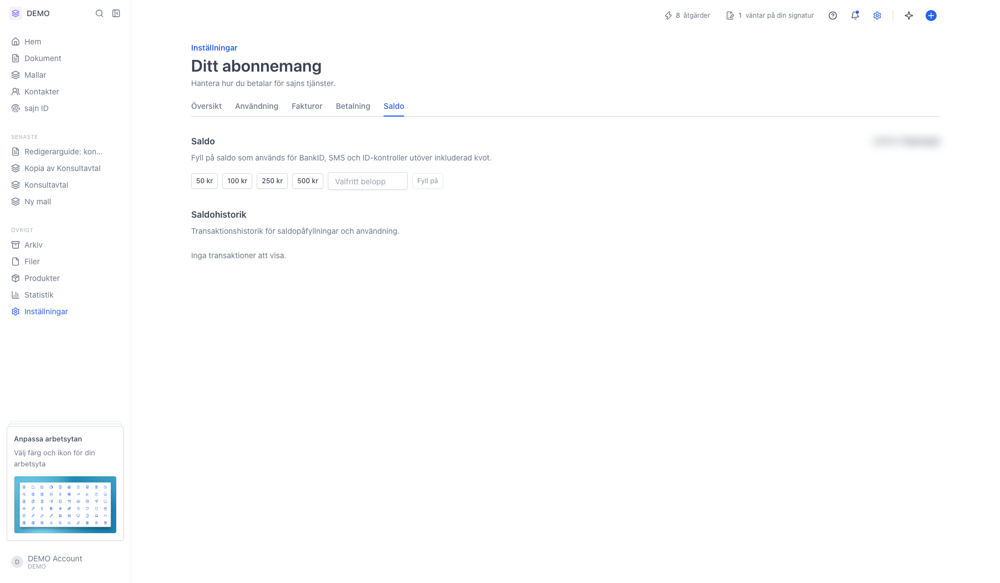
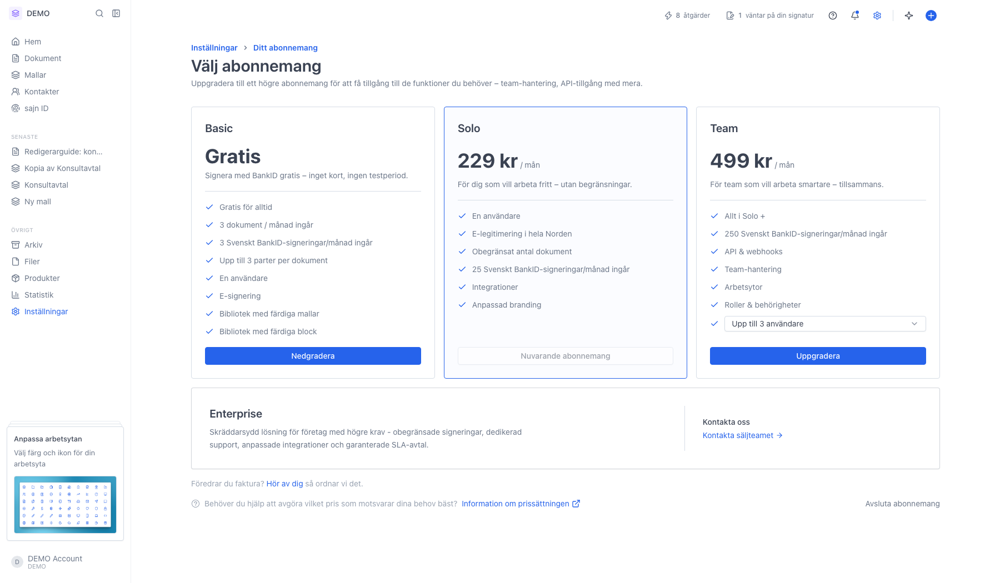

# Hantera din prenumeration och tillägg

<!--
slug: settings-subscription
audience: Organisationsadministratörer
last_verified: 2026-09-13
auto-generated from steps.json — edit the spec, then re-run the runner
-->

Under Ditt abonnemang ser du vilken plan organisationen har, vad som ingår, när nästa faktura skickas och var fakturorna ligger.

## Innan du börjar

- Du är inloggad och har behörighet att hantera organisationens abonnemang.

## Steg

### 1. Öppna Inställningar och välj Ditt abonnemang

Sidan gäller hela organisationen; alla arbetsytor delar samma abonnemang. Till höger står planen, priset och datum för nästa faktura, under det vad som ingår. Till vänster sammanfattas periodens rörliga avgifter.

### 2. Fliken Fakturor listar alla utställda fakturor

Varje rad har fakturanummer, status, belopp och datum. Menyn med tre punkter längst till höger öppnar fakturan hos vår betalleverantör eller laddar ner PDF:en.

### 3. Fliken Betalning – betalmetoder och faktureringsuppgifter

Överst ligger organisationens betalmetoder. Under visas faktureringsinformationen skrivskyddad; den ändrar du under Inställningar › Företag via länken Ändra under Företag.

### 4. Fliken Saldo – fyll på och följ transaktionerna

Saldot täcker rörliga avgifter som SMS och extra signeringar. Fliken visas inte på Basic.

### 5. Välj abonnemang visar planerna sida vid sida

Basic, Solo och Team ligger som tre kort, med Enterprise som ett eget kort under. Din nuvarande plan är markerad och dess knapp är inaktiverad. På Team-kortet väljer du antal användare i listan. Längst ned finns Avsluta abonnemang om du redan har en betald plan.

---

*Senast verifierad: 2026-09-13. Generad av `scripts/guide-runner.ts`.*
