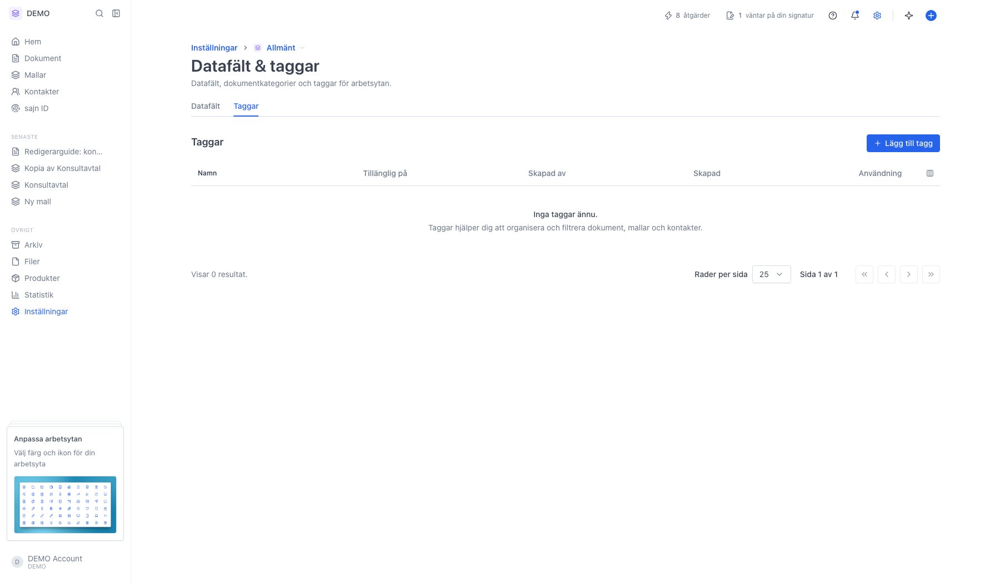
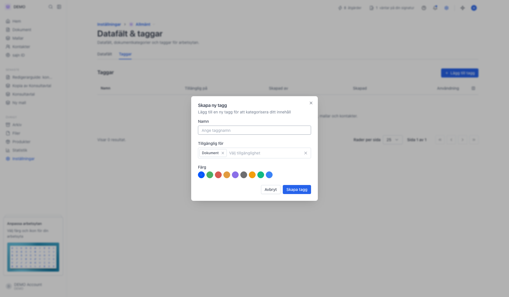
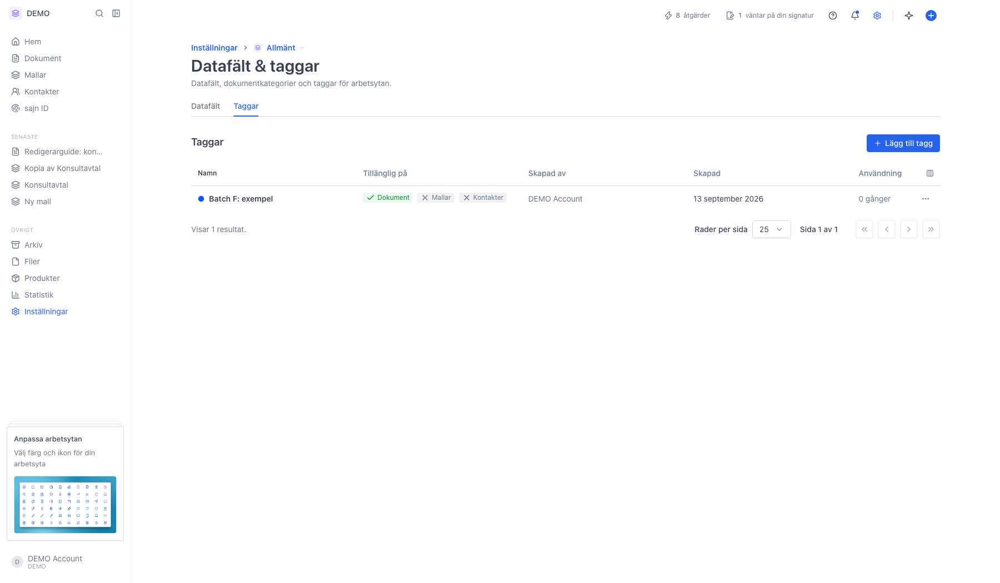
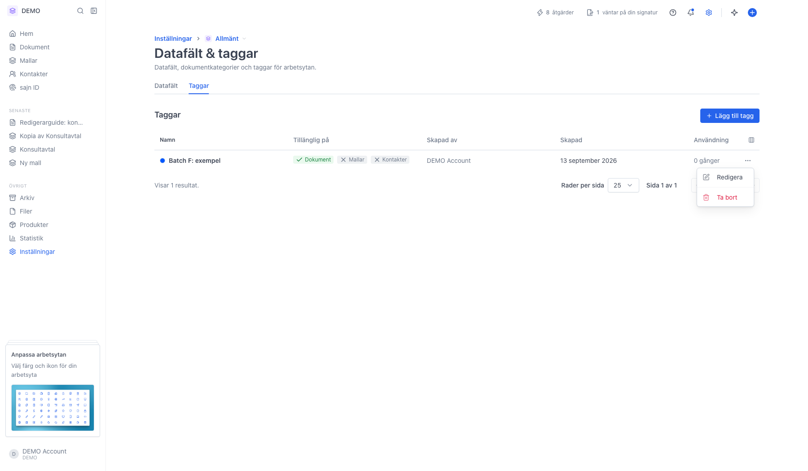

# Hantera taggar för dokument och kontakter

<!--
slug: settings-tags
audience: Arbetsyteadministratörer
last_verified: 2026-09-13
auto-generated from steps.json — edit the spec, then re-run the runner
-->

Taggar är färgkodade etiketter som kategoriserar dokument, mallar och kontakter. Sidan Taggar ligger som en flik under Datafält & taggar och visar alla taggar i arbetsytan: namn, färg, var de får användas och hur ofta de används.

## Innan du börjar

- Du är inloggad och har valt en arbetsyta.
- Taggar är en arbetsyteinställning — varje arbetsyta har sin egen tagglista.
- Du behöver behörighet att administrera arbetsytan för att skapa, redigera eller ta bort taggar.

## Steg

### 1. Öppna Datafält & taggar och välj fliken Taggar

Sidan ligger under arbetsyteinställningarna tillsammans med datafält och dokumentkategorier. Byter du arbetsyta byter du också tagglista. Är tabellen tom har ingen i arbetsytan skapat en tagg ännu.

### 2. Lägg till tagg öppnar en ruta med tre fält

Namn är det som visas överallt där taggen används. Tillgänglig för avgör var taggen får sättas — Dokument, Mallar eller Kontakter — och är det du använder för att hindra att en kontakttagg hamnar på ett dokument. Färg är den prick som följer med taggen i listor och filter.

### 3. Så läser du en rad i tagglistan

Namn visar taggens färg som en prick följt av namnet. Tillgänglig på visar var taggen får användas, med grön bock för tillåten och grått kryss för inte tillåten. Skapad av visar vem som lade till taggen; står det System är den skapad automatiskt. Skapad är datumet, och Användning räknar hur många dokument som har taggen just nu — ett snabbt sätt att se vilka taggar som faktiskt används. Ikonen längst till höger i rubrikraden döljer och visar kolumner.

### 4. Trepunktsmenyn på raden: Redigera och Ta bort

Redigera öppnar samma ruta som när du skapade taggen, så du kan ändra namn, färg och var den får användas. Ta bort tar bort taggen från alla dokument, kontakter och mallar där den används — det går inte att ångra.

---

*Senast verifierad: 2026-09-13. Generad av `scripts/guide-runner.ts`.*
