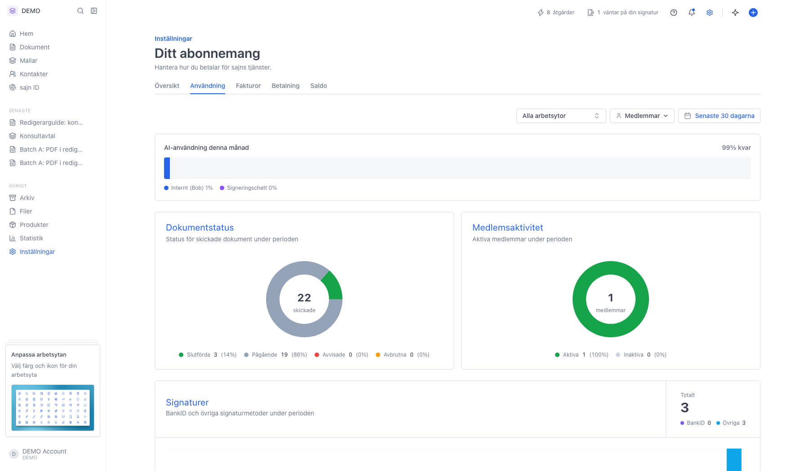
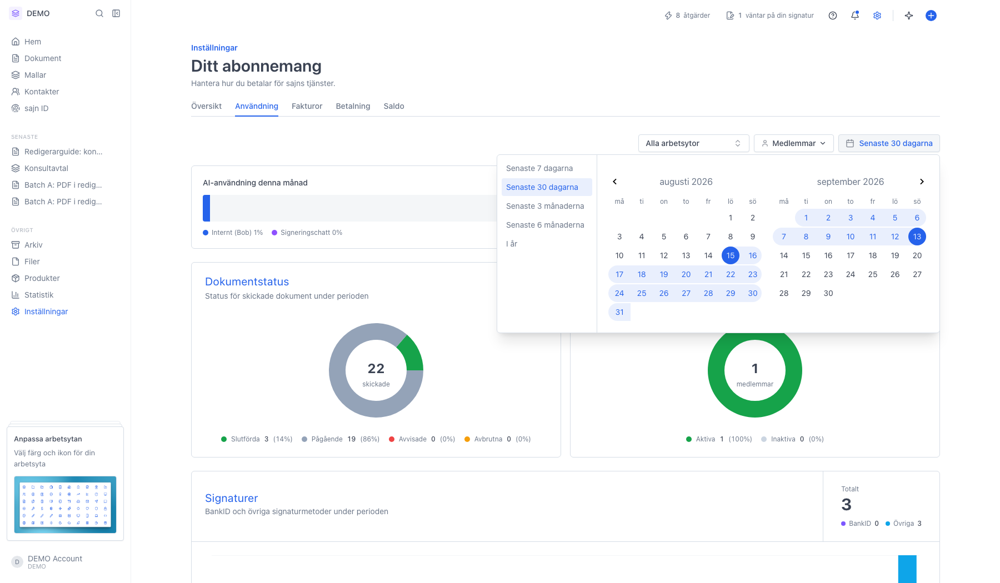
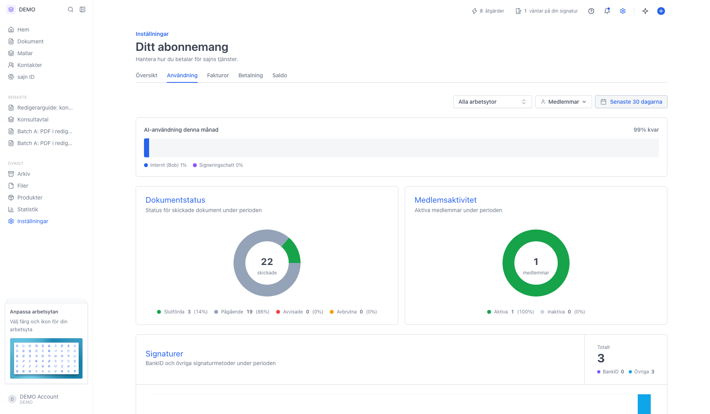
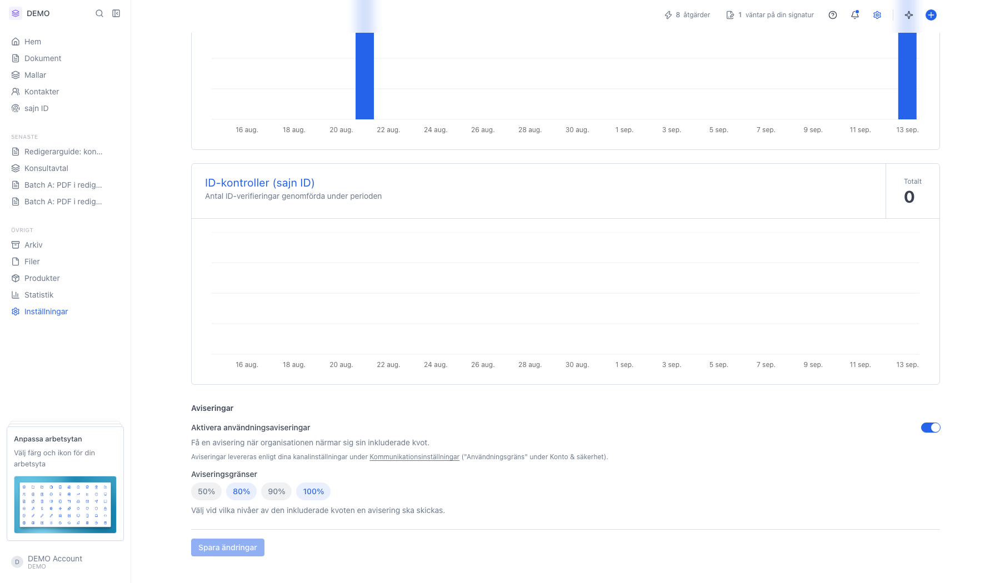

# Följ organisationens användning

<!--
slug: settings-usage
audience: Organisationsadministratörer
last_verified: 2026-09-13
auto-generated from steps.json — edit the spec, then re-run the runner
-->

Fliken Användning under Ditt abonnemang visar AI-förbrukning, dokumentstatus, signaturer, e-post, SMS och ID-kontroller per period.

## Innan du börjar

- Du är inloggad och har behörighet att se organisationens användningsstatistik.

## Steg

### 1. Öppna Ditt abonnemang och välj fliken Användning

Siffrorna gäller hela organisationen. Överst ligger filtren, under dem AI-användningen och sedan diagram för dokument, medlemmar och signaturer.

### 2. Tidsperioden styr alla diagram på sidan

Välj en förinställd period eller markera ett eget intervall i kalendern. Valet gäller bara din vy och sparas inte i organisationen.

### 3. Diagrammen längre ned följer samma upplägg

Skapade, slutförda och skickade dokument, E-post skickade, SMS skickade, AI-generationer, AI-chatmeddelanden och ID-kontroller (sajn ID). För muspekaren över en stapel för att se värdet för den dagen.

### 4. Aviseringar varnar innan kvoten tar slut

Slå på användningsaviseringar och välj vid vilka nivåer sajn ska mejla. Kräver behörighet att hantera organisationens inställningar.

---

*Senast verifierad: 2026-09-13. Generad av `scripts/guide-runner.ts`.*
