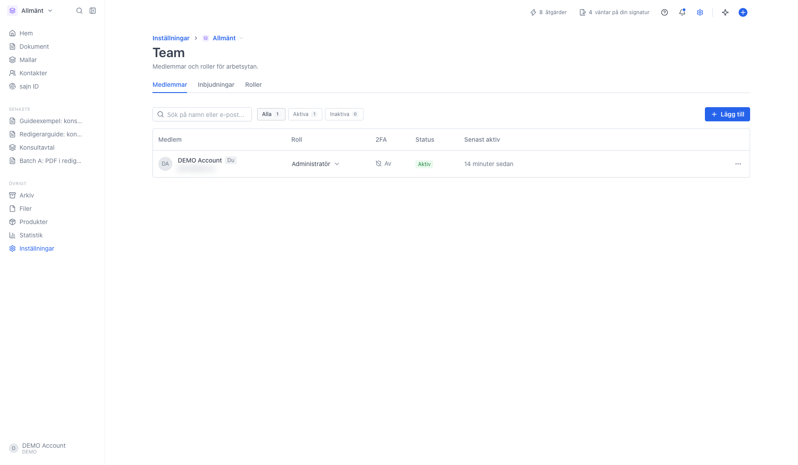
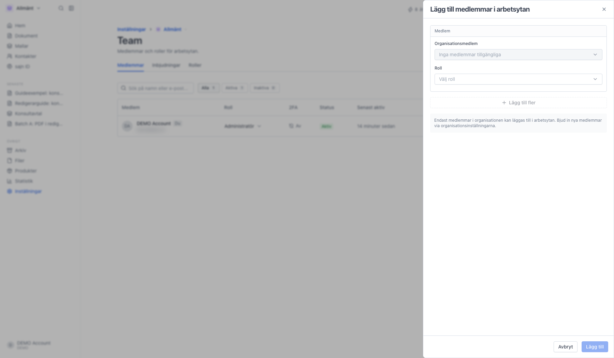
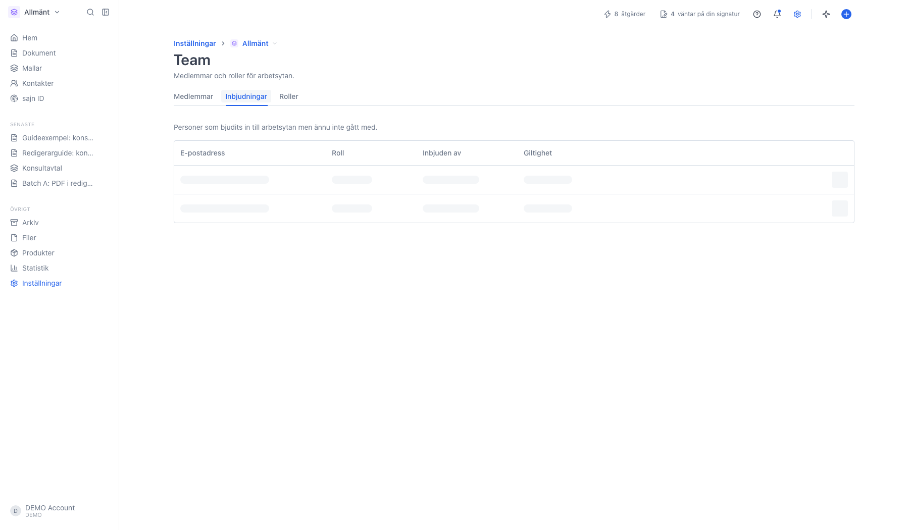
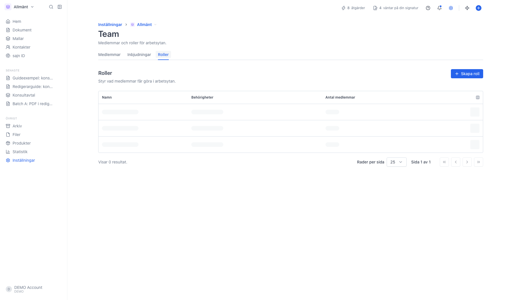

# Medlemmar och roller i en arbetsyta

<!--
slug: settings-workspace-members-roles
audience: Arbetsyteadministratörer
last_verified: 2026-09-13
auto-generated from steps.json — edit the spec, then re-run the runner
-->

Varje arbetsyta har sin egen medlemslista och sina egna roller. Under Team väljer du vilka i organisationen som kommer åt arbetsytan och vilken roll de får, och på fliken Roller bestämmer du vad rollerna ger för behörigheter. Guiden bjuder inte in någon och ändrar ingen roll.

## Innan du börjar

- Sidan Team för arbetsytan kräver Team eller Enterprise.
- Du har behörigheterna Hantera medlemmar och Hantera roller i arbetsytan.
- Nya arbetsytemedlemmar måste redan finnas i organisationen.

## Steg

### 1. Öppna Team för arbetsytan

Sidan heter Team och har tre flikar: Medlemmar, Inbjudningar och Roller. Namnet på arbetsytan står i brödsmulan högst upp, och byter du arbetsyta får du en helt egen lista.

Kolumnerna är Medlem med namn och e-postadress, Roll som är arbetsyterollen, 2FA, Status och Senast aktiv. Knapparna Alla, Aktiva och Inaktiva filtrerar listan och sökrutan söker på namn eller e-postadress.

### 2. Panelen Lägg till medlemmar i arbetsytan

Bara personer som redan finns i organisationen kan läggas till här. För varje rad väljer du organisationsmedlem och roll, och Lägg till fler ger en rad till, upp till tio åt gången. Är listan tom är alla i organisationen redan med i arbetsytan; bjud i så fall in nya personer under Inställningar, Team & säkerhet, Inbjudningar. Inget händer förrän du klickar Lägg till längst ner.

### 3. Inbjudningar till arbetsytan

Här ligger personer som har bjudits in till arbetsytan men ännu inte gått med, med kolumnerna E-postadress, Roll, Inbjuden av och Giltighet.

### 4. Roller bestämmer vad medlemmarna får göra

Medlemmar-fliken bestämmer vem som har vilken roll. Här bestämmer du vad en roll får göra. Namn visar rollens namn, Behörigheter antalet rättigheter med en info-ikon som listar dem, och Antal medlemmar hur många som har rollen.

Inbyggda roller är märkta Inbyggd och går bara att läsa. Trepunktsmenyn innehåller Redigera eller Visa behörigheter, Gör en kopia och Ta bort. Kopian heter Namn (Kopia) och är en bra utgångspunkt för en egen roll. Uppe till höger finns Skapa roll.

---

*Senast verifierad: 2026-09-13. Generad av `scripts/guide-runner.ts`.*
