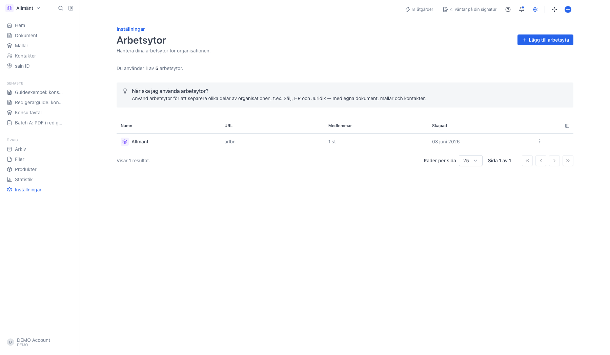
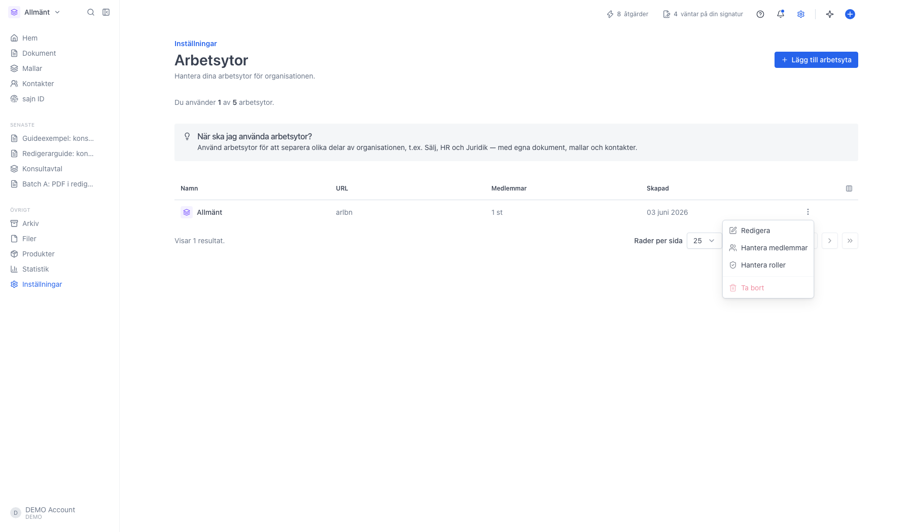
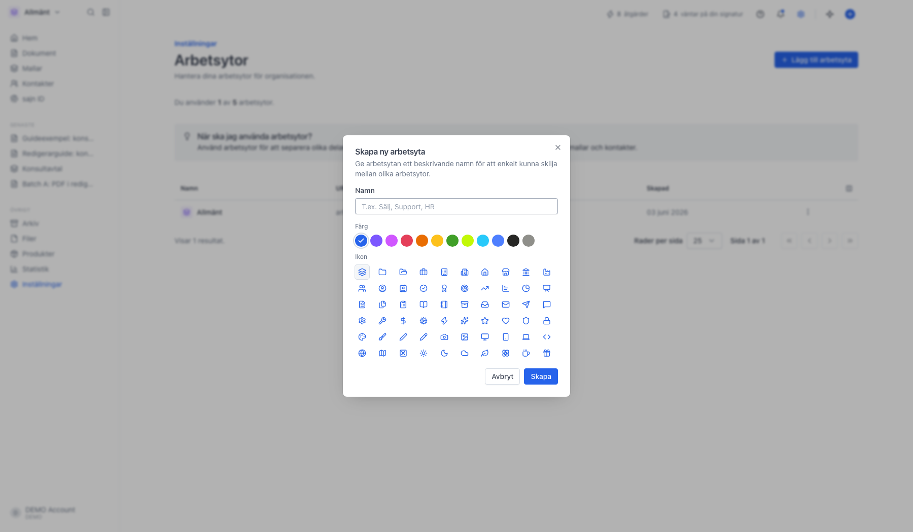

# Lista och hantera dina arbetsytor

<!--
slug: settings-workspaces
audience: Organisationsadministratörer
last_verified: 2026-09-13
auto-generated from steps.json — edit the spec, then re-run the runner
-->

Arbetsytor är separata utrymmen inom samma organisation, till exempel en för Sälj, en för HR och en för Juridik, med egna dokument, mallar, kontakter och medlemmar. På sidan Arbetsytor ser du alla arbetsytor som hör till organisationen. Guiden skapar, döper inte om och byter inte arbetsyta.

## Innan du börjar

- Sidan Arbetsytor kräver Team eller Enterprise. På Basic och Solo ingår en enda arbetsyta.
- Du har behörighet att hantera arbetsytor i organisationen.

## Steg

### 1. Öppna Arbetsytor under Organisation

Sidan är organisationsövergripande: listan är densamma oavsett vilken arbetsyta du står i. Under rubriken står hur många arbetsytor du använder av paketets kvot, och rutan under förklarar när arbetsytor är rätt verktyg.

Tabellen visar Namn med arbetsytans ikon och färg, URL som är den del av adressen som pekar ut arbetsytan, Medlemmar som räknar personer med tillgång, och Skapad. Byter arbetsyta gör du med väljaren längst upp till vänster i sidomenyn, inte härifrån.

### 2. Trepunktsmenyn på raden

Redigera öppnar en ruta där du byter namn, ikon och färg. URL-delen ändras inte i efterhand. Hantera medlemmar och Hantera roller tar dig till just den arbetsytans inställningar. Ta bort raderar arbetsytan permanent efter en bekräftelse, och är gråad så länge det bara finns en arbetsyta kvar.

### 3. Skapa en ny arbetsyta

Du anger namn och väljer ikon och färg. URL-delen skapas automatiskt utifrån namnet. Har du nått paketets maxantal är knappen gråad, och texten ovanför tabellen visar hur många du använder av kvoten.

---

*Senast verifierad: 2026-09-13. Generad av `scripts/guide-runner.ts`.*
