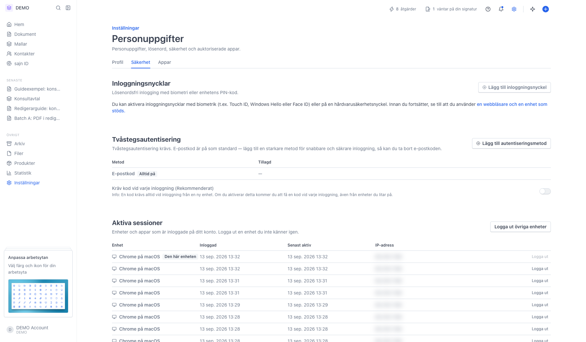
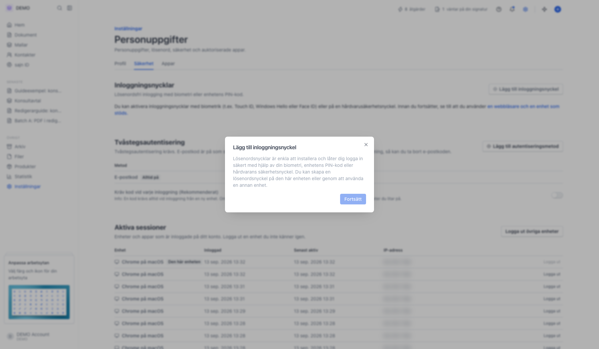
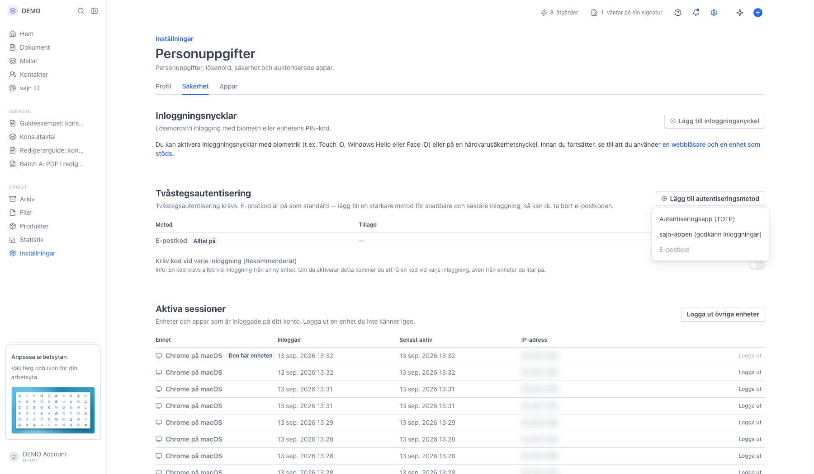

# Säkra ditt konto med inloggningsnyckel eller tvåstegsautentisering

<!--
slug: setup-2fa-passkey
audience: Alla användare
last_verified: 2026-09-13
auto-generated from steps.json — edit the spec, then re-run the runner
-->

Tvåstegsautentisering krävs för alla sajn-konton, och e-postkod är påslagen från början. Den här guiden visar var du lägger till ett starkare skydd: en inloggningsnyckel för lösenordsfri inloggning, eller en autentiseringsapp. Guiden stannar innan registreringen, så ingenting ändras på ditt konto.

## Innan du börjar

- Du är inloggad på ditt sajn-konto.
- Inställningarna gäller ditt personliga konto och följer med dig mellan arbetsytor.
- För inloggningsnyckel behöver du en enhet och webbläsare som stöder det, till exempel Touch ID, Face ID, Windows Hello eller en säkerhetsnyckel.

## Steg

### 1. Öppna Inställningar, Personuppgifter och fliken Säkerhet

Sidan Personuppgifter har tre flikar: Profil, Säkerhet och Appar. Under Säkerhet ligger Inloggningsnycklar, Tvåstegsautentisering, Aktiva sessioner och betrodda enheter. Allt här gäller ditt personliga konto, inte arbetsytan.

### 2. Lägg till inloggningsnyckel förklarar vad som händer

Trycker du Fortsätt tar webbläsaren över och frågar var nyckeln ska sparas, till exempel i lösenordshanteraren eller på en säkerhetsnyckel. Du bekräftar med biometri eller PIN och får sedan namnge nyckeln. Här stannar vi vid informationen, så inget registreras.

### 3. Tvåstegsautentisering erbjuder tre metoder

Autentiseringsapp (TOTP) ger en sexsiffrig kod i en app som Google Authenticator eller Apple Lösenord. sajn-appen låter dig godkänna inloggningen i mobilen i stället för att skriva en kod. E-postkod är gråmarkerad här eftersom den redan är på.

---

*Senast verifierad: 2026-09-13. Generad av `scripts/guide-runner.ts`.*
