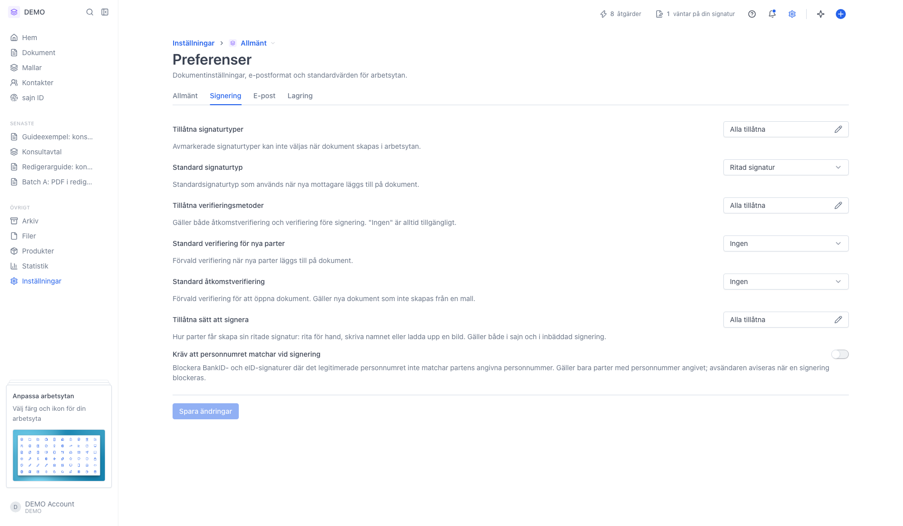
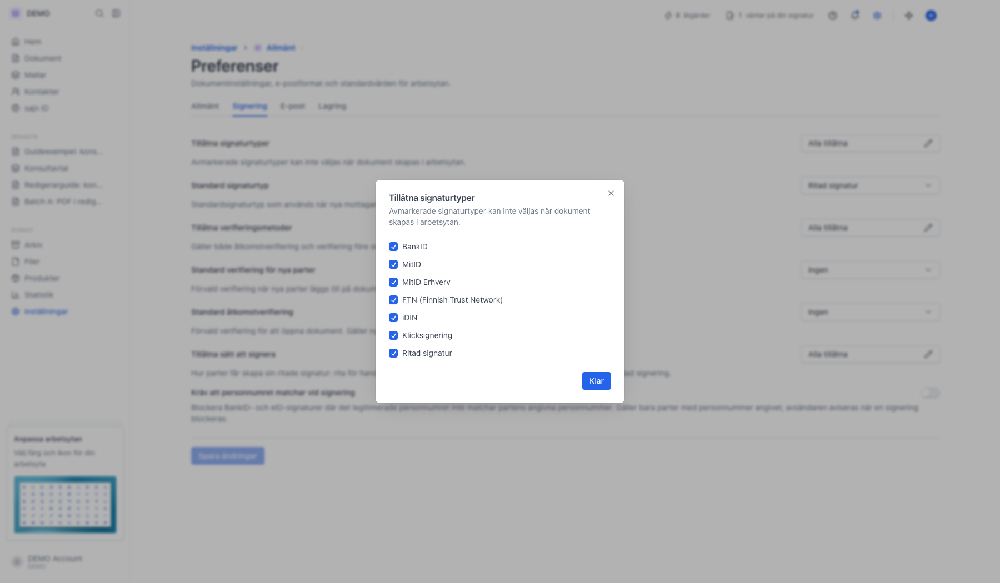
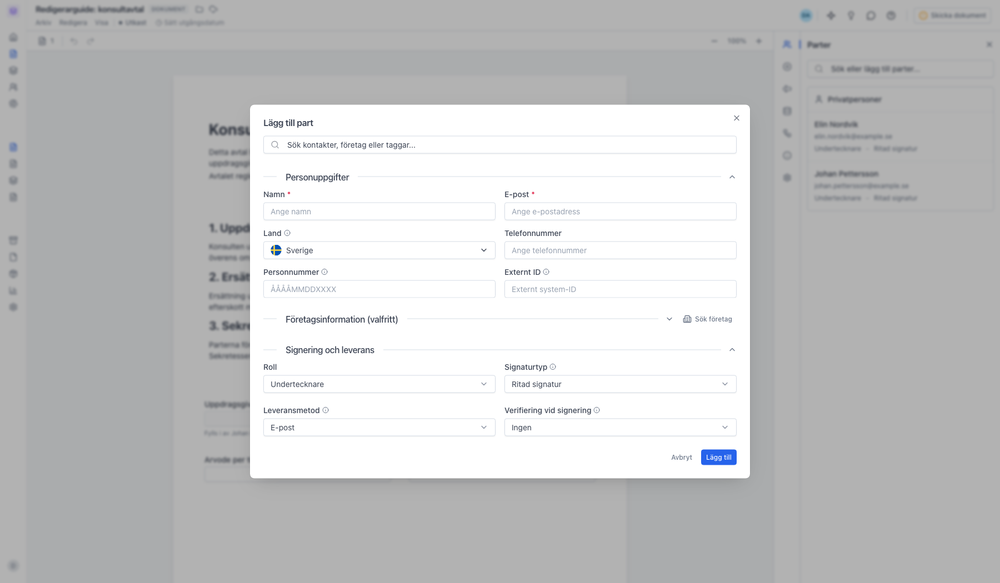
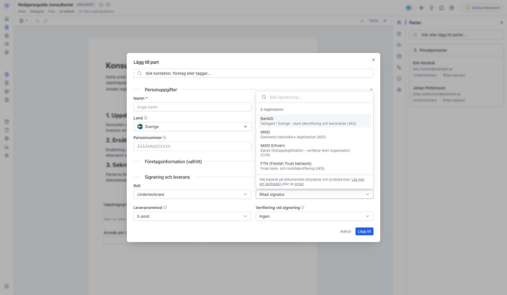
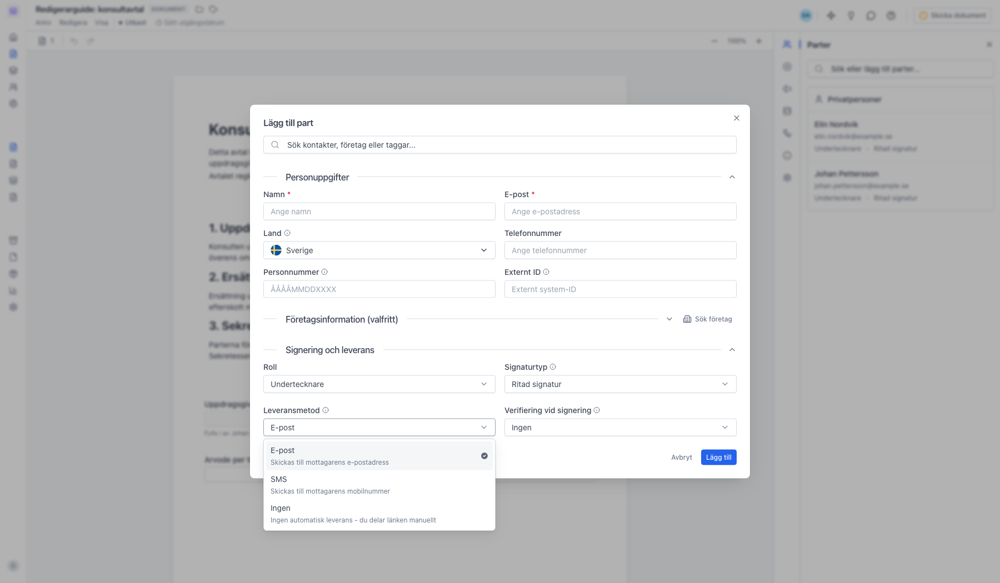
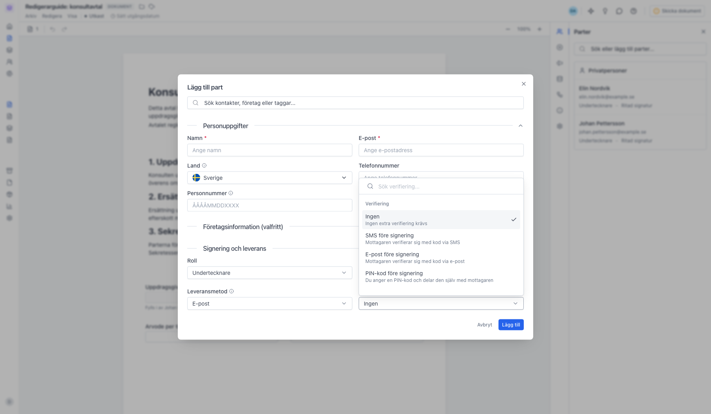

# Signaturtyp, leveransmetod och verifiering

<!--
slug: signing-methods
audience: Alla som förbereder dokument
last_verified: 2026-09-13
auto-generated from steps.json — edit the spec, then re-run the runner
-->

Tre olika inställningar styr hur en part tar sig genom signeringen: signaturtypen är hur personen skriver under, leveransmetoden är hur dokumentet når fram, och verifieringen är den extra identitetskontroll du kan lägga på. De går att kombinera fritt. Arbetsytan sätter standardvärden, och du kan ändra per part på ett enskilt dokument.

## Innan du börjar

- Du är inloggad och har valt en arbetsyta.
- För att ändra arbetsytans standardvärden behöver du komma åt arbetsytans inställningar.
- Svenskt BankID ingår i alla planer med ett begränsat antal signaturer per månad. Övriga e-legitimationer kräver betalplan.

## Steg

### 1. Arbetsytans standardvärden ligger under Preferenser, fliken Signering

Tillåtna signaturtyper bestämmer vilka som går att välja alls i arbetsytan. Standard signaturtyp är den som nya parter får från början. Tillåtna verifieringsmetoder och de två standardvalen under styr verifieringen. Tillåtna sätt att signera gäller bara hur en ritad signatur får skapas: rita, skriva namnet eller ladda upp en bild.

### 2. Sju signaturtyper går att tillåta

Fem är e-legitimationer: BankID, MitID, MitID Erhverv, FTN och iDIN. Två är enkla signaturer: Klicksignering, där parten bekräftar med ett klick, och Ritad signatur, där parten ritar sin namnteckning. Avmarkerar du en typ går den inte att välja på dokument i arbetsytan.

### 3. De tre valen sitter tillsammans på parten

I dialogen Lägg till part ligger de under rubriken Signering och leverans. Roll avgör om parten ska signera, godkänna eller bara få en kopia. Signaturtyp, Leveransmetod och Verifiering vid signering är de tre axlarna, och de är oberoende av varandra. Värdena kommer från arbetsytans standard och gäller bara den här parten på det här dokumentet.

### 4. Signaturtyp: hur parten skriver under

Listan är grupperad i E-legitimation och Enkel signatur. E-legitimation betyder att parten legitimerar sig med BankID, MitID, FTN eller iDIN, vilket ger högst bevisvärde. Enkel signatur är Klicksignering eller Ritad signatur, som är snabbare men bygger på svagare identifiering.

### 5. Leveransmetod: hur dokumentet når fram

E-post skickar en länk till adressen, SMS skickar den till mobilnumret och Ingen betyder att sajn inte skickar något alls - då delar du länken själv. Valet säger ingenting om hur parten signerar.

### 6. Verifiering vid signering: extra kontroll i signeringsögonblicket

Utöver Ingen kan du kräva en engångskod via SMS eller e-post, en PIN-kod du delar med parten på annat sätt, eller en e-legitimation. Det här är ett lager ovanpå signaturtypen, inte ett alternativ till den. Vill du i stället kräva verifiering för att över huvud taget öppna dokumentet sätter du det på dokumentet, inte på parten.

---

*Senast verifierad: 2026-09-13. Generad av `scripts/guide-runner.ts`.*
