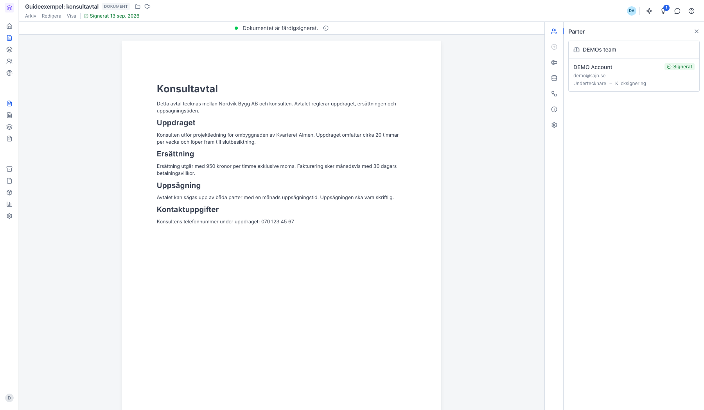
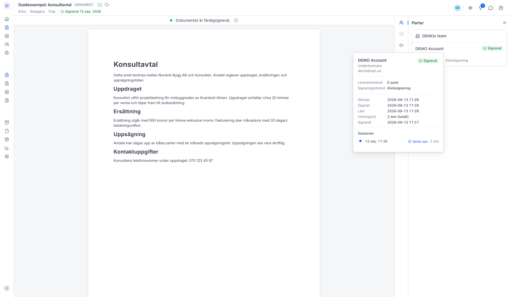
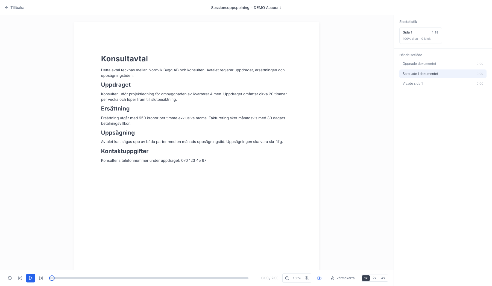

# Spela upp en mottagares signeringssession

<!--
slug: signing-session-replay
audience: Alla som får se dokument i arbetsytan
last_verified: 2026-09-13
auto-generated from steps.json — edit the spec, then re-run the runner
-->

När en mottagare öppnar ett dokument spelar sajn in hur de rör sig i det: vilka sidor de tittade på, hur länge, var de klickade och vad de markerade. Uppspelningen visar det i efterhand.

## Innan du börjar

- Du är inloggad i en arbetsyta där du får se dokument.
- Dokumentet har skickats och minst en mottagare har öppnat det.
- Sessionsuppspelning kräver betalplan, alltså Solo, Team eller Enterprise.

## Steg

### 1. Öppna dokumentet och gå till panelen Parter

Panelen Parter listar alla mottagare med sin status. Den är förvald när du öppnar ett dokument, annars öppnar du den med den översta ikonen i raden till höger.

### 2. Klicka på partens namn för att se detaljerna

Rutan visar leveransmetod och signeringsmetod, tidslinjen Skickat, Öppnat, Läst och Signerat med exakta tidpunkter, och Visningstid, alltså hur länge mottagaren totalt hade dokumentet framme. Längst ner ligger Sessioner: en rad per gång mottagaren öppnade dokumentet. Har sajn hunnit spara interaktionsdata står Spela upp bredvid tidpunkten. Det är statusmärket som inte går att klicka på - det är namnet du ska klicka på.

### 3. Uppspelningen öppnas i helskärm

Till vänster ligger dokumentet som mottagaren såg det, med spela och pausa, hastigheterna 1x, 2x och 4x och en tidslinje du kan dra i. Värmekarta lägger i stället en färgkarta över var uppmärksamheten låg. Till höger visar Sidstatistik tid, scrolldjup och antal klick per sida, och under det listar Händelseflöde varje händelse i tur och ordning. Klicka på en händelse för att hoppa dit i uppspelningen. Tillbaka uppe till vänster eller Esc stänger vyn.

---

*Senast verifierad: 2026-09-13. Generad av `scripts/guide-runner.ts`.*
