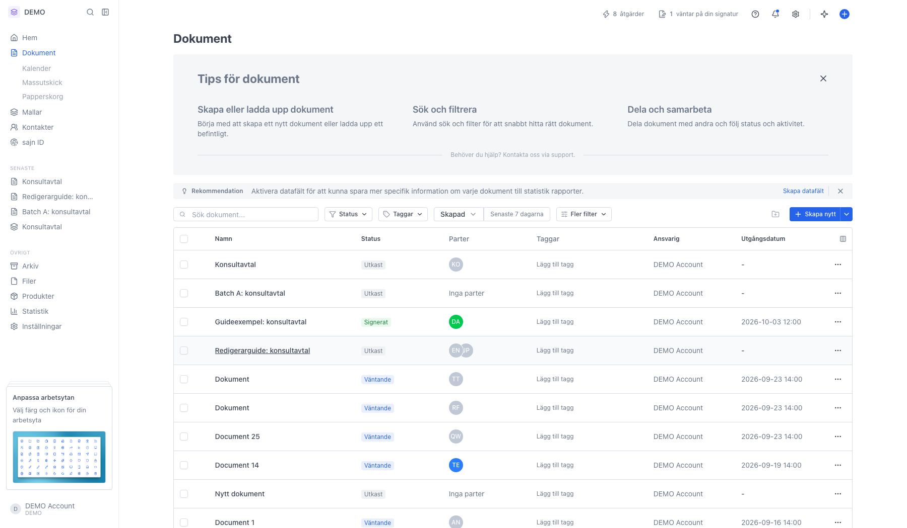
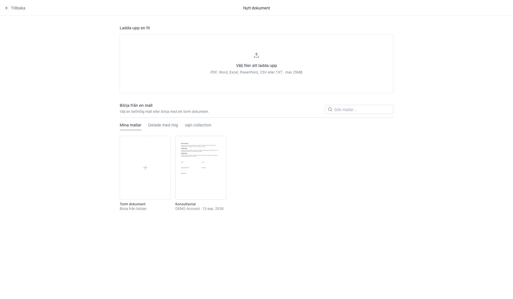
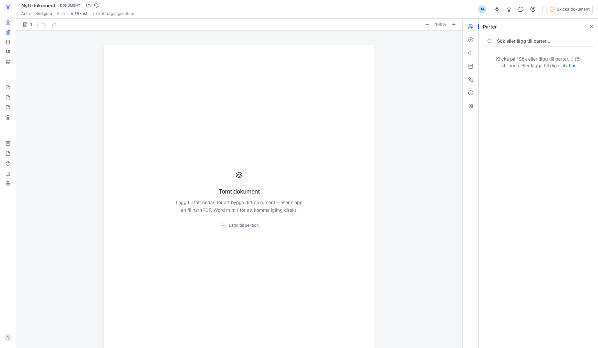
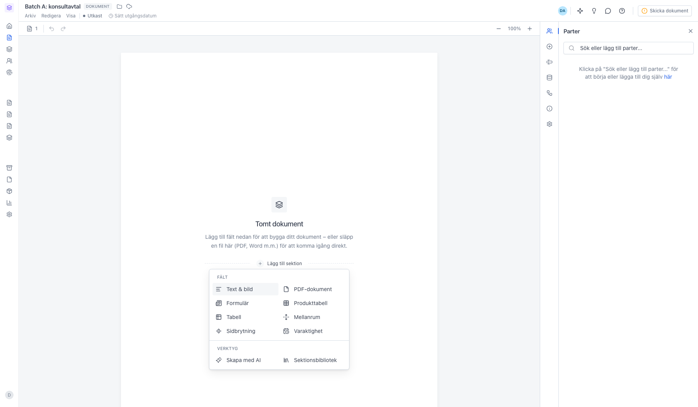
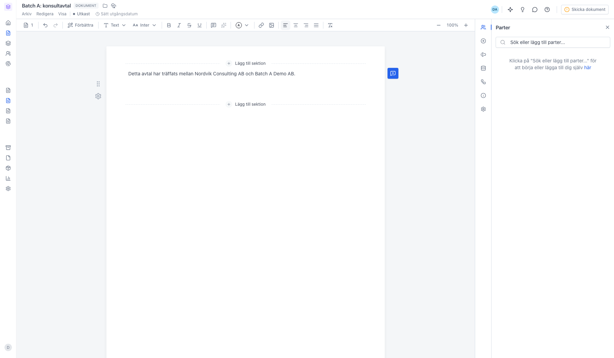

# Skapa ett dokument

<!--
slug: skapa-dokument
audience: Alla användare
last_verified: 2026-09-13
auto-generated from steps.json — edit the spec, then re-run the runner
-->

Ett dokument börjar antingen från en mall, från en fil du laddar upp eller från ett tomt papper. Alla tre vägarna ligger bakom Skapa nytt i dokumentlistan, och alla tre slutar på samma ställe: redigeraren.

## Innan du börjar

- Du är inloggad i sajn och har valt en arbetsyta.
- Du har behörighet att skapa dokument i arbetsytan.

## Steg

### 1. Öppna Dokument i sidomenyn

Listan visar arbetsytans dokument med status, parter och datum. Knappen Skapa nytt uppe till höger är delad: texten öppnar sidan Nytt dokument, och pilen bredvid är en genväg till ett tomt dokument eller en filuppladdning.

### 2. Välj var dokumentet ska börja

Sidan Nytt dokument har två halvor. Överst laddar du upp en fil från datorn — PDF, Word, Excel, PowerPoint, CSV eller TXT, max 25 MB. Har arbetsytan en ansluten tjänst kan du hämta filen därifrån i stället. Under Börja från en mall ligger arbetsytans mallar som kort, uppdelade på Mina mallar, Delade med mig och sajn collection. Första kortet är Tomt dokument.

### 3. Dokumentet öppnas som utkast i redigeraren

Ett tomt dokument heter Nytt dokument och har statusen Utkast. Pappret i mitten är det mottagaren får, och panelen till höger öppnas på Parter. Du kan också släppa en fil direkt på det tomma pappret. Allt du ändrar sparas automatiskt.

### 4. Bygg innehållet av sektioner

Ett dokument består av sektioner, och den streckade linjen öppnar menyn. Text & bild är brödtext, PDF-dokument lägger in en färdig fil, Formulär är en ruta med ifyllbara fält och Produkttabell räknar ihop rader och summa. Tabell, Mellanrum, Sidbrytning och Varaktighet formar sidan. Skapa med AI skriver en sektion åt dig, och Sektionsbibliotek hämtar en du sparat tidigare.

### 5. Skriv innehållet i sektionen

En Text & bild-sektion är fri brödtext. När du står i sektionen byts raden överst mot formateringen — rubriker, typsnitt, listor, länkar, bilder och tabeller. Skriv { där en part ska fylla i något, så infogas ett fält mitt i texten.

---

*Senast verifierad: 2026-09-13. Generad av `scripts/guide-runner.ts`.*
