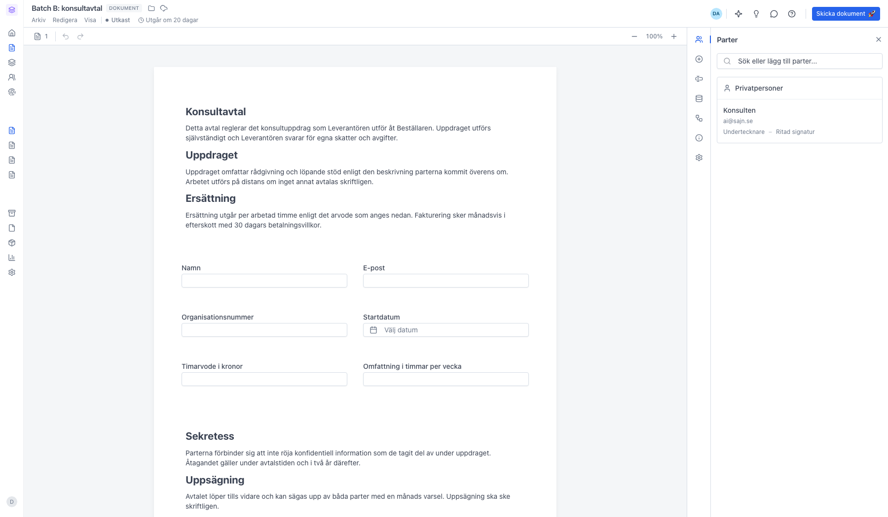
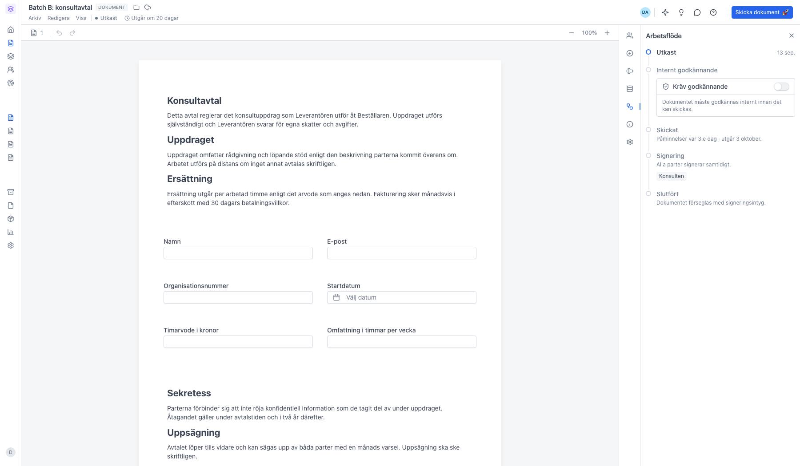
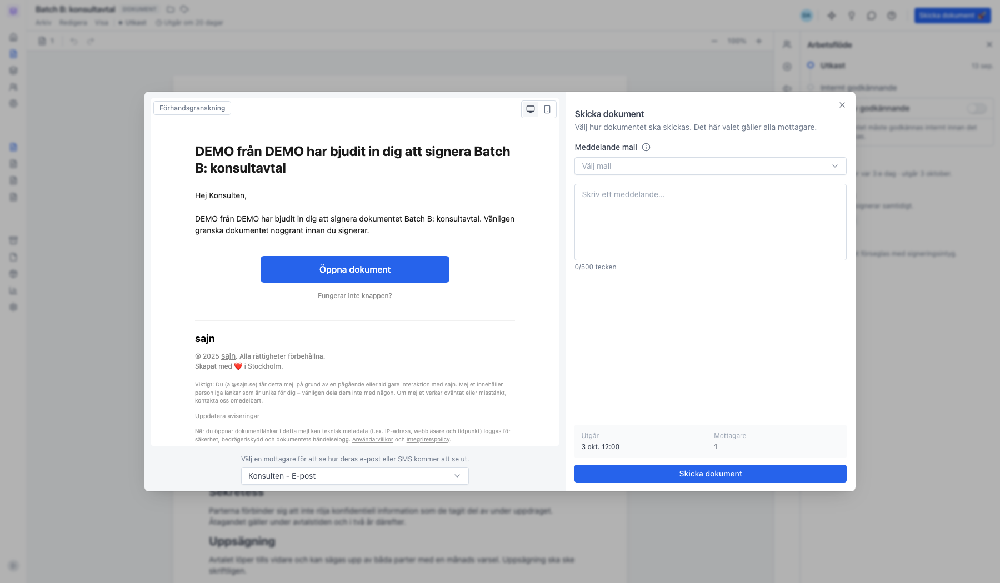
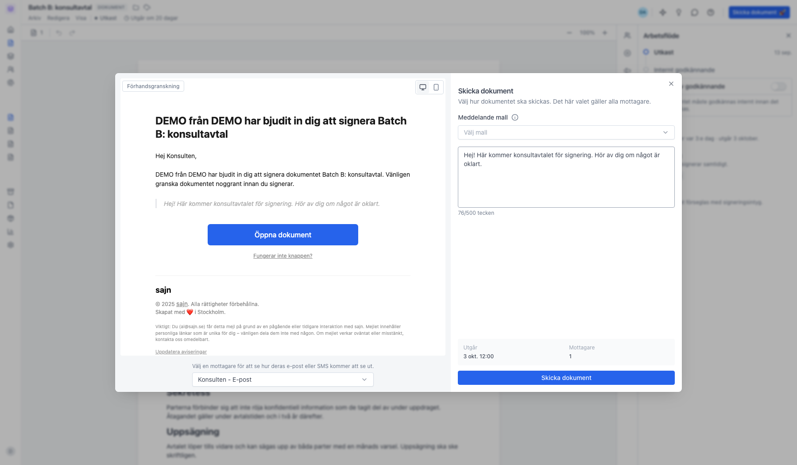
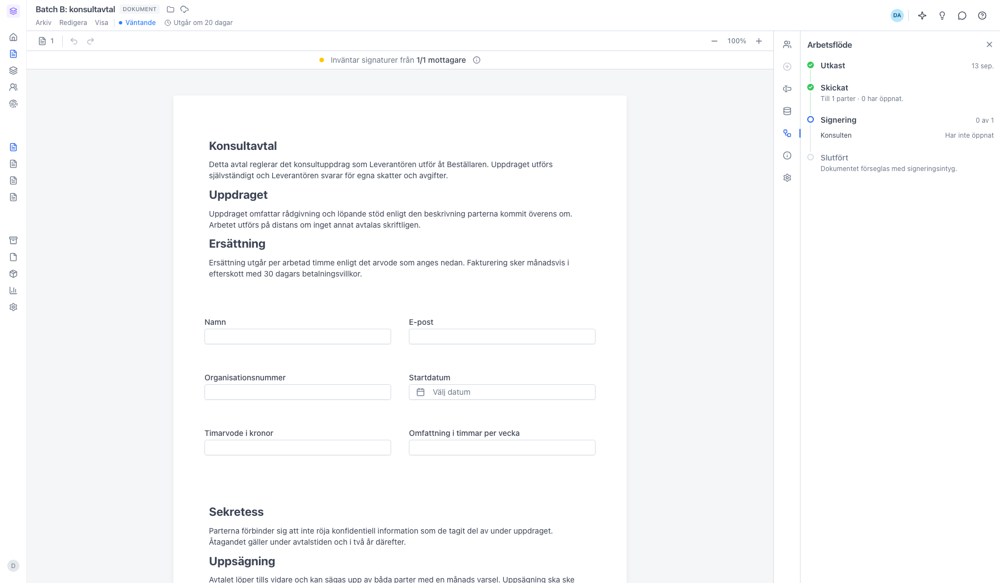
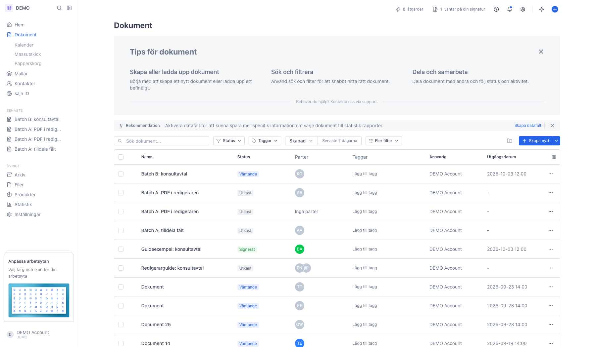

# Skicka ett dokument för signering

<!--
slug: skicka-dokument
audience: Alla användare
last_verified: 2026-09-13
auto-generated from steps.json — edit the spec, then re-run the runner
-->

När innehållet, parterna och inställningarna är klara skickar du dokumentet. Guiden följer ett utkast hela vägen från granskning till utskickat, och visar vad sajn kontrollerar innan knappen släpper igenom dig.

## Innan du börjar

- Du är inloggad i sajn och har valt en arbetsyta.
- Du har ett dokument i status Utkast.
- Du har behörighet att skicka dokument i arbetsytan.

## Steg

### 1. Granska dokumentet innan du skickar

Gå igenom innehållet, parterna i panelen Parter och inställningarna. Knappen Skicka dokument uppe till höger släpper bara igenom dig när allt som krävs finns på plats: minst en part, kontaktuppgifter som matchar vald leveransmetod och ett utgångsdatum. Saknas något står det i knappen hur många saker som är kvar, och du ser listan om du klickar på den.

### 2. Arbetsflöde visar vad som händer efter utskicket

Kedjan går från Utkast till Slutfört. Här ser du om dokumentet ska godkännas internt först, hur ofta påminnelser skickas, när fristen går ut och om parterna signerar samtidigt eller i tur och ordning.

### 3. Skriv ett meddelande och kontrollera sammanfattningen

Till vänster ser du hur e-posten eller SMS:et kommer att se ut för den mottagare du väljer i listan. Till höger väljer du en meddelandemall eller skriver ett eget meddelande på upp till 500 tecken. Rutan längst ner sammanfattar när dokumentet utgår och hur många mottagare som får det. Valet gäller alla mottagare.

### 4. Meddelandet följer med i utskicket

Texten hamnar i e-postmeddelandet till samtliga mottagare. Med en meddelandemall kan du återanvända en text du redan skrivit, och variabler som mottagarens namn fylls i automatiskt.

### 5. Dokumentet är skickat och har status Väntande

Parterna har fått sin länk och du följer läget i panelen Arbetsflöde: vem som har öppnat, vem som har signerat och vem som fortfarande väntar. Statusen står kvar på Väntande tills alla har signerat.

### 6. Listan visar samma status

I Dokument ser du status, parter och utgångsdatum för varje dokument. Trepunktsmenyn längst till höger på raden innehåller åtgärderna för ett skickat dokument, bland annat Förläng utgångsdatum och Återkalla dokument.

---

*Senast verifierad: 2026-09-13. Generad av `scripts/guide-runner.ts`.*
