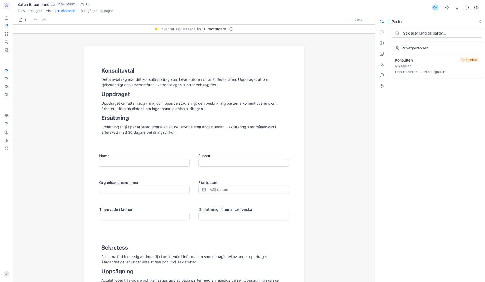
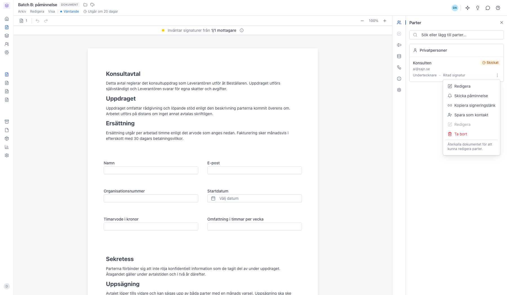
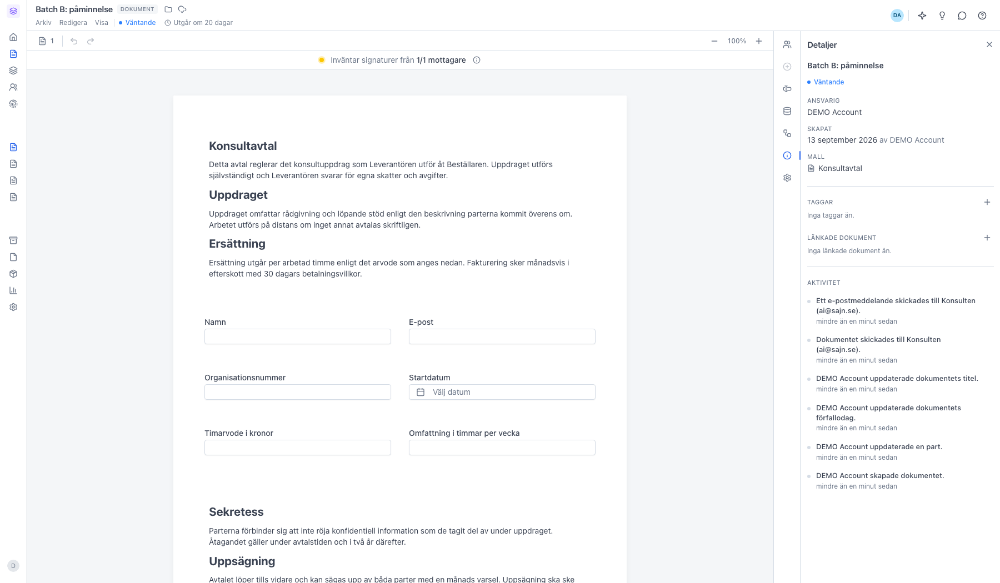

# Skicka en manuell påminnelse till en mottagare

<!--
slug: skicka-paminnelse
audience: Alla användare
last_verified: 2026-09-13
auto-generated from steps.json — edit the spec, then re-run the runner
-->

En manuell påminnelse skickar om signeringslänken till en enskild mottagare, utan att röra dokumentet eller de andra parterna. Guiden utgår från ett utskickat dokument som ingen har signerat ännu.

## Innan du börjar

- Dokumentet är i status Väntande.
- Mottagaren får dokumentet via e-post eller SMS och har inte signerat eller avböjt.

## Steg

### 1. Öppna dokumentet och panelen Parter

Panelen Parter är förvald när du öppnar ett dokument. Varje part visas med sin e-postadress, sin roll och sin signeringsstatus. Dokumentet står i status Väntande, vilket är förutsättningen för att kunna påminna.

### 2. Öppna partens meny och välj Skicka påminnelse

Menyn öppnas med de tre prickarna till höger på raden. Den visas när du för muspekaren över raden — på pekskärm syns den alltid. Här finns också Kopiera signeringslänk, om du hellre vill skicka länken via en annan kanal.

### 3. Påminnelsen loggas i dokumentets historik

Påminnelsen skickas direkt, utan bekräftelse. I panelen Detaljer ser du den i dokumentets händelselogg tillsammans med allt annat som hänt. Övriga parter påverkas inte och utgångsdatumet ändras inte.

---

*Senast verifierad: 2026-09-13. Generad av `scripts/guide-runner.ts`.*
