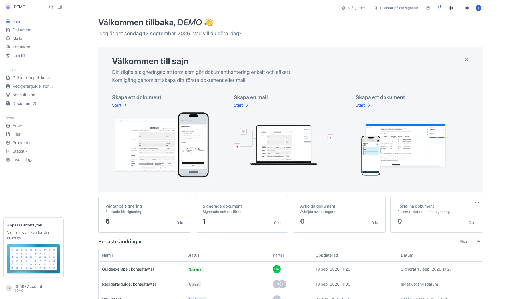
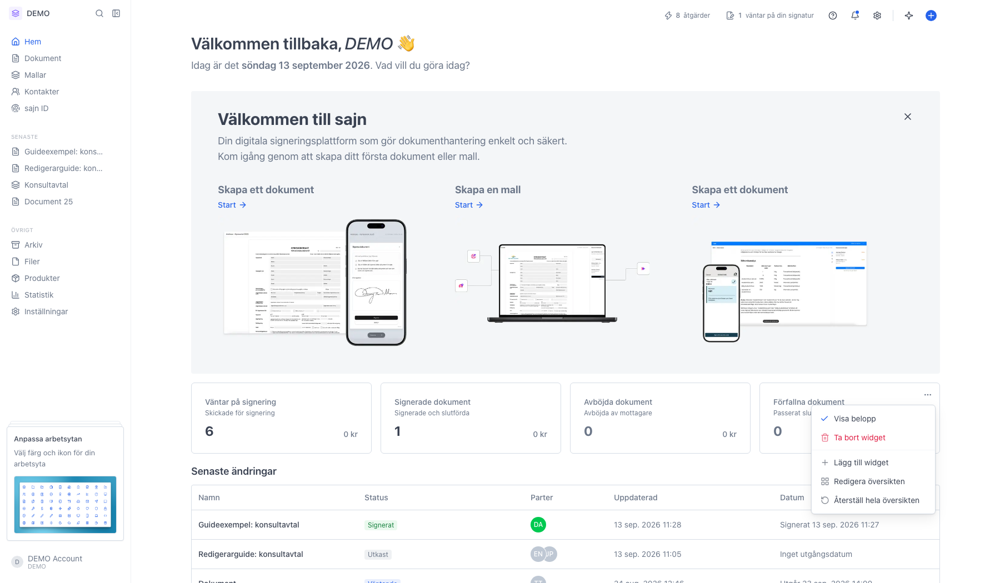
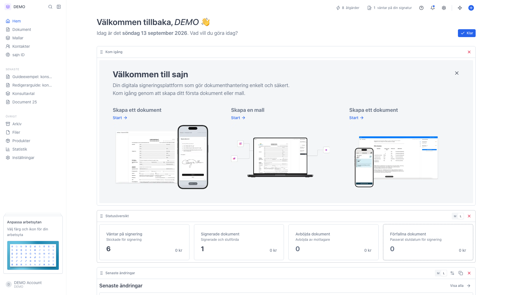
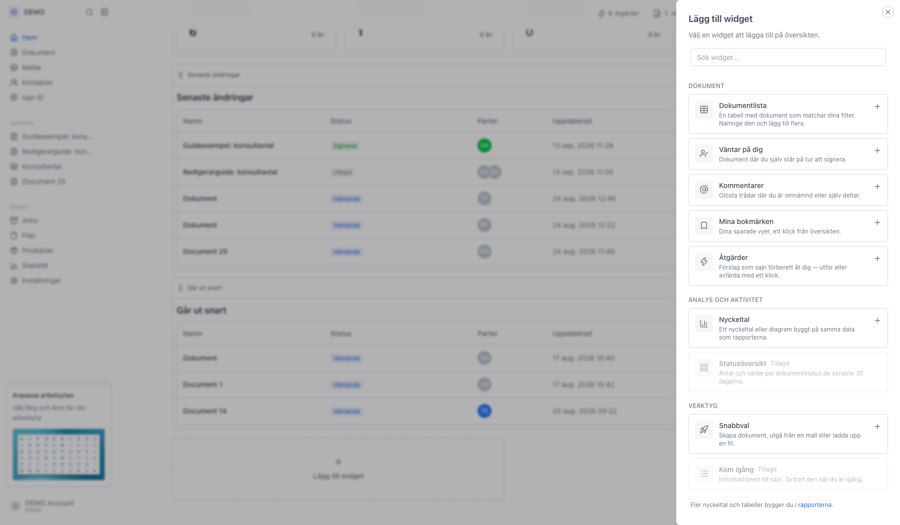
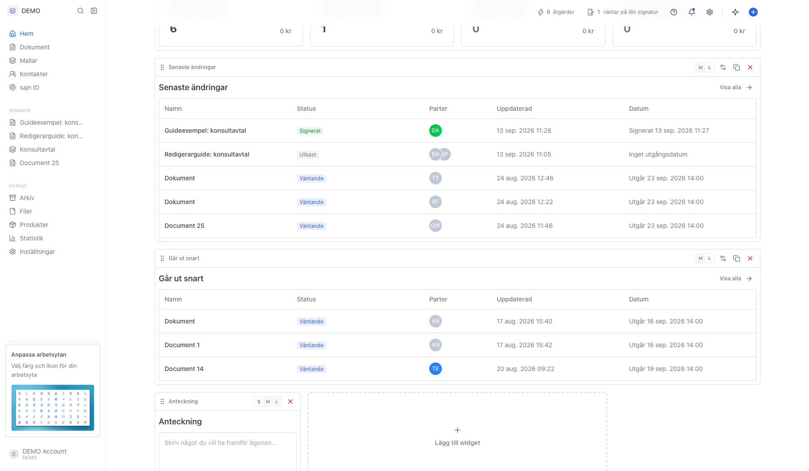

# Anpassa startsidan med widgets

<!--
slug: startsidan-widgets
audience: Alla användare
last_verified: 2026-09-13
auto-generated from steps.json — edit the spec, then re-run the runner
-->

Startsidan är din egen. Den byggs av widgets som du lägger till, flyttar och tar bort, och varje arbetsyta har sin egen uppsättning.

## Innan du börjar

- Du är inloggad i sajn och har valt en arbetsyta.

## Steg

### 1. Startsidan är din översikt

Hälsningen överst visar vem du är inloggad som och vilken dag det är. Allt under den är widgets. Det finns ingen knapp som heter Anpassa, för varje widget bär sin egen meny.

### 2. För muspekaren över en widget och klicka på de tre punkterna

Menyn styr både den enskilda widgeten och hela sidan. Innehållet varierar med widgeten: Statusöversikt har ett eget val för att visa belopp, widgets som går att ställa in får Anpassa widget, och de du kan ha flera av får Duplicera. Du når samma meny genom att högerklicka på widgeten.

### 3. I redigeringsläget kan du flytta och ändra storlek

Varje widget får en ram med egna knappar: flytta upp, flytta ner, ändra storlek, duplicera och ta bort. Du kan också dra en widget dit du vill ha den. Knappen Klar uppe till höger sparar och lämnar läget, och Esc gör samma sak.

### 4. Välj bland widgetarna i panelen

Widgetarna ligger i tre grupper. Dokument innehåller listor och statusvyer, Analys och aktivitet innehåller nyckeltal, kommentarer och det som väntar på dig, och Verktyg innehåller snabbval, mallgenvägar, Fråga Bob och anteckningar. Sökfältet filtrerar listan. En widget som är gråad finns redan på sidan och går bara att ha en gång.

### 5. Widgeten läggs till sist på sidan

Den nya widgeten hamnar längst ner. Dra den dit du vill ha den, eller använd pilarna i ramen. Klicka sedan Klar för att spara. Ångrar du dig tar du bort widgeten med papperskorgen i dess ram.

---

*Senast verifierad: 2026-09-13. Generad av `scripts/guide-runner.ts`.*
