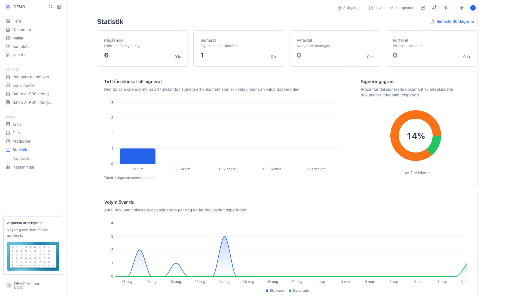
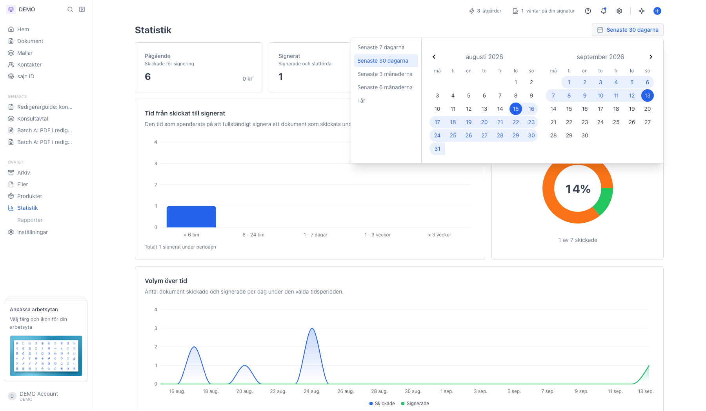
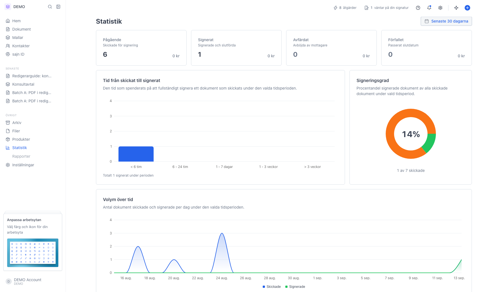

# Statistik och nyckeltal

<!--
slug: statistics
audience: Alla som arbetar i en arbetsyta
last_verified: 2026-09-13
auto-generated from steps.json — edit the spec, then re-run the runner
-->

Statistik visar arbetsytans dokumentflöde: hur mycket som är på gång, hur stor andel som blir signerat och hur lång tid det tar.

## Innan du börjar

- Du är inloggad och har valt en arbetsyta.

## Steg

### 1. Öppna Statistik via sidomenyn

Siffrorna gäller den arbetsyta du står i. KPI-korten överst visar antal dokument och sammanlagt värde per status för den valda perioden.

### 2. Tidsperioden uppe till höger styr alla siffror

Välj en förinställd period eller markera ett eget intervall i kalendern. Valet hamnar i adressfältet, så du kan dela en länk till exakt samma vy.

### 3. Aktiva användare och Mest använda mallar längst ned

Aktiva användare listar medlemmar som skickat eller signerat under perioden, med Skickade, Signerade och Signeringsgrad. Mest använda mallar rankar mallarna efter antal skickade dokument; klicka på ett namn för att öppna mallen.

---

*Senast verifierad: 2026-09-13. Generad av `scripts/guide-runner.ts`.*
