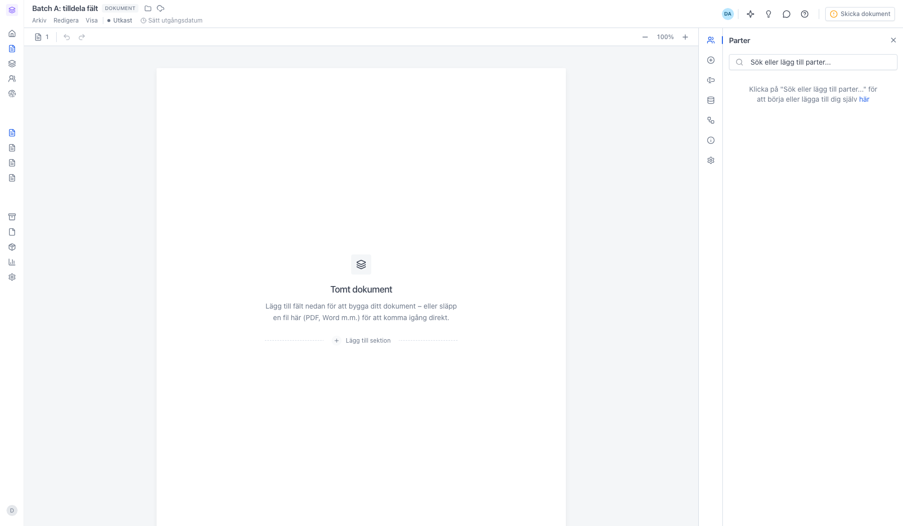
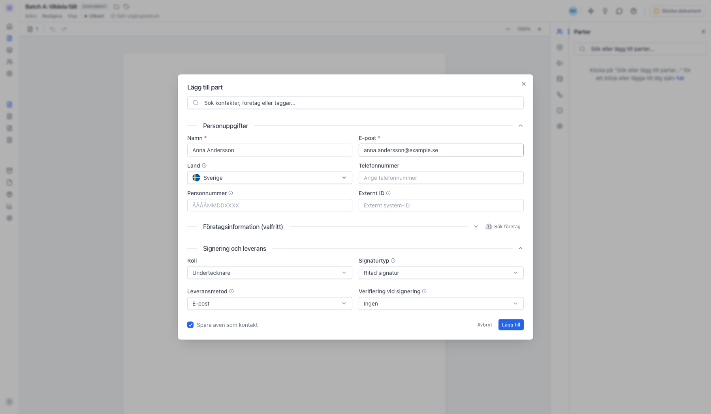
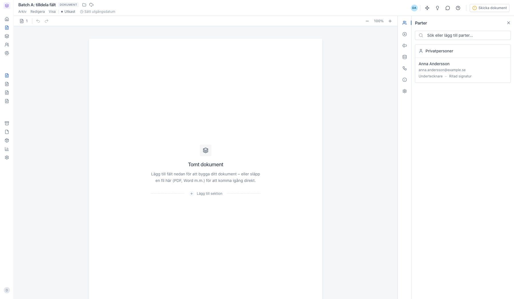
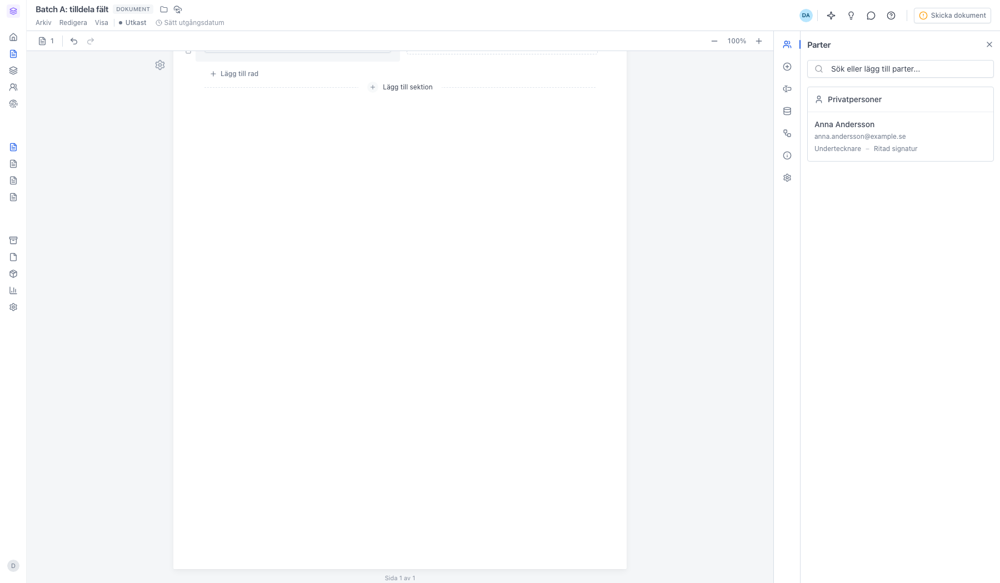
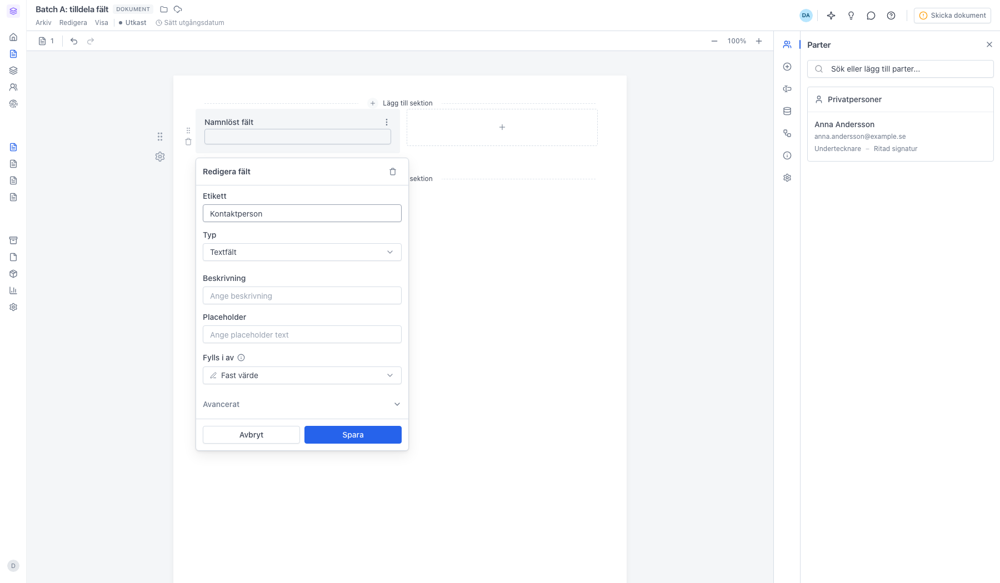
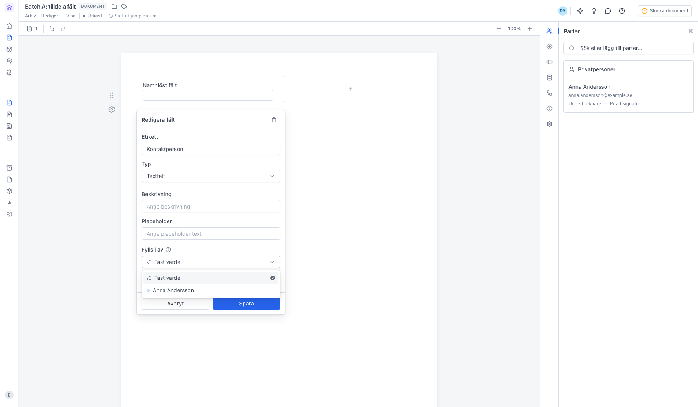
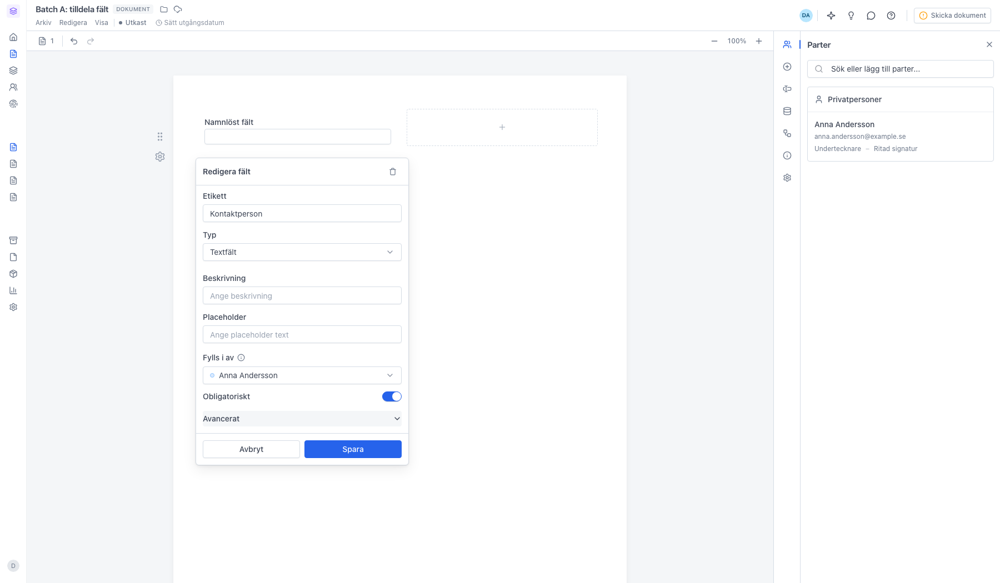
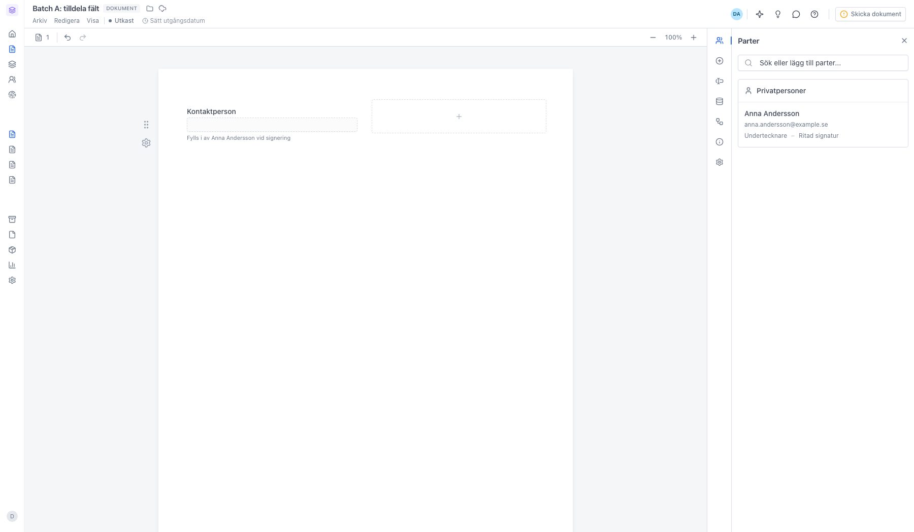
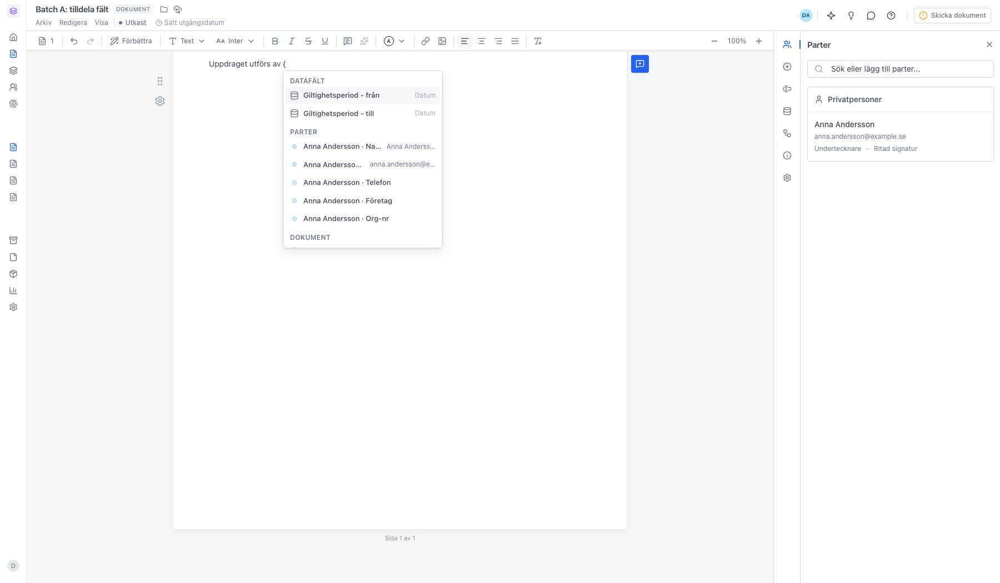
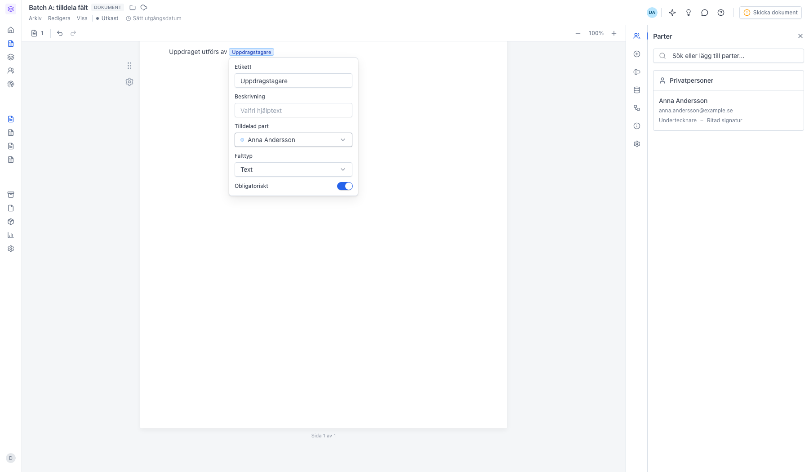

# Tilldela fält till rätt part

<!--
slug: tilldela-falt-till-part
audience: Alla användare
last_verified: 2026-09-13
auto-generated from steps.json — edit the spec, then re-run the runner
-->

Ett fält kan antingen fyllas i av dig nu eller av en part vid signeringen. Det avgörs av en enda inställning: Fylls i av i formulärsektionen, Tilldelad part för en variabel i löpande text.

## Innan du börjar

- Du är inloggad i sajn.
- Du har behörighet att skapa dokument i din arbetsyta.

## Steg

### 1. Börja med parterna

Redigeraren öppnas med panelen Parter till höger. Utan parter finns det ingen att koppla fälten till, så börja här.

### 2. Lägg till minst en part

Fyll i Namn och E-post och klicka Lägg till. Finns personen redan bland kontakterna söker du fram den i fältet högst upp. Under Signering och leverans väljer du signaturtyp, hur dokumentet skickas och om parten ska verifiera sig vid signeringen.

### 3. Parten får en egen färg

Anna Andersson ligger nu i dokumentet. Färgen framför namnet följer med överallt där ett fält kopplas till parten, så du ser direkt vem som ska fylla i vad.

### 4. Skapa ett fält i formulärsektionen

Fältet heter Namnlöst fält tills du döper om det. Klicka på fältet för att öppna inställningarna.

### 5. Fylls i av sitter direkt i Redigera fält

Du behöver inte fälla ut Avancerat. Fylls i av ligger under Placeholder, mellan fältets utseende och Avancerat. Avancerat rymmer bara fältets nyckel.

### 6. Välj vem som fyller i fältet

Fast värde betyder att fältet är fast text som du fyller i här och nu — det är förvalt. Väljer du en part i listan fylls fältet i av den parten vid signeringen. Färgpricken framför namnet är samma färg som i panelen Parter.

### 7. Obligatoriskt dyker upp när fältet har en part

Slå på Obligatoriskt om parten måste fylla i fältet innan den kan signera. Klicka Spara.

### 8. Fältet är kopplat till parten

Under fältet står nu Fylls i av Anna Andersson vid signering, och ramen blir streckad för att visa att värdet fylls i senare. Fält med Fast värde står kvar som fast text.

### 9. Skriv { för att infoga ett fält i löpande text

Menyn listar allt som går att infoga, och den filtrerar medan du skriver. Under Datafält ligger arbetsytans egna uppgifter, under Parter och Dokument uppgifter som hämtas automatiskt — som partens namn och dokumentets titel — och under Fylls i av part de fält som redan finns i dokumentet. Längst ner i listan skapar Ny variabel ett nytt fält på plats.

### 10. Variabeln har sin egen ruta

Ge variabeln en Etikett, välj Tilldelad part och sätt Fälttyp — Text, Datum eller Flerval. Obligatoriskt längst ner styr om parten måste fylla i den. En variabel i löpande text måste ha en part; det är parten som fyller i värdet vid signeringen.

---

*Senast verifierad: 2026-09-13. Generad av `scripts/guide-runner.ts`.*
