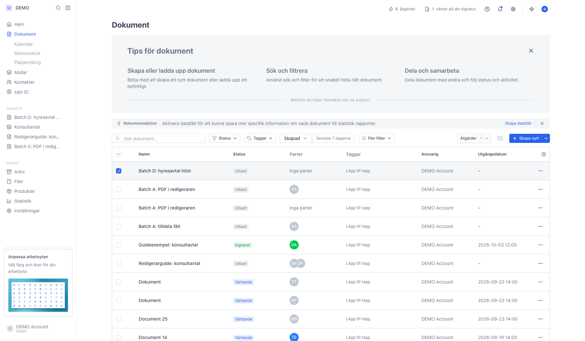
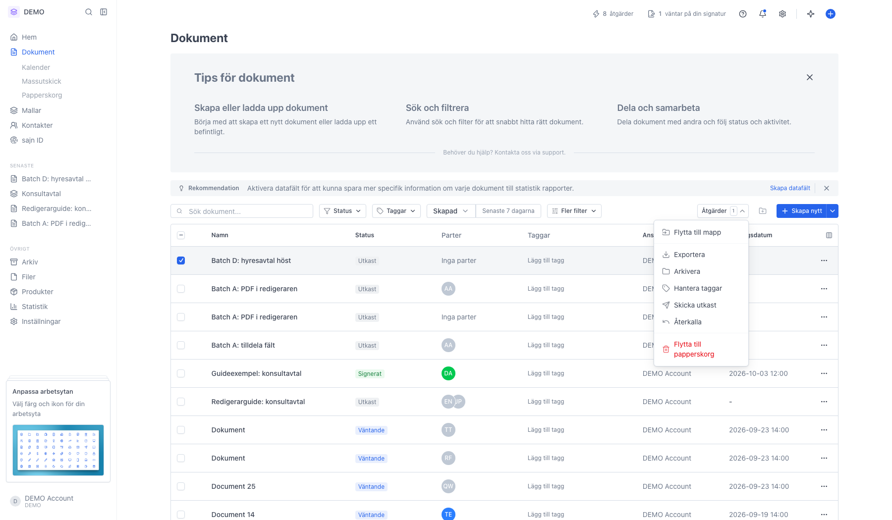
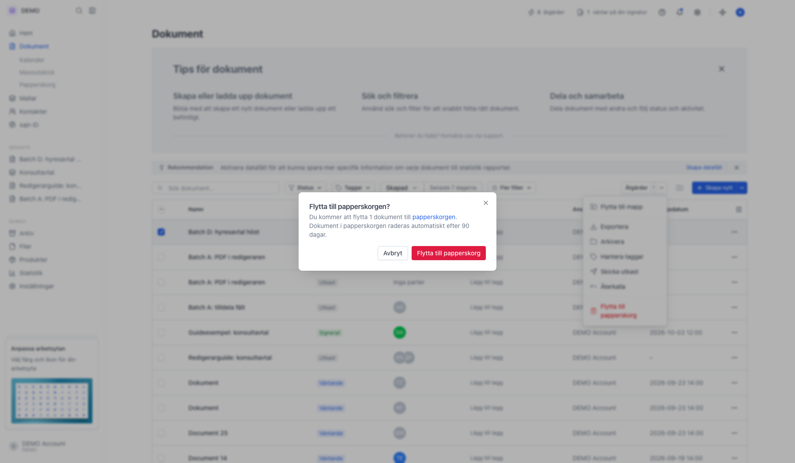
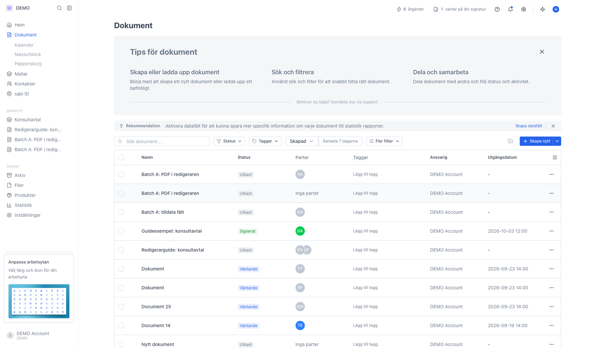
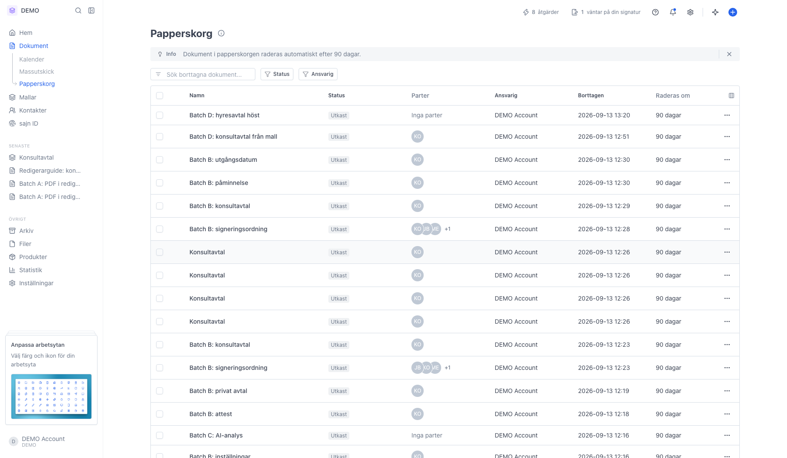
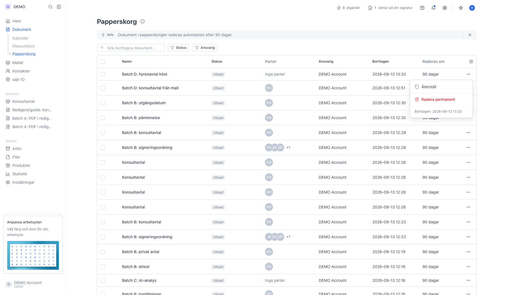
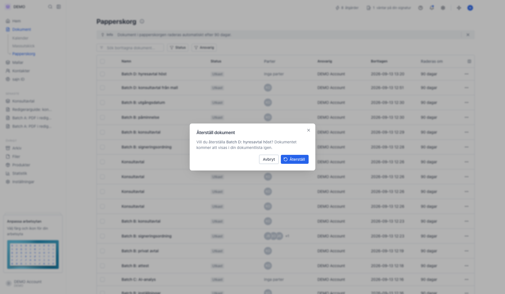
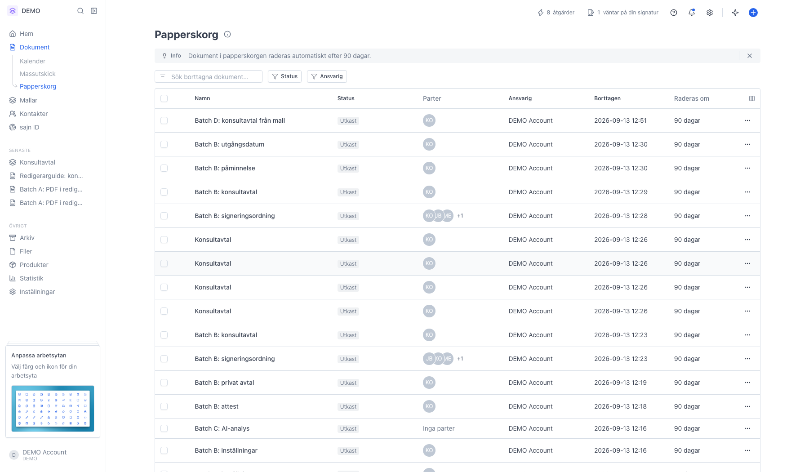
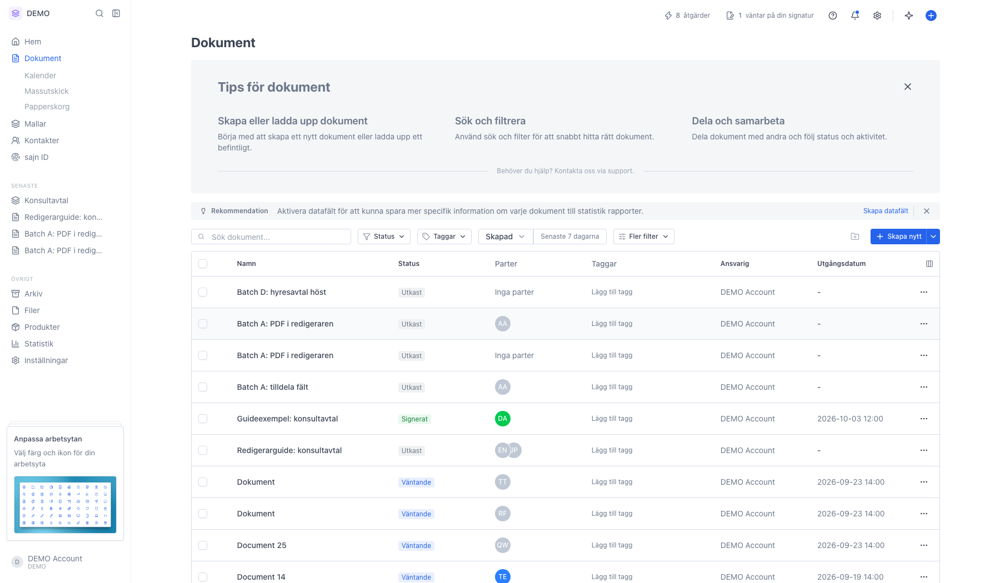

# Flytta ett dokument till papperskorgen och återställa det

<!--
slug: trash-document
audience: Alla användare
last_verified: 2026-09-13
auto-generated from steps.json — edit the spec, then re-run the runner
-->

Papperskorgen är en mellanstation. Dokumentet försvinner ur listan men finns kvar tills arbetsytans lagringstid gått ut.

## Innan du börjar

- Du är inloggad i en arbetsyta där du får ta bort dokument.

## Steg

### 1. Hitta dokumentet i listan Dokument

### 2. Bocka för dokumentet

### 3. Flytta till papperskorg ligger längst ner

### 4. Dialogen påminner om den automatiska raderingen

### 5. Raden försvinner ur listan Dokument

### 6. Papperskorg ligger under Dokument i sidomenyn

### 7. Radmenyn har Återställ och Radera permanent

### 8. Bekräfta i dialogen Återställ dokument

### 9. Raden försvinner ur papperskorgen

### 10. Dokumentet är tillbaka i listan

---

*Senast verifierad: 2026-09-13. Generad av `scripts/guide-runner.ts`.*
