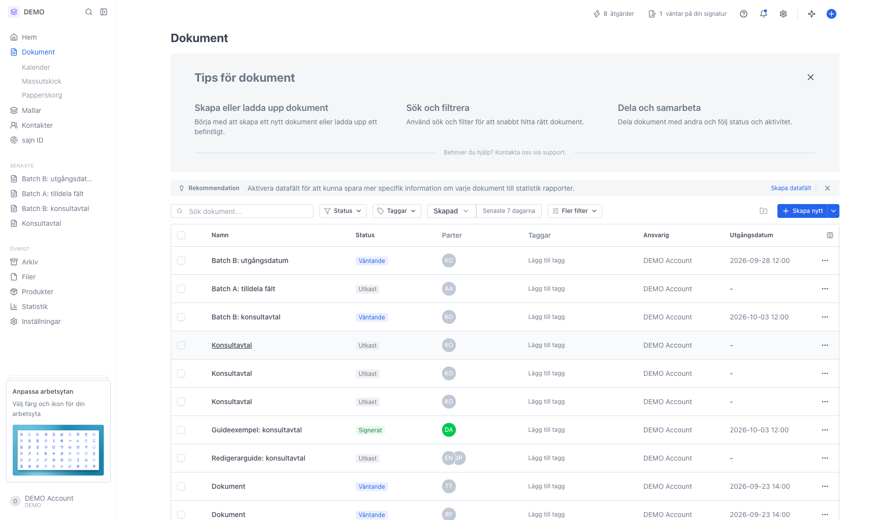
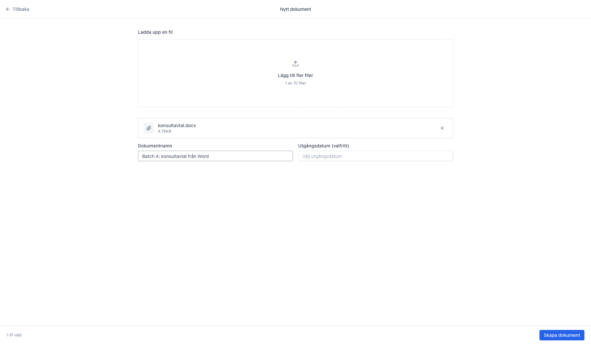
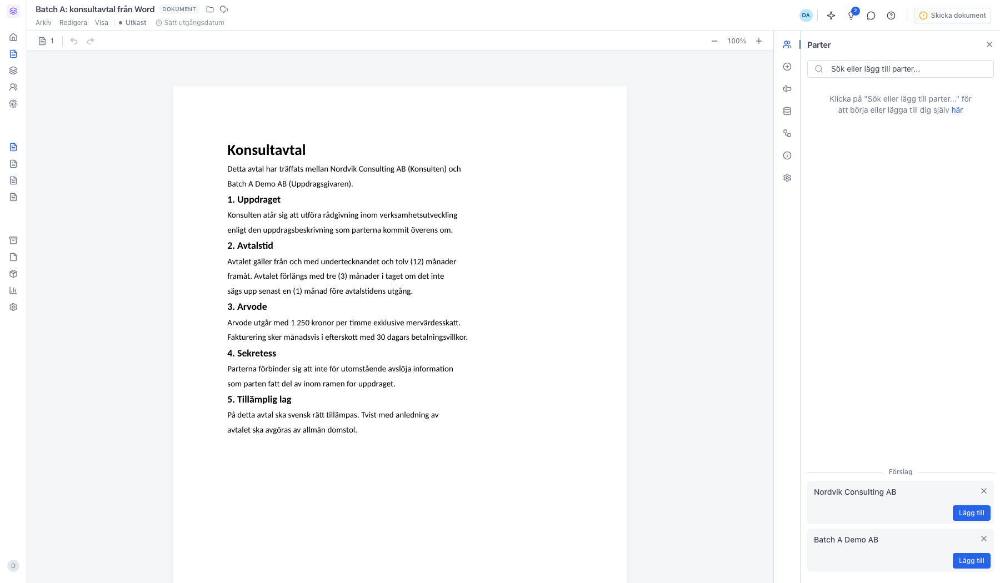

# Ladda upp Word-, Excel-, PowerPoint- och CSV-filer som dokument

<!--
slug: upload-office-documents
audience: Alla användare
last_verified: 2026-09-13
auto-generated from steps.json — edit the spec, then re-run the runner
-->

Office-filer, CSV och vanlig text konverteras automatiskt till PDF och blir innehållet i ett nytt sajn-dokument. Du använder samma uppladdning som för PDF.

## Innan du börjar

- Du är inloggad i sajn och har valt en arbetsyta.
- Du har en fil i något av formaten DOCX, DOC, XLSX, XLS, PPT, PPTX, CSV eller TXT, max 25 MB.
- Du har behörighet att skapa dokument i arbetsytan.

## Steg

### 1. Öppna Dokument i sidomenyn

Samma väg som för en PDF. Knappen Skapa nytt högst upp till höger öppnar sidan Nytt dokument; pilen bredvid har genvägen Ladda upp fil.

### 2. Samma uppladdning för alla filtyper

Rutan tar emot PDF, Word, Excel, PowerPoint, CSV och TXT, max 25 MB per fil. sajn känner igen filtypen på filändelsen och MIME-typen — du behöver inte välja format någonstans.

### 3. Namnge dokumentet och skapa det

Word-filen listas med sin storlek. Lämnar du Dokumentnamn tomt får dokumentet filens namn utan filändelse. Klicka Skapa dokument nere till höger — konverteringen till PDF sker i bakgrunden.

### 4. Den konverterade filen blir dokumentets innehåll

Dokumentet får statusen Utkast och den konverterade PDF:en visas som en egen sektion. Originalfilen sparas inte separat — det är den konverterade PDF:en som blir dokumentets innehåll, så formateringen kan skilja sig något från originalet.

---

*Senast verifierad: 2026-09-13. Generad av `scripts/guide-runner.ts`.*
