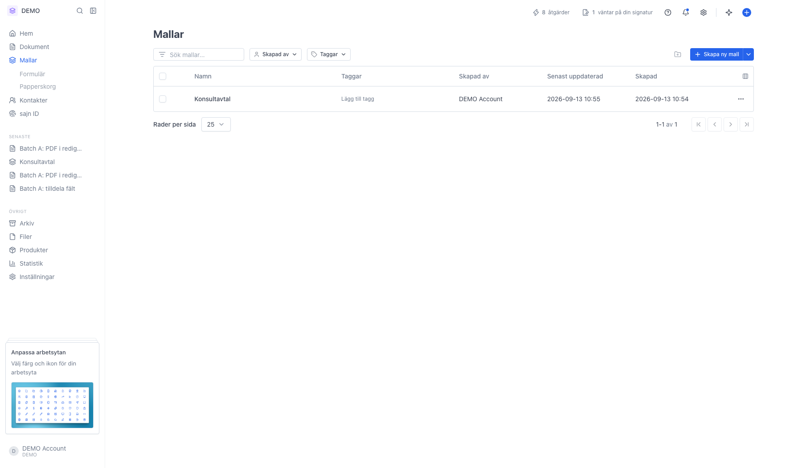
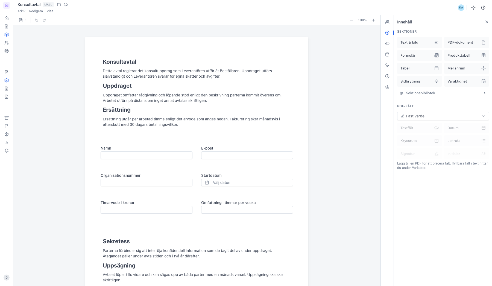
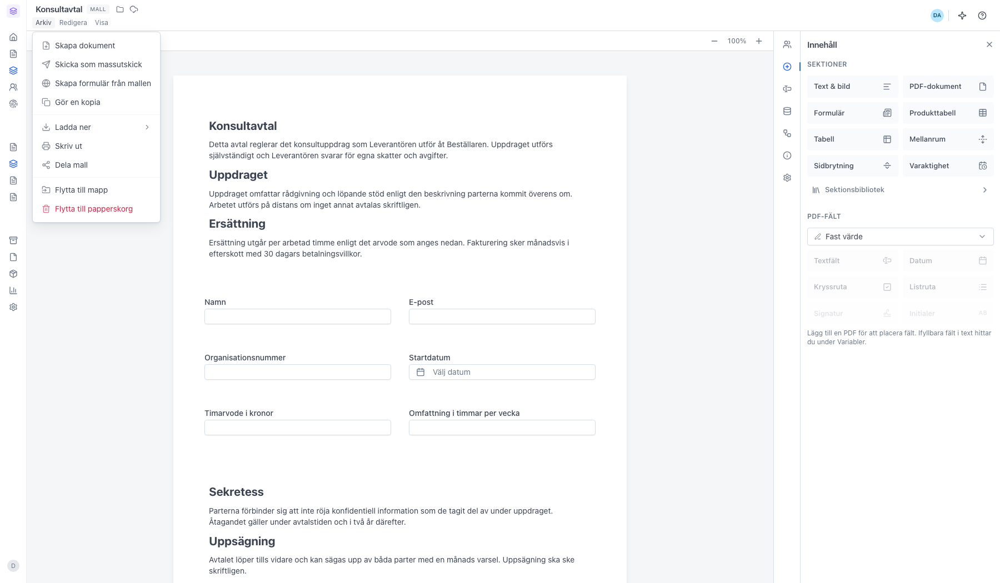
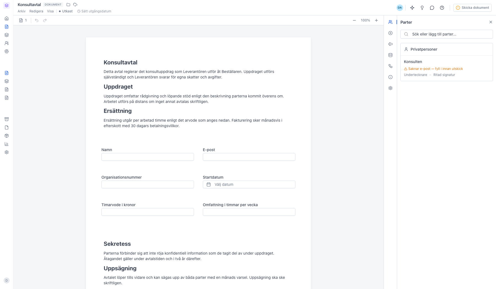
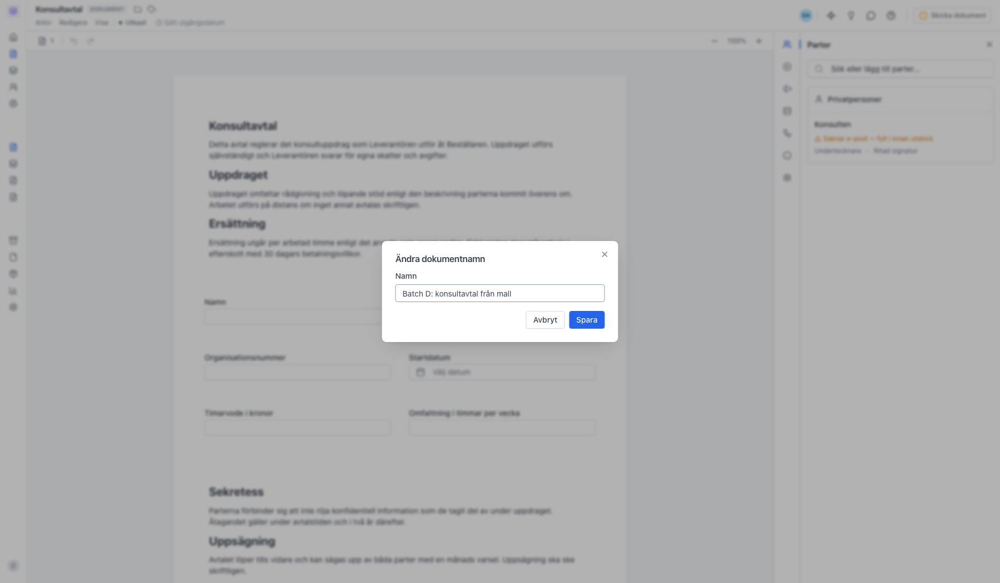
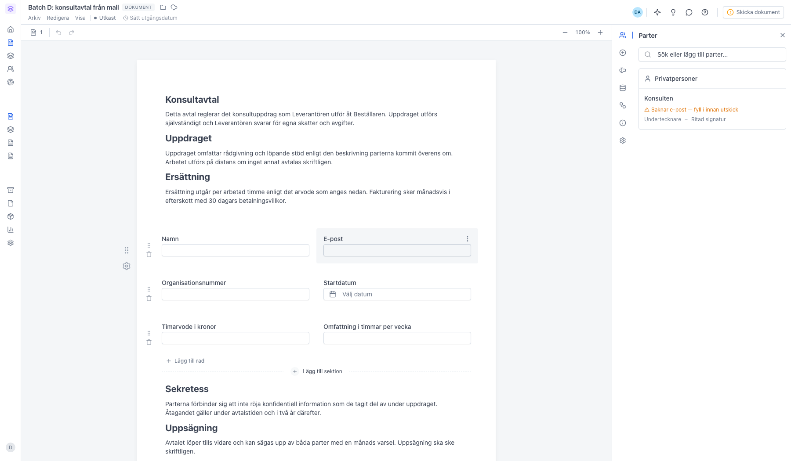

# Använd en mall för att skapa ett nytt dokument

<!--
slug: use-template
audience: Alla användare
last_verified: 2026-09-13
auto-generated from steps.json — edit the spec, then re-run the runner
-->

Snabbaste vägen från en färdig mall till ett utkast går via mallens egen Arkiv-meny.

## Innan du börjar

- Du är inloggad i en arbetsyta med minst en mall.

## Steg

### 1. Öppna Mallar i sidomenyn

### 2. Mallen öppnas i redigeraren

### 3. Skapa dokument ligger överst i Arkiv

### 4. Dokumentet ärver innehåll, parter och fält

### 5. Byt namn på dokumentet

### 6. Utkastet är klart att anpassas och skicka

---

*Senast verifierad: 2026-09-13. Generad av `scripts/guide-runner.ts`.*
