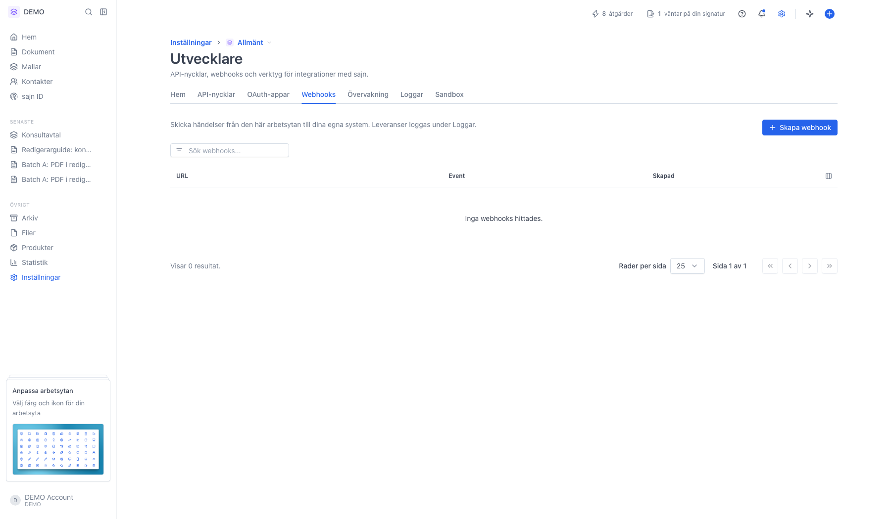
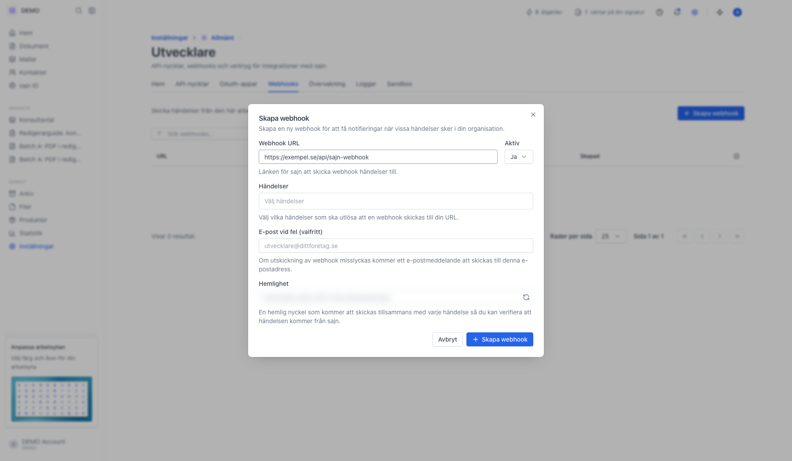
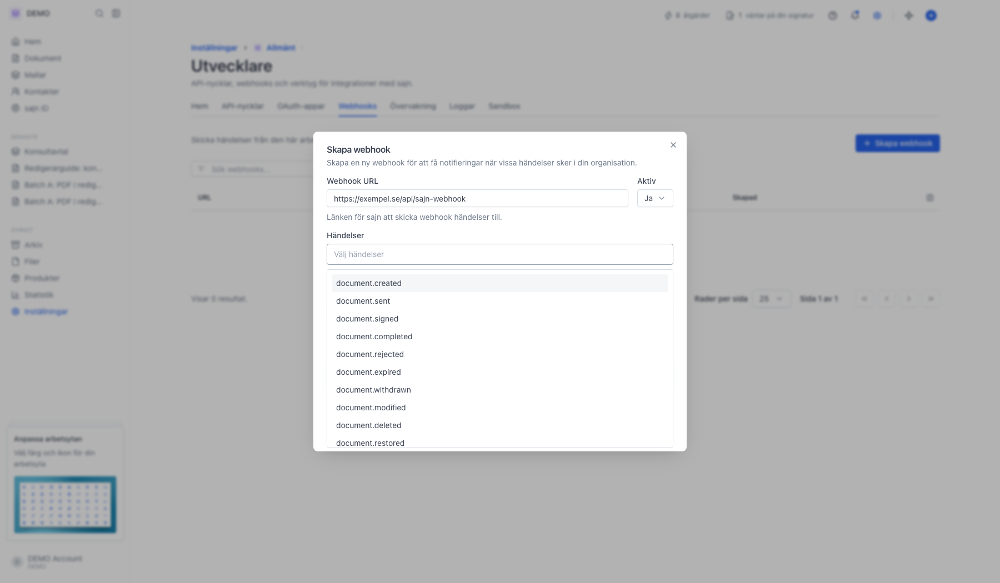

# Konfigurera webhooks för dokumenthändelser

<!--
slug: webhooks
audience: Utvecklare och arbetsyteadministratörer
last_verified: 2026-09-13
auto-generated from steps.json — edit the spec, then re-run the runner
-->

Rundtur av webhooks: var de ligger, vad dialogen innehåller och vilka händelser du kan prenumerera på. Guiden skapar ingen webhook.

## Innan du börjar

- Du är inloggad och har behörighet att hantera webhooks i arbetsytan.
- API-åtkomst ingår i Team och Enterprise.
- Din endpoint går att nå över HTTPS från publika internet.

## Steg

### 1. Öppna Inställningar, Utvecklare och fliken Webhooks

Tabellen visar URL, vilka händelser som utlöser anropet och när webhooken skapades. Sökfältet filtrerar listan.

### 2. Dialogen Skapa webhook

Fälten är Webhook URL, Aktiv, Händelser, E-post vid fel och Hemlighet. Det finns ingen arbetsyteväljare — webhooken hör till den arbetsyta du står i. Hemligheten är maskad i bilden.

### 3. Välj bland tillgängliga händelser

Listan är lång. Skriv i fältet för att filtrera, och välj så få händelser som möjligt.

---

*Senast verifierad: 2026-09-13. Generad av `scripts/guide-runner.ts`.*
