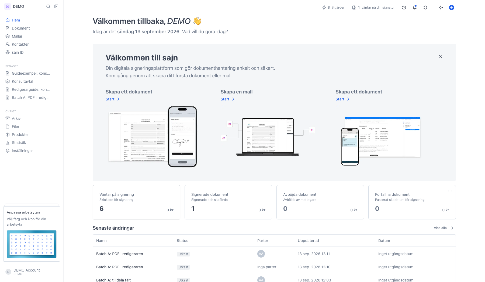
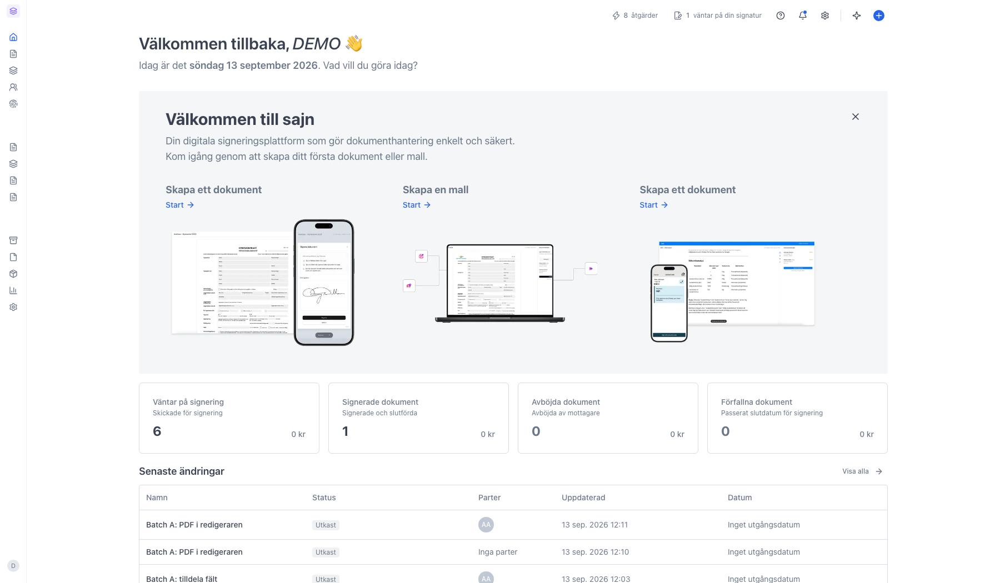

# Växla mellan arbetsytor

<!--
slug: workspace-switching
audience: Alla användare
last_verified: 2026-09-13
auto-generated from steps.json — edit the spec, then re-run the runner
-->

En organisation kan ha flera arbetsytor parallellt, till exempel en för Sälj och en för HR, med egna dokument, mallar och kontakter. Raden längst upp i sidomenyn är både skylten som visar var du är och genvägen till att byta.

## Innan du börjar

- Du är inloggad i sajn.
- Flera arbetsytor kräver Team eller Enterprise. Basic och Solo har en arbetsyta.

## Steg

### 1. Raden längst upp i sidomenyn visar var du är

Ikonen och färgen är arbetsytans egna. Namnet bredvid är arbetsytans namn, utom på Basic och Solo som bara har en arbetsyta - där står organisationens namn. Till höger ligger sök och knappen som fäller ihop sidomenyn.

### 2. Ihopfälld sidomeny visar bara ikonen

Fäller du ihop sidomenyn krymper raden till arbetsytans ikon. Ikonen blir då knappen som fäller ut sidomenyn igen, så för att byta arbetsyta fäller du först ut.

---

*Senast verifierad: 2026-09-13. Generad av `scripts/guide-runner.ts`.*
