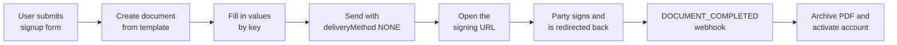

In this guide, you add a signing step to your signup flow. A new user fills in your form, signs a membership agreement without leaving your app, and lands back in your flow. A webhook then confirms the signature and activates the account.

The flow has two tracks:

- In the browser: your form, then the signing page, then a redirect back to your app. The user sees one continuous signup.
- Server to server: the `DOCUMENT_COMPLETED` webhook event, then the PDF download, then account activation. This track is the source of truth, because it doesn't depend on the user's browser.



## Before you begin

- Store your API key in the `SAJN_API_KEY` environment variable. To create a key, go to workspace settings in the sajn app, then **Utvecklare** (Developer) > **API-nycklar** (API keys).
- Create a template with the agreement's content and FORM fields whose keys match your form, such as `full-name` and `org-number`. For more information, see [Templates and forms](/guides/templates/templates-and-forms).
- Subscribe a webhook endpoint to `DOCUMENT_COMPLETED`. For more information, see [Webhooks](/webhooks/overview).
- Have a page in your app that finishes the onboarding, such as `https://app.example.com/onboarding/done`.

## Build the flow

<Steps>
  <Step title="Create the document from the template">
    When the user submits your form, create a document from the template with the user as the only party. `"deliveryMethod": "NONE"` stops sajn from emailing an invitation, because you show the signing page yourself:

    ```bash
    curl -X POST https://app.sajn.se/api/v1/documents \
      -H "Authorization: Bearer $SAJN_API_KEY" \
      -H "Sajn-Version: 2026-10" \
      -H "Content-Type: application/json" \
      -d '{
        "name": "Membership agreement - Alex Andersson",
        "templateId": "TEMPLATE_ID",
        "externalId": "signup-4711",
        "documentMeta": {
          "redirectEnabled": true,
          "redirectUrl": "https://app.example.com/onboarding/done?doc={documentId}"
        },
        "parties": [
          {
            "name": "Alex Andersson",
            "email": "alex@example.com",
            "role": "SIGNER",
            "deliveryMethod": "NONE",
            "requiredSignature": "SE_BANKID"
          }
        ]
      }'
    ```

    Replace `TEMPLATE_ID` with your template's ID. The response is the document. Store its `id` and `parties[0].id`.

    `externalId` links the document to the signup in your system, so the webhook handler can find the user. For the redirect placeholders, see [Redirect after signing](/guides/documents/redirect-url).
  </Step>

  <Step title="Optional: Match the national ID">
    To make BankID check that the person who signs is the person who signed up, set the party's national identity number before you send:

    ```bash
    curl -X PATCH https://app.sajn.se/api/v1/documents/DOCUMENT_ID/parties/PARTY_ID \
      -H "Authorization: Bearer $SAJN_API_KEY" \
      -H "Sajn-Version: 2026-10" \
      -H "Content-Type: application/json" \
      -d '{ "role": "SIGNER", "nationalId": "NATIONAL_ID" }'
    ```

    Replace `NATIONAL_ID` with the personal identity number the user entered. Send `role` on every party update: a party update without `role` sets it to `SIGNER`.
  </Step>

  <Step title="Fill in the form values">
    Write every value in one request with [Fill in values on a document](/api-reference/fill-in-values-on-a-document). The keys must match the keys on the template's FORM fields:

    ```bash
    curl -X PATCH https://app.sajn.se/api/v1/documents/DOCUMENT_ID/field-values \
      -H "Authorization: Bearer $SAJN_API_KEY" \
      -H "Sajn-Version: 2026-10" \
      -H "Content-Type: application/json" \
      -d '{
        "values": [
          { "key": "full-name", "value": "Alex Andersson" },
          { "key": "org-number", "value": "556000-0000" }
        ]
      }'
    ```

    The response's `results` array has one entry per key, with `success` and, when a value fails, an `error`. `remaining` lists required values that are still empty. To see every key on the document, send a `GET` request to the same path.
  </Step>

  <Step title="Send the document and get the signing URL">
    Send the document. Because the party has `"deliveryMethod": "NONE"`, no email goes out. Then get the party's signing URL:

    ```bash
    curl -X POST https://app.sajn.se/api/v1/documents/DOCUMENT_ID/send \
      -H "Authorization: Bearer $SAJN_API_KEY" \
      -H "Sajn-Version: 2026-10" \
      -H "Content-Type: application/json" \
      -d '{}'

    curl https://app.sajn.se/api/v1/documents/DOCUMENT_ID/parties/PARTY_ID \
      -H "Authorization: Bearer $SAJN_API_KEY" \
      -H "Sajn-Version: 2026-10"
    ```

    Return `signingUrl` from the second response to your frontend, and redirect the browser to it. To show the signing page inside your app instead, see [Embedded signing](/guides/embedding/overview). The URL lets anyone sign as the party, so don't log it.
  </Step>

  <Step title="Show the result after the redirect">
    After the user signs, sajn redirects the browser to your `redirectUrl`, such as `https://app.example.com/onboarding/done?doc=cm4k2x9p10001abcd1234efgh`. Show a confirmation screen, but don't activate the account here: the user can close the tab before the redirect, and anyone can open the URL.
  </Step>

  <Step title="Activate the account from the webhook">
    When the document is sealed, sajn sends `DOCUMENT_COMPLETED` to your endpoint. Verify the signature, find the signup by `payload.externalId`, archive the PDF, and activate the account:

    ```javascript
    import crypto from "node:crypto";

    import express from "express";

    const app = express();

    const isSignedBySajn = (header, rawBody) => {
      const parts = Object.fromEntries(String(header ?? "").split(",").map((part) => part.split("=")));
      const expected = crypto
        .createHmac("sha256", process.env.SAJN_WEBHOOK_SECRET)
        .update(`${parts.t}.${rawBody}`)
        .digest("hex");
      return (
        typeof parts.v1 === "string" &&
        parts.v1.length === expected.length &&
        crypto.timingSafeEqual(Buffer.from(parts.v1), Buffer.from(expected))
      );
    };

    app.post("/webhooks/sajn", express.raw({ type: "application/json" }), async (req, res) => {
      if (!isSignedBySajn(req.headers["x-sajn-signature"], req.body)) {
        return res.status(401).end();
      }
      res.status(200).end();

      const { event, payload } = JSON.parse(req.body);
      if (event !== "DOCUMENT_COMPLETED") return;

      const download = await fetch(
        `https://app.sajn.se/api/v1/documents/${payload.id}/download/SIGNED`,
        { headers: { Authorization: `Bearer ${process.env.SAJN_API_KEY}`, "Sajn-Version": "2026-10" } },
      );
      const { downloadUrl } = await download.json();
      const pdf = Buffer.from(await (await fetch(downloadUrl)).arrayBuffer());

      // Replace with your own storage and account logic.
      await storeSignedAgreement(payload.externalId, pdf);
      await activateAccount(payload.externalId);
    });

    app.listen(3000);
    ```

    `SAJN_WEBHOOK_SECRET` is the webhook's `secret`, returned once when you create the webhook. For timestamp checks and retries, see [Verify webhook signatures](/webhooks/verify-signatures) and [Delivery and retries](/webhooks/delivery-and-retries).
  </Step>
</Steps>

## Design choices

- **Why `NONE` instead of `EMAIL`?** The user is already in your app. An email detour costs conversions. For a party who isn't present, such as a co-signer, use `EMAIL` or `SMS` on that party; the delivery method is per party.
- **Why a template?** The legal team edits the content in the sajn app without a deploy, and the FORM field keys stay the same when the text around them changes.
- **Why both a redirect and a webhook?** The redirect decides what the user sees next. The webhook decides whether the signup is complete. With only the redirect, a closed tab leaves an orphaned signup. With only the webhook, the user sees no confirmation.
- **Which signing method?** For identity you rely on later, such as KYC, use an eID such as `SE_BANKID`. For accepting terms of service, `CLICK_TO_SIGN` or `DRAWING` has no eID requirement. For more information, see [Set the signing method](/guides/identity/signing-methods).

To catch signups whose webhook delivery failed, run a reconciliation job that lists `COMPLETED` documents and checks each `externalId`. For an example, see [Sync all completed documents nightly](/guides/recipes/nightly-sync).

## Handle errors

- `400 VALIDATION_FAILED` on create: a party or `documentMeta` field is invalid. Read `issues`.
- `results[].success: false` on `field-values`: the key doesn't exist, or the value doesn't match the field's type or options. Fix the value; the other values are already written.
- `404 NOT_FOUND`: the template or the document doesn't exist in the workspace that the API key belongs to.

For the error shape and every code, see [Errors](/api-fundamentals/errors).

## Next steps

<CardGroup cols={2}>
  <Card title="Embedded signing" icon="window" href="/guides/embedding/overview">
    Show the signing page inside your app.
  </Card>
  <Card title="Templates and forms" icon="file-lines" href="/guides/templates/templates-and-forms">
    Build a template with field keys.
  </Card>
  <Card title="Download documents" icon="download" href="/guides/documents/downloading-documents">
    Archive the sealed PDF and the journal.
  </Card>
  <Card title="Verify identity with sajn ID" icon="id-card" href="/guides/recipes/verify-identity-before-signing">
    Verify who the user is before they sign.
  </Card>
</CardGroup>
