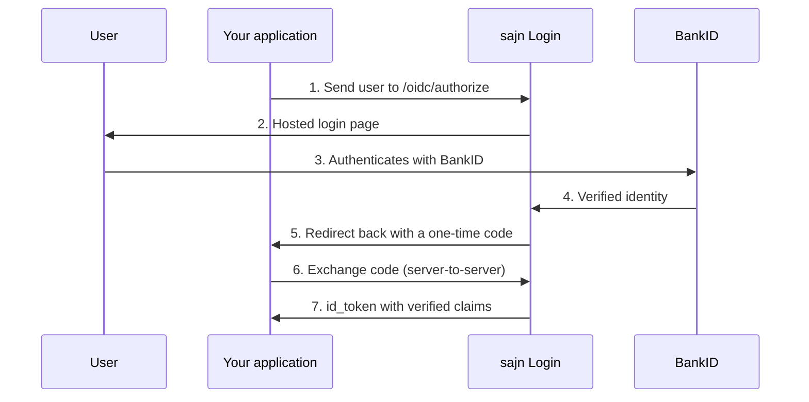

# sajn Login

sajn Login lets your users sign in to **your** product with Swedish BankID. You get a verified
identity back; sajn holds the BankID agreement, operates the certificate, and runs the login
screen.

It is a standalone product. You do not need a BankID agreement of your own, you do not need to
handle certificates, and you do not need to use sajn for e-signing.

<CardGroup cols={2}>
  <Card title="Standard OpenID Connect" icon="key">
    Authorization Code flow with PKCE. Any OIDC library works — NextAuth, Auth0, Keycloak,
    passport, ASP.NET. No sajn SDK required.
  </Card>
  <Card title="Or a plain REST API" icon="code">
    Two calls if you would rather not run an OIDC client. Ideal for mobile apps that open the
    login page in an in-app browser.
  </Card>
  <Card title="Your name in the BankID app" icon="id-card">
    With your own hosted certificate the user sees *"Legitimera dig hos Acme AB"* — not sajn.
  </Card>
  <Card title="Nothing to operate" icon="shield-check">
    Certificate lifecycle, QR rotation, accessibility timers and BankID's API changes are ours.
  </Card>
</CardGroup>

## How it works

Step 6 happens from **your server**, authenticated with your client secret. That is what makes
the result trustworthy: the browser only ever carries a single-use code, never an identity.

## Two ways to integrate

<CardGroup cols={2}>
  <Card title="OpenID Connect" icon="lock" href="/login/oidc">
    The default. Point any OIDC library at our discovery document and you are done.
  </Card>
  <Card title="Session API" icon="terminal" href="/login/session-api">
    `POST` to start a login, `GET` to read the result. No OIDC library needed.
  </Card>
</CardGroup>

Both use the same hosted login page, the same BankID engine and the same claims. They differ
only in how a login starts and how you collect the result. You can use both at once — one
client per application.

<Note>
  Not sure which? If your application already has a login system that speaks OIDC, use OIDC. If
  you are building a mobile app and would rather make two HTTP calls than configure an OIDC
  client, use the Session API.
</Note>

## Core concepts

<AccordionGroup>
  <Accordion title="Client" icon="cube">
    One per application. A client owns its redirect URIs, the data it may request, the language
    its login page renders in, and its credentials.

    Clients are **reviewed by sajn before they can authenticate anyone**. You create one as a
    draft, submit it, and we approve it. Changing a redirect URI or the requested data later
    sends it back for review — an approval describes a specific configuration, not just a name.
  </Accordion>

  <Accordion title="Subject (sub)" icon="fingerprint">
    The stable, pseudonymous identifier for a person **within your organization**.

    The same individual signing in to any of your applications always yields the same `sub`. It
    cannot be correlated with their identifier at any other sajn customer, and the personnummer
    cannot be derived from it. Store `sub` as your user key — not the personnummer.
  </Accordion>

  <Accordion title="Certificate" icon="certificate">
    The BankID relying-party certificate a login runs on. It decides the company name shown in
    the BankID app.

    By default that is sajn. Order your own through us and your users see **your** company name
    instead — that is the reseller part of the product, arranged with our team rather than
    self-served.
  </Accordion>

  <Accordion title="Test vs production" icon="flask">
    A certificate is either a test or a production certificate, and a client inherits that.

    Test clients talk to BankID's test environment and only accept test BankIDs from
    demo.bankid.com — they can never authenticate a real person. See [Testing](/login/testing).
  </Accordion>
</AccordionGroup>

## What you get back

| Claim | Requires scope | Example |
| --- | --- | --- |
| `sub` | `openid` | `clx7f2k9v0001…` |
| `name`, `given_name`, `family_name` | `profile` | `Anna Andersson` |
| `birthdate` | `profile` | `1985-03-15` |
| `nin` | `nin` | `198503151234` |
| `amr`, `auth_time` | always | `["BANKID_SE"]` |

Request only what you need — every scope beyond `openid` is reviewed before your client is
approved, and `nin` in particular needs a reason.

Full detail: [Scopes and claims](/login/claims).

## How it differs from sajn ID

sajn Login and [sajn ID](/concepts/sajn-id) both use BankID, but solve different problems.

| | sajn Login | sajn ID |
| --- | --- | --- |
| Question it answers | *Let this person into my app* | *Prove who this person is* |
| Trigger | The user initiates a login | You create a verification and send it |
| Frequency | Every day, per user | Once, at onboarding |
| Result | Claims for a session | A recorded, auditable verification with a report |
| Whose name is in the BankID app | Yours, if you have a certificate | Always sajn — the attestation is sajn's |

Rule of thumb: if you would call it *login* or *sign-in*, it is sajn Login. If you would call it
*KYC* or *onboarding*, it is sajn ID.

## Getting access

sajn Login is enabled per organization by our team, and each client is reviewed before it goes
live.

<Steps>
  <Step title="Talk to us">
    Contact sajn to enable sajn Login for your organization. If you want your own company name
    in the BankID app, this is where the reseller sub-agreement and certificate ordering start.
  </Step>
  <Step title="Create a client">
    In the sajn dashboard: **Inställningar → Utvecklare → sajn Login**. Set the name your users
    will see, the redirect URIs, the data you need and the page language.
  </Step>
  <Step title="Submit for review">
    We check the configuration and approve it. Until then the client exists but cannot
    authenticate anyone.
  </Step>
  <Step title="Integrate">
    Follow the [Quickstart](/login/quickstart).
  </Step>
</Steps>

## Pricing

Billed per **successful** authentication. Failed and abandoned logins are free. Usage is
invoiced in arrears alongside your other sajn usage — there is no per-login prepayment, and a
login is never refused because of a balance.

## Limits worth knowing up front

- **No refresh tokens.** A login produces claims at a point in time; your application owns the
  session afterwards. Re-authenticate by starting a new login.
- **No single sign-on.** Every login is a fresh BankID authentication. The phone is the session.
- **No logout endpoint.** There is no sajn-side session to end — clear your own.
- **Swedish BankID only** today. Other Nordic eIDs are planned; the `amr` claim is namespaced
  (`BANKID_SE`) so adding one will not change the shape of what you receive.

## Next steps

<CardGroup cols={2}>
  <Card title="Quickstart" icon="rocket" href="/login/quickstart">
    A working login in about ten minutes
  </Card>
  <Card title="OpenID Connect reference" icon="lock" href="/login/oidc">
    Endpoints, parameters and token validation
  </Card>
  <Card title="Session API" icon="terminal" href="/login/session-api">
    The two-call REST alternative
  </Card>
  <Card title="Testing" icon="flask" href="/login/testing">
    Test BankID and what differs from production
  </Card>
</CardGroup>
